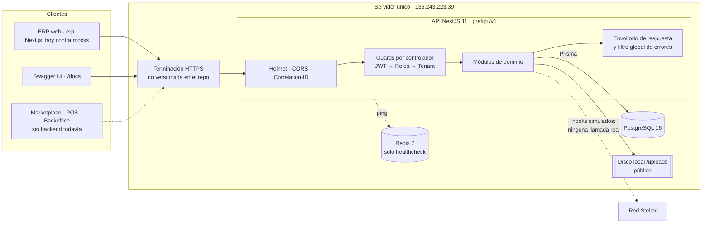
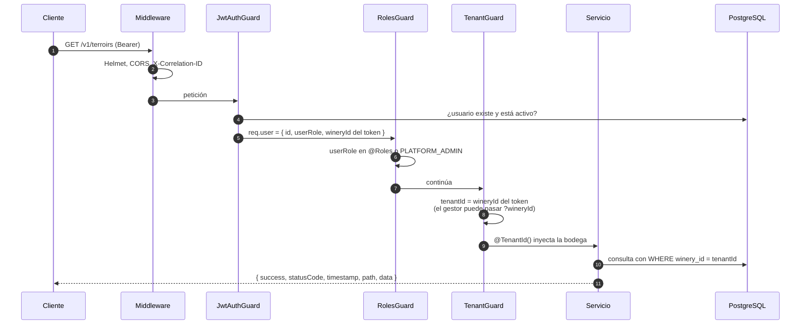
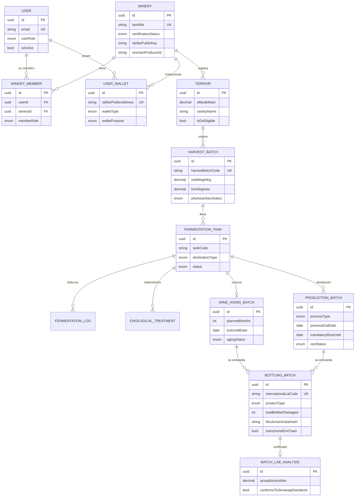
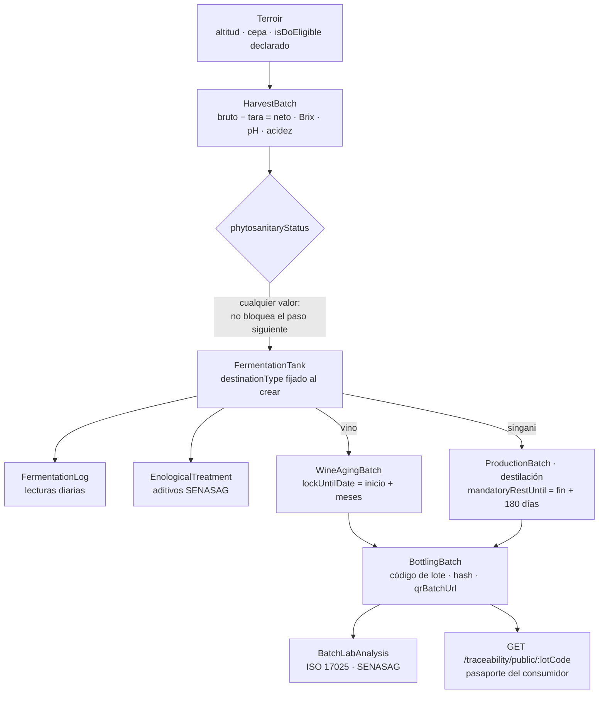
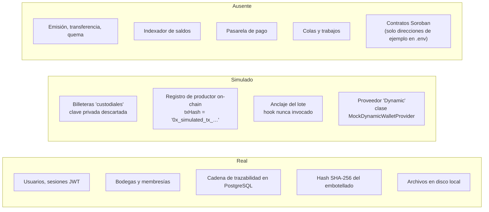

# 01 · Estado actual del backend

> **BORRADOR** · versión 0.2 · 27 de septiembre de 2026. Análisis del repositorio `drinks-on-chain-back` (rama `main`; código del commit `6985642`, sin cambios en el `d7d479b` del 27-09, que solo añade documentación) y del servidor desplegado. Nada de este documento es oficial hasta su revisión.
>
> Cambios en la v0.2: la documentación de diseño del equipo (`docs/analisis`, `docs/architecture`, `docs/bd`, `docs/contratos`, `docs/rules`) ya está versionada; se revisó y sus diferencias con lo acordado están en el doc 04 §2.2. Los hallazgos sobre el código siguen vigentes.

Fuentes: el código completo del repositorio (≈ 12.000 líneas de TypeScript, esquema Prisma y migración), su README, sus guías de prueba (`docs/demo/`) y su catálogo de endpoints (`docs/endpoints/`); el OpenAPI del servidor desplegado; y la documentación de frontend (`drinks-on-chain-docsfront`, sobre todo los documentos 04, 06, 09 y 11). Las rutas de archivo citadas son relativas a `drinks-on-chain-back/`.

## 0. Resumen ejecutivo

- **Qué hay**: una API REST en NestJS 11 + Prisma 6 + PostgreSQL 16 que cubre el **ERP de trazabilidad** (S1): identidad con JWT, bodegas con membresías y aprobación, parcelas, vendimia, fermentación, crianza, destilación, embotellado, certificado de laboratorio y un pasaporte público por código de lote. Está desplegada y responde (`/v1/health` en verde el 26-09-2026, 35 rutas, las mismas que el repositorio).
- **Qué no hay**: nada de Marketplace, POS ni Backoffice más allá de aprobar bodegas. **Todo lo on-chain es simulado**: no hay ninguna llamada a Stellar, las "billeteras custodiales" son direcciones cuya clave privada se descarta al crearlas, y los hashes de transacción son texto inventado.
- **Calidad de la base**: buena estructura modular, validación estricta de entrada, envoltorio de respuesta uniforme, aislamiento por bodega en las consultas, pruebas unitarias y e2e. Es una base razonable para seguir construyendo.
- **Riesgo principal**: las reglas que dan valor al producto (candados de crianza y reposo, Denominación de Origen, dictamen fitosanitario, número de botellas) **se pueden eludir** con peticiones válidas, y el registro no es inmutable. Hay que corregirlo **antes de emitir un solo token**, porque cada botella registrada de más sería un token sin respaldo.
- **Cobertura estimada del alcance del MVP**: ≈ 25 %, concentrada en el ERP (§10).

## 1. Ficha técnica

| Aspecto | Valor |
|---|---|
| Repositorio | `drinks-on-chain/drinks-on-chain-back`, una sola rama (`main`), 19 commits de un único autor entre el 28-08 y el 24-09-2026 |
| Lenguaje y framework | TypeScript 5.8 (`strict`), NestJS 11 (Express), class-validator, Swagger |
| Datos | Prisma 6.4 sobre PostgreSQL 16; 14 modelos, 14 enumeraciones, una migración inicial (`20260907032543_init_traceability_schema`) |
| Colas y caché | Redis 7 y BullMQ declarados como dependencias; **solo se usa Redis en el healthcheck**; no hay colas registradas |
| Stellar | `@stellar/stellar-sdk` 13.3, usado **solo** para `Keypair.random()` |
| Archivos | Disco local (`./uploads`) servido como estático público en `/uploads/` |
| Seguridad transversal | Helmet, CORS por lista, `ValidationPipe` con `whitelist` y `forbidNonWhitelisted`, bcrypt (coste 12), throttling solo en `/auth` |
| Observabilidad | Logger de Nest en texto, identificador de correlación (`X-Correlation-ID`) en `AsyncLocalStorage`, saneado de datos sensibles en logs |
| Pruebas | Jest: el README declara 102 unitarias (25 suites) y 37 e2e (4 suites) que usan una base de datos real |
| Entrega | `docker-compose.yml` solo para PostgreSQL y Redis. **Sin Dockerfile, sin CI, sin infraestructura versionada** |
| Despliegue | `https://136.243.223.39.sslip.io` (entorno de desarrollo), Swagger público en `/docs` |
| Documentación | README, catálogo de endpoints, guías de prueba y, desde el 27-09, el análisis y la arquitectura del equipo (alcance, decisión NestJS frente a Supabase, módulos, flujos, pagos y QR, contratos Stellar, catálogo de 28 tablas, roadmap v4) y sus reglas de código (`docs/rules/`). `docs/implementation` sigue fuera del repositorio |

## 2. Arquitectura actual

Monolito NestJS con un módulo por dominio y una capa compartida (`src/shared`). Todo corre en un solo proceso.

[Abrir en Mermaid Live](https://mermaid.live/edit#pako:eNpVVG1P4zAM_itWP91JbGPbiRPohHRQXgWs1w6BRO9D1nprWBpXSToOAf_9nGwr40sbO4_tx_bTvkUFlRgdQTRX9FJUwji4SXMNYNvZwoimglMlUTu03glwliZPecRPeMEZ5O3-_uwnoGn6v2ZmcHyH_1z_2e5BRa9QkHZGQE3F0ubR33V89sDh2YtYLNDA_dU2w6Ck4hN0fj9l1K0wS3SNEgVuYckk2x5PRLGk-VwWGCpbqWHGLtQlOCrFysOwFJuc7M71l7YyNCtZkvF0NseQei60LGhbZTg-6I9-jPuj0bg_PuwIJo8cNkVTSy0KGcLGGi6n0yQLbDTBCo2VpEUpuDigAoMNdQk6Gr-TK07FT7hD664zGA63tRuDc_lMMFgNuziAWz_AS1Q1ui3wdJJ2YzklY1AJx6V7V_FO3AWHXbTClBYabjUsh5TgtgPj64cppxgND0eQkkK7NaaohXa79Sex382657JVZKFEKIlHIWkHNwk7PNMrUo6MJI8yaJuW2xSh5CvMpWISsFA0E8oD0BhiUJcmrM0f4pOnb3mUkHULg9mfGxge5NH3DSqN_WWKpbTwc60GUgQVCuWqosJi-Yk9z56YViwt71hRwWUHbaNIlDYENmsJzBRrgFl81U7mO-IykDlUSphA01_4z6HXO2ZZBNjDjsFShl6_M5PHcHe7hlysjUkc3jwxD9mY74mRthbv3PqOl_l3Vh_yqCJaWrCybv0q7dFafVIvWi2AOdZef4YHkUfgWWShhJcbhzeMC940znW0B1HNihay9L-DtzxyFdaYs5FHGlv-lDnJh4eJ1lH2qgu-cqZF9rRNKRzGUrCo64374z_fsFzv) · [código](diagramas/01-01-arquitectura-actual.mmd)

### 2.1 Recorrido de una petición autenticada

[Abrir en Mermaid Live](https://mermaid.live/edit#pako:eNptU8Fu4jAQ_ZVRTiCFpdXeoi0tBNqCmm03ibQ9RKpMMgVrEzu1x7AI8e87BnJhuXneezPz_GTvg1JXGEQQWPxyqEqcSrEyoikUgHCklWuWaHzVCkOylK1QBDEIC3EtURFeconnEllVNW6F-Y9eeHqxpbGj9ZMTproUpF6Q6hrtVTr3dI6Kz1f5zPMZmg0D-pKcTjz7pi2tDGa_XgrlFfFgNEoieJrlMNzcDgmN0dJY6E2QL2D6XpOcNM9YN0ghxK9pFsL7INbGYC1IajWYTzvhIoIW_dLC3dx8fj8uWTA-nUTgoeWns-xdasC_0hLCDtCSZ_AWRElyo--7njQCg1_fnEUDd7AHWYXgC59QCFup0OzmFVRYA-k_qODgO9NTZycExh-OmYKGt5dx_viaJh_jaTL_2anzCEqtSKqjZyE8np9wOqbNS-6u7PuxNMNRj6sVX0EbaB1WyKFbYeC-k_e7aVkED_l5XK8PUu2wJAG1gCW_w9Vxa3ZOiu1YVzPLB_j9PEtn5_Uf0lvpXJ1auCeOOB7ryhKtDcGSIGdjnhoCyYbNiaYN2RitQ6gEj-WgghCCBk0jZOX_wL4IaI0NFlwUgUJHRtRFcPAy_xmynSqZIuN4aOBaHtP9lzN8-Ac0dxzp) · [código](diagramas/01-02-recorrido-de-una-peticion-autenticada.mmd)

El aislamiento por bodega está bien resuelto en las consultas (cada `findFirst` filtra por `wineryId`) y responde 404 ante recursos ajenos. La bodega activa viaja en el JWT y no se puede cambiar sin volver a iniciar sesión.

## 3. Módulos y endpoints

| Módulo | Responsabilidad | Endpoints (`/v1`) | Estado |
|---|---|---|---|
| `health` | Salud de base de datos y Redis | `GET /health` | Real |
| `auth` | Registro, login, renovación | `POST /auth/signup`, `/auth/login`, `/auth/refresh` | Real (básico) |
| `users` | Perfil propio y billetera | `GET/PATCH /users/me`, `GET /users/me/wallet` | Real; la billetera es simulada |
| `wallets` | Aprovisionar billeteras | Sin controlador; lo usan `auth` y `wineries` | **Simulado** |
| `wineries` | Solicitud de alta, aprobación, rechazo, miembros | `POST /wineries`, `GET /wineries`, `/wineries/pending`, `/wineries/my`, `PATCH /wineries/my`, `POST /wineries/my/members`, `/my/members/create`, `GET /my/members`, `POST /wineries/:id/approve`, `/:id/reject` | Real; registro on-chain simulado |
| `terroirs` | Parcelas | `GET/POST /terroirs`, `GET/PATCH /terroirs/:id` | Real |
| `harvest-batches` | Pesaje y dictamen fitosanitario | `GET/POST /harvest-batches`, `GET /:id`, `PATCH /:id/phyto-status` | Real |
| `traceability` | Fermentación, bitácora, tratamientos, crianza, destilación, embotellado, laboratorio, grafo y pasaporte | 17 rutas bajo `/fermentation-tanks`, `/wine-aging`, `/production-batches`, `/bottling`, `/lab-analyses`, `/traceability` | Real; anclaje simulado y nunca invocado |
| `uploads` | Subida de imágenes y PDF | `POST /uploads?folder=` | Real (disco local) |

El detalle de cada endpoint frente a las pantallas del ERP está en el documento 09 de `drinks-on-chain-docsfront`, que sigue siendo válido: el OpenAPI desplegado coincide con el código analizado.

## 4. Modelo de datos

Catorce modelos. Todas las entidades de trazabilidad llevan `winery_id` (omitido en el diagrama para que se lea mejor).

[Abrir en Mermaid Live](https://mermaid.live/edit#pako:eNqVVltv4joQ_isWz2elXZ23fQuQbaNCQCE91UqV0GBPE6uOjWynu2zLfz8TJ5QECtVKSCTjuX3fXJzXETcCR9_ZCO1UQmGhetSM3a_ijL29ffliXtlDksbZz_U8no9J-J09jtCxSmK1seZx1Gi3Gpf1vUSNrWrfcfO8fohmszgPalvjED_yeKootfPS11waDeojgzzOskXSBrdYSOcttHqHk07xNsr-i1f5ehzlk9ugbqwspO60h8edzY84m8dpHuXJIl3nUXoX7JTCg9W5wkeWs8VNMNxI_1h__YrfuLGfOYjTBZklk2i2zrM4yhutlmELHqgm2ht31cdbYGod3STpTQ81txL0n8_CL7PF9H4SxEdTgVQMBVw2KJ7-1cd6DKJ0LsaLPJ8NYztk1EvGo1JdAmdx_sb4RKlDHV7Ws2i8jtJo9nOVrFrcaL18khxEaOX3Dn1tnhiraykY_ZZ37Tv1kdQFRQSp2H0nRF1XrHZoM6OwFW2MUUy6iHv5EkT7Xo9e9-3hdyJS6Yfu3_P01PMrD752AysXCLDLeqMkv8Pd4NBoXoLUS2tETY4ScZLRYVQvJBbeG3yJYD_6sl9So931pCHViupx5GJ_oPQwv9fRD3BEQlh0bsjEL6BJ8_lui2fCZW2bFfIe9jDrF0IK5LICxUA1y0TgHJwaJPMCVqLfpVANyzo1saIlsekhHC6K6xhLsC80M2PwvJzQ8n3Hd0hIo39AWZT-rhgebKz8PcXCIroe-G25o6kHLT3Y3bE39h-P8mfdp5-bnHruw3zr0HgnrLthrLORvxBKas-2CrRGMTfalx0WAR6ZMvz5XtM-mdJbLxTQTi5OsJ1tiQvxWpKs4dRLRwQhXCeNtTjGCwcVaPo3dpcR-pBQzxc1pT_J5WTpXCeZCEDbMgpqZvygCQ7Z0qj2urzhzBsPamy8V-iWwJ-hQDHwu2nYC6NOaOAWXDncRrQGjEWx0JNG55j7-Wr8bGK4r0FFipvSqGjz0gvDjX4ytnK5WdF96KApGlFpxYGr0T9sVKGlDSqar45XurtKpAEbNetYY003GV3p-0YNam9WO83pyNsaSVJvm-p03ymdeP8_CN3UqA) · [código](diagramas/01-03-modelo-de-datos.mmd)

Observaciones sobre el modelo:

- **No hay entidad "Lote"**: la trazabilidad es una cadena de entidades por etapa. El frontend lo resolvió con una vista derivada (`LotView`) en el cliente. Es una decisión válida para el ERP, pero el resto del ecosistema (colecciones, tokens, pases) necesitará un identificador de lote estable en el servidor; hoy ese papel lo cumple `BottlingBatch.internationalLotCode`.
- **No hay nada del resto del producto**: productos, colecciones, precios, activos, órdenes, pagos, saldos, pases, puntos de recojo, dispositivos, turnos, entregas, tickets, reseñas, transacciones en cadena, notificaciones ni auditoría.
- **16 relaciones con `onDelete: Cascade`**: borrar una bodega o una parcela borra en cascada toda su historia productiva. Contradice la promesa de registro inmutable.
- Los decimales usan `Decimal` con precisión fija (correcto). Los importes de dinero aún no existen.
- Las fechas de algunas etapas son `DATE` sin zona horaria y otras `TIMESTAMPTZ`; los cálculos de candados usan la hora del servidor.

## 5. Flujo de trazabilidad implementado

[Abrir en Mermaid Live](https://mermaid.live/edit#pako:eNpdk9tuEzEQhl9ltLdQJQ1CRRFUSkjaIFUQNVtxwXIxazuboV5760Nge3h3xt6k0N6N7Zlv_jn4oRBWqmIKxVbb32KHLkC5qAxA-aMqSuWcJfexdqNz1IFClFDF8bg-A6E6PNrkF3apqaFaK5BKaHQobVX8hJOTc1gxaIVur3yYYxC7TKtdDJbjJ5PTCQT2h09gVL7KyLmjP0e7Wx0tFCTVPYOTwFWmrx-qotv1wXo0xKB-EzBEXxVPyWedfB6rQkTUd5GUgz1q66ZZg7FQa3sXFYLS0KG34KlhLxNUVTzCBQu_UK7lMwaypkRzmwMll0JmuOs7BVv6xfUCahBOoTvou8j6rl5BrmyTGVqJEB16kISO0L8IKq85ammstg0J1CVTQyIMg5AUaG89bJZfZ5vZ5f-RXOqejE3qZ4z4TkbNGjLNv8ZrK25vTCC9wKC46WRIkIU30Cqv_CuW51Bua8ItGLd2VkaRqsi841RyOzTPJp2370zO06KRGKzrr_k1J-RkWzKc6fTDGGTyVfK57lmue85J5jYE_UKyGLiSGsu5QFsWfki9Q_8s487lkBunD8zFwEzmfJhF6kl2usJ6ZlD3nnxO8WXzDU7PxpP3R9jL3g7h65uk73JZwig4FApr0hT6URdrTWI0ZWGf-TNlIG8TdtaF9B94LazxsSVph90o3kLR8k4gyfTzeIPDTrW8c1OoCqMi07mGp-SG_E02vRH8FFxUfBM77qtaEDYO28P101-EJEBU) · [código](diagramas/01-04-flujo-de-trazabilidad-implementado.mmd)

Transiciones de estado que el modelo declara pero **ningún código ejecuta**:

| Entidad | Estados declarados | Qué pasa realmente |
|---|---|---|
| `FermentationTank.status` | `FILLING → FERMENTING → COMPLETED → TRANSFERRED \| CLEANED` | Se fija al crear y no cambia nunca (no hay `PATCH`) |
| `WineAgingBatch.agingStatus` | `AGING → READY → BOTTLED \| DISCARDED` | Siempre `AGING` |
| `ProductionBatch.restStatus` | `RESTING → READY → BOTTLED \| DISCARDED` | `READY` solo se calcula al leer `rest-status`; nunca `BOTTLED` |
| `BottlingBatch.isAnchoredOnChain` | `false → true` | Siempre `false`: el hook de anclaje existe pero nadie lo llama |

## 6. Identidad, roles y multi-tenant

| Concepto | Implementación |
|---|---|
| Roles globales (`userRole`) | `PLATFORM_ADMIN`, `WINERY_ADMIN`, `ENOLOGIST`, `AGRONOMIST`, `CONSUMER`, `POS_OPERATOR`. Uno por usuario |
| Roles en la bodega (`memberRole`) | `OWNER`, `ENOLOGIST`, `AGRONOMIST`, `OPERATOR`, `ACCOUNTANT`. Uno por membresía |
| Autorización | Los guards comprueban **solo `userRole`**; `memberRole` no se usa para autorizar |
| Sincronización | Al añadir un miembro se sobrescribe su `userRole` global: `OWNER → WINERY_ADMIN`, `ENOLOGIST → ENOLOGIST`, `AGRONOMIST → AGRONOMIST`, **`OPERATOR → POS_OPERATOR`** (el operario de planta pasa a ser "cajero"), `ACCOUNTANT →` sin cambio (`CONSUMER` si es nuevo) |
| Contenido del JWT | `sub`, `email`, `userRole`, `wineryId`, `memberRole`. La membresía elegida es "la primera activa" sin orden definido |
| Duración | Acceso 7 días, renovación 30 días, sin rotación, sin revocación, sin cierre de sesión |
| Alta de usuarios | `signup` público solo crea `CONSUMER` o `WINERY_ADMIN`; el personal lo crea el dueño de la bodega (`members/create`); el `PLATFORM_ADMIN` sale del seeder |
| Faltantes | Recuperación de contraseña, verificación de correo o teléfono, 2FA, cambio de bodega activa, rol de soporte, identidad de dispositivos POS |

Un rol global por usuario no encaja con personas que trabajan para varias bodegas con papeles distintos, ni con el soporte y el cajero que pide el producto (doc 01 de frontend §2).

## 7. Qué es real y qué es simulado

[Abrir en Mermaid Live](https://mermaid.live/edit#pako:eNp1k0FvEzEQhf_KaC8BKYWQ0h4QIG1bpIKKVLKgHlgUTexJ4tbrCR47Tan63xlvqm45cMuOn9_4ezO5rwxbqt5BtfR8a9YYE1zM2gAgebGKuFnDjNCXAsDszc-2-iEZo2MZg5A4DiTw5ep7W_161ExVc6KeKxS4g466RSRp82RCFmWQHarsFC0FBEuQIv7BhfPOogUKcMmSVpGabxfDjbd64xxlDc15fTA9OtZ7HtSeE3mPlgflkSrraNZuy1LcrBPD4NkoyF5Ewf7D2Lgu9x69QVM4T5z3lCgqxshkSWwdepLR-0V8_dF43BJsotuiLQBiNDj9-fSGpsQwo5WTFLkQbiLbbBJH4HCgObvQG6Vdj_QBRpPdXPpXJLLztJu3eTqZHo8Gx5JYHbTzNfXoXsF7jzXzDYQcDIILW6V8lkVTUruMvCWy2nt0dhewc-aJQgi-srl5LF9hYS5yZyn-J6s6C4VEe_-6RPWpc-LKiJeHYVxmGWRJkYJxOIbfmbohl7rk8jlY2mF5jwYj6C0Pi1EXzEsUjOT71djgasCpC84p-363tNECr5_fPepPgx4knXzDkRe4z_mFsNc5uEjG7JdWremauo2WdUVeUdi-fA5cjaHqKHbobPl33LdVWlNHrX60VaCsPXSZHooMc-LmLhg9SjGTVvLG6hjPHGpi3WP54S-rfyQK) · [código](diagramas/01-05-que-es-real-y-que-es-simulado.mmd)

**Las billeteras merecen un aviso explícito.** `MockDynamicWalletProvider.createCustodialVault` (`src/modules/wallets/providers/mock-dynamic-wallet.provider.ts:16`) y el seeder (`prisma/seed.ts:48`) generan un par de claves y **guardan solo la clave pública**. Esas direcciones no existen en la red (no están fondeadas), nadie puede firmar por ellas y cualquier activo que se les enviara quedaría perdido. La documentación de frontend (04 §3, 09 §1, 11 §1) las describe como billeteras custodiales reales; no lo son. Deben regenerarse con un custodio de claves de verdad antes de cualquier operación en cadena. Además, al aprobar una bodega sin clave se usa una dirección fija de reserva que ni siquiera es una clave Stellar válida (`src/modules/wineries/wineries.service.ts:315`).

La configuración de entorno (`src/config/env.validation.ts`) **exige** como obligatorias variables de funciones que no existen (API del banco, Dynamic, cuatro contratos Soroban, clave del relayer). El servidor arranca con valores de relleno, lo que oculta qué está realmente integrado.

## 8. Calidad y operación

Puntos fuertes, que conviene conservar:

- Separación por módulos de dominio con DTO validados y documentados en Swagger.
- `ValidationPipe` estricto: rechaza campos desconocidos.
- Envoltorio de respuesta y de error uniforme, con código de error y detalles; el frontend ya lo consume.
- Identificador de correlación por petición y saneado de secretos en logs.
- Filtro por bodega en todas las consultas del ERP; 404 ante recursos de otra bodega.
- Patrón *strategy* por tipo de bebida (vino, singani, cerveza): buena idea de diseño, mal enchufada (ver EA-01).
- Pruebas unitarias y e2e del recorrido completo.
- Catálogo de errores de dominio (`src/shared/exceptions/domain-errors.ts`) que ya anticipa colecciones, claims y pagos.

Carencias de ingeniería:

- Sin integración continua: nada garantiza que las pruebas, el lint o la compilación pasen en cada cambio.
- Sin Dockerfile ni definición del despliegue: el servidor actual no es reproducible desde el repositorio.
- Una sola rama (`main`) y un solo autor.
- La documentación de diseño describe en parte otra plataforma (Supabase) y otras decisiones (Dynamic, USDC, *lazy minting*) que ya no aplican; conviene marcarla como histórica (doc 04 §2.2).
- Logs en texto plano (no JSON), sin métricas ni trazas distribuidas.
- Sin transacciones de base de datos en ninguna operación de varios pasos (no hay ni un `$transaction` en el código).

## 9. Hallazgos priorizados

Severidad: **Crítica** (compromete el respaldo de los tokens o la seguridad de todo el sistema), **Alta** (rompe una promesa del producto o permite abuso entre bodegas), **Media** (riesgo acotado o deuda que bloqueará fases siguientes), **Baja** (higiene).

### 9.1 Integridad de la trazabilidad (lo que luego se tokeniza)

| ID | Sev. | Hallazgo | Evidencia | Recomendación |
|---|---|---|---|---|
| EA-01 | Crítica | **Los candados de crianza y reposo se pueden eludir.** La estrategia de validación se elige con el `productType` que envía el cliente, no con el origen real. `BEER` siempre es válido; `WINE` sobre una destilación no comprueba el reposo (busca `lockUntilDate`, que la destilación no tiene). Un singani de un día o un vino bloqueado se embotellan declarando otro tipo | `src/modules/traceability/services/bottling.service.ts:43`, `strategies/beer-traceability.strategy.ts:67` | Derivar el tipo del origen (destino del tanque y proceso), rechazar combinaciones incoherentes y validar en el servidor con el reloj de la base de datos |
| EA-02 | Crítica | **Embotellado ilimitado de una misma fuente.** Embotellar no marca la crianza ni la destilación como `BOTTLED` ni comprueba volumen: se pueden registrar tantos embotellados y botellas como se quiera sobre el mismo vino | `bottling.service.ts` (sin cambio de estado ni balance) | Balance de volumen (botellas × cL ≤ litros disponibles, con merma tolerada), estados terminales, embotellados parciales explícitos |
| EA-03 | Alta | **La Denominación de Origen se puede eludir.** En la destilación la validación D.O. solo corre si `isDoEligible` llega en `true`, pero si se omite se guarda `true` sin validar. La parcela declara su propia aptitud sin comprobar altitud ni cepa. Tampoco se comprueba que el tanque tenga destino singani | `production-batches.service.ts:45` y `:112`; `terroirs.service.ts` (alta) | Calcular la aptitud D.O. en el servidor (altitud ≥ 1.600 m y Moscatel de Alejandría) y exigir coherencia de destino |
| EA-04 | Alta | **El dictamen fitosanitario no bloquea nada.** El estado se puede fijar en el mismo alta del pesaje (autoaprobación) y se puede fermentar uva rechazada o en cuarentena. El error `HARVEST_BATCH_NOT_APPROVED` existe pero no se usa | `harvest-batches.service.ts:84`; `fermentation.service.ts:26` | Quitar el estado del alta, exigir `APPROVED` para llenar un tanque, registrar quién dictamina |
| EA-05 | Alta | **El pasaporte público muestra datos inventados.** Métricas fijas de vinificación (12,80 % y 0,28 g/L), `isCertified: true` fijo en etapas, nombres de operador genéricos ("Jefe de Báscula", "Maestro de Cava"). Es lo que verá el consumidor al escanear | `dag-builder.service.ts:185`, `:187`, `:216`, `:125`–`:284` | Mostrar solo datos registrados; marcar lo que falta como "no registrado"; operador real desde la membresía |
| EA-06 | Alta | **El registro no es inmutable ni auditable.** Parcelas y dictámenes se editan después de usarse (el dictamen sobrescribe notas), 16 borrados en cascada, sin historial de cambios. El hash del embotellado cubre 7 campos con `JSON.stringify` no canónico (existe `HashUtil.sha256CanonicalJson` sin usar) y nunca se ancla | `bottling.service.ts:100`; `harvest-batches.service.ts:172`; `prisma/schema.prisma` | Registro *append-only* con correcciones compensatorias, `RESTRICT` en claves foráneas, hash canónico del expediente completo y anclaje real (ver doc 03 §7) |
| EA-07 | Alta | **El código de lote puede colisionar entre bodegas.** Prefijo de 3 letras del nombre comercial ("Bodega X" y "Bodega Y" → `BOD`) más un contador por bodega; el código es único global, así que la segunda bodega recibe un 500 y no puede embotellar. Los contadores (`count + 1`) tienen condición de carrera, igual que el código de vendimia | `bottling.service.ts:76`–`:83`; `harvest-batches.service.ts` | Prefijo único asignado a la bodega al aprobarla y secuencia en base de datos (secuencia o fila con bloqueo) |
| EA-08 | Media | **El laboratorio da por conforme lo que no se declara.** `conformsToSenasagStandards` vale `true` por defecto; el límite de metanol se compara con 200 sobre un campo en mg/L cuando la norma citada usa mg/100 mL | `lab-analyses.service.ts:40`–`:41` | Conformidad calculada con reglas explícitas y unidades documentadas; `false` si faltan datos |

### 9.2 Seguridad

| ID | Sev. | Hallazgo | Evidencia | Recomendación |
|---|---|---|---|---|
| SE-01 | Alta | **Un dueño de bodega puede cambiar el rol global de cualquier usuario del sistema**, incluido el `PLATFORM_ADMIN`, añadiéndolo por `userId` a su bodega (y lo incorpora sin su consentimiento) | `wineries.service.ts:142`–`:180` | Invitación con aceptación; roles por membresía; nunca modificar `userRole` global desde una bodega |
| SE-02 | Alta | **Billeteras sin clave** (ver §7): direcciones que nadie controla presentadas como custodiales | `mock-dynamic-wallet.provider.ts:16`; `prisma/seed.ts:48` | Custodia real con KMS/HSM o smart accounts; marcar las actuales como inválidas |
| SE-03 | Media | **Sesiones largas e irrevocables**: acceso de 7 días y renovación de 30, sin rotación, lista de revocación ni cierre de sesión; `expiresIn` fijo aunque cambie la configuración | `auth.service.ts:258`, `:126`, `:190` | Acceso de 10–15 min, renovación rotativa guardada con hash y detección de reutilización |
| SE-04 | Media | **Subidas abiertas**: cualquier usuario autenticado (también un consumidor) sube hasta 15 MB a una carpeta pública servida desde el mismo origen de la API; se admite SVG (XSS almacenado); informes y matrículas quedan públicos sin URL firmada | `uploads.controller.ts:32`; `main.ts` (`useStaticAssets`) | Almacenamiento de objetos con URL firmadas, sin SVG o saneado, cuotas por rol, antivirus |
| SE-05 | Media | **Bodegas no aprobadas operan el ERP**: ningún guard ni servicio comprueba `certificationStatus`; una bodega `PENDING`, `SUSPENDED` o `REVOKED` registra trazabilidad igual | búsqueda de `certificationStatus` en `src/` | Guard de organización activa |
| SE-06 | Media | **Limitación de tasa parcial**: solo en `/auth`; detrás de un proxy sin `trust proxy` todos los clientes podrían compartir la IP del proxy (a verificar en el servidor); `limit` de las listas sin máximo | `auth.controller.ts:27`; `main.ts` | Rate limit global por usuario e IP real, máximo de página |
| SE-07 | Baja | `GET /traceability/dag/:id` accesible a cualquier usuario autenticado de cualquier bodega | `traceability-dag.controller.ts:31` | Restringir a miembros y gestores |
| SE-08 | Baja | Swagger público en el servidor desplegado; el OpenAPI declara `JWT-auth` pero solo define `bearer` | `main.ts` | Swagger protegido o solo en desarrollo; corregir el esquema de seguridad |

### 9.3 Operación y diseño

| ID | Sev. | Hallazgo | Recomendación |
|---|---|---|---|
| OP-01 | Alta | Sin transacciones en operaciones de varios pasos (`createWinery`: bodega + membresía + billetera + actualización; `createAndAddMember`: usuario + billetera + membresía). Un fallo intermedio deja datos huérfanos | `prisma.$transaction` y, para efectos externos, patrón *outbox* |
| OP-02 | Media | Sin CI, sin Dockerfile, despliegue no reproducible | Pipeline de GitHub Actions, imagen de contenedor, entornos declarados |
| OP-03 | Media | La validación de entorno exige secretos de funciones que no existen | Variables obligatorias solo para lo que está activo; *feature flags* por integración |
| OP-04 | Media | Redis y BullMQ sin uso; estados derivados que nunca se persisten; ningún trabajo programado | Colas para cadena, pagos y notificaciones; tareas programadas para candados |
| OP-05 | Media | Modelo de roles que mezcla operario de planta con cajero y un rol global por usuario | Roles por membresía y organización (doc 03 §11) |
| OP-06 | Baja | URL del QR fija (`https://drinksonchain.com/trace/batch/{código}`), no configurable por entorno | Variable de entorno; el frontend propone `app.{dominio}/b/{código}` |
| OP-07 | Baja | Un `PLATFORM_ADMIN` sin `?wineryId` que crea recursos del ERP provoca un 500 (bodega indefinida) | Exigir bodega explícita en escrituras del gestor |

## 10. Cobertura frente al producto

Capacidades del MVP (documento maestro y doc 01 de frontend) contra lo que existe en el backend.

| Capacidad | Sistema | Estado |
|---|---|---|
| Login de personal con correo y contraseña | S1, S3 | ✅ Hecho (sesiones a endurecer) |
| Recuperar contraseña, verificar correo o teléfono | Todos | ❌ No |
| 2FA del Backoffice | S3 | ❌ No |
| Cambio de bodega activa | S1 | ❌ No |
| Solicitud, aprobación y rechazo de bodegas | S3 | ✅ Hecho (motivo de rechazo no se guarda) |
| Credenciales del ERP generadas desde el Backoffice | S3 | 🟡 Parcial (lo hace el dueño; el gestor solo con `?wineryId`) |
| Parcelas y aptitud D.O. | S1 | 🟡 Parcial (aptitud declarada, no calculada) |
| Pesaje y análisis de vendimia | S1 | ✅ Hecho |
| Dictamen fitosanitario | S1 | 🟡 Parcial (no bloquea) |
| Fermentación, bitácora y tratamientos | S1 | ✅ Hecho |
| Bifurcación vino / singani | S1 | 🟡 Parcial (se fija al crear el tanque) |
| Crianza con candado | S1 | 🟡 Parcial (eludible, EA-01) |
| Destilación con reposo de 180 días | S1 | 🟡 Parcial (eludible, EA-01 y EA-03) |
| Embotellado, código de lote y URL de QR | S1 | 🟡 Parcial (sin balance, EA-02) |
| Conciliación kilos → litros → botellas, mermas, reportes del dueño | S1 | ❌ No |
| Códigos QR por botella | S1, S2 | ❌ No |
| Certificado de laboratorio | S1 | ✅ Hecho |
| Pasaporte público del lote | S2 | 🟡 Parcial (datos ficticios, EA-05) |
| Cuenta Stellar de la bodega | S1, S3 | 🟠 Simulado |
| Anclaje del lote en la red | S1, S3 | 🟠 Simulado y sin invocar |
| Billetera del consumidor | S2 | 🟠 Simulado |
| Registro ligero con OTP por teléfono o correo | S2 | ❌ No |
| Productos, colecciones y precio fijo | S2, S3 | ❌ No |
| Alerta "lote listo" al Backoffice y emisión de tokens | S1, S3 | ❌ No |
| Órdenes y pago con la pasarela del banco | S2 | ❌ No |
| Cava del usuario (saldos) | S2 | ❌ No |
| Pase de retiro | S2 | ❌ No (solo una utilidad suelta `QrUtil`) |
| Puntos de recojo, dispositivos y PIN | S3, S4 | ❌ No |
| Validación del pase y quema al entregar | S4 | ❌ No |
| Turno y conciliación de entregas | S4 | ❌ No |
| Reseñas | S2 | ❌ No |
| Tickets, disputas y entrega manual | S3 | ❌ No |
| Notificaciones y eventos entre sistemas | Todos | ❌ No |
| Auditoría de operaciones | Todos | ❌ No |

Resultado: de 34 capacidades, 5 hechas, 8 parciales, 3 simuladas y 18 ausentes. Contando las parciales como media y las simuladas como cero, **≈ 25 % del alcance del MVP**, prácticamente todo en el ERP.

## 11. Alineación con el frontend

- Los **20 puntos de alineación** del doc 09 §8 de `drinks-on-chain-docsfront` siguen abiertos; el código confirma todos los que se podían comprobar (listas `{ items, total }` sin esquema declarado, QR fijo, bifurcación sin `PATCH`, tanque sin transiciones, análisis obligatorio en el pesaje, sin cambio de bodega, sin recuperación de contraseña, crianza sin `startDate` en la respuesta, `phyto-status` que pisa notas, `details` como lista de cadenas).
- La forma real de las listas es `data: { items, total }` **sin** `limit` ni `offset` en la respuesta (`terroirs.service.ts` y equivalentes); `wineries/pending` y `my/members` devuelven un array plano. Los mocks del frontend asumen `{ items, total, limit, offset }` y `unwrapList()` tolera ambas formas: compatible.
- Hay **contradicciones de fondo** entre lo que el frontend asume y lo que el backend declara (billeteras reales, proveedor Dynamic frente a passkeys, contratos Soroban propios frente a activo clásico, pagos en USDC frente a bolivianos, caducidad del pase en horas frente a días). Están listadas en el doc 04 §2 para decidirlas.

## 12. Conclusión

El backend actual es un **buen prototipo del ERP** con una estructura que se puede conservar. No es todavía una base segura para tokenizar: primero hay que cerrar EA-01 a EA-07 y SE-01, y convertir la trazabilidad en un registro auditable. El resto del producto (Marketplace, POS, Backoffice, pagos y Stellar) está por diseñar y construir; la propuesta está en `02-vision-funcional.md` y `03-vision-backend.md`, y las decisiones pendientes en `04-decisiones-y-preguntas.md`.
