# 02 · Visión funcional del ecosistema

> **BORRADOR** · versión 0.2 · 27 de septiembre de 2026. Sustituye a la v0.1 (en `antiguo/`). Incorpora las respuestas del cliente y del equipo del 27-09-2026: preventa desde el inicio del proceso, NFT por botella, trazabilidad pública, canje con código de botella, configuración desde el back office y alta de bodegas por dos caminos.

Qué hace Drinks on Chain de punta a punta, contado como el **ciclo completo del MVP**. El detalle de cada proceso está en `07-procesos-detallados.md`; la lista exhaustiva de funcionalidades del backend, en `05-catalogo-funcional-backend.md`; la parte de Stellar, en `06-tokens-billeteras-y-cadena.md`.

## 0. Qué cambió respecto a la v0.1

| Tema | v0.1 | v0.2 |
|---|---|---|
| Tokenización | Al final: lote embotellado → emisión → venta | **Preventa**: la bodega autoriza tokenizar un lote (y cuántas botellas) desde el inicio del proceso; el comprador sigue el avance casi en tiempo real |
| Token | Activo clásico por lote | **Un NFT por botella** |
| Escaneo de la botella | Exigía cuenta | **Público**; la cuenta solo hace falta para dejar una reseña |
| Identificar quién recibió cada botella | No resuelto | **Código único por botella** que el cajero registra al canjear |
| Pase de retiro | Caducidad en días | **Pase de canje** con caducidad **en horas**, configurable; se puede volver a generar |
| Reglas, precios y límites | Fijos | **Configurables desde el back office**: estándar general y ajuste por bodega |
| Alta de bodegas | Formulario + aprobación | Formulario + aprobación **o** alta directa desde el back office |
| Equipo de la bodega | Lo gestiona el dueño | El dueño **invita**; el back office también puede añadir, cambiar y **bloquear** colaboradores |
| Puntos de canje | Los habilita el gestor | Tres caminos: la bodega (si está habilitada), soporte, o postulación del punto |
| Auditoría | Mencionada | **Bitácora** completa y consultable de todo lo que se hace desde el back office y los sistemas |
| Verificación | OTP por teléfono y correo | **Solo correo** |
| Pagos | En el MVP | Infraestructura preparada; la integración con el banco queda para el final |

## 1. Propósito e invariantes

Drinks on Chain registra la vida de un vino o singani boliviano **desde la parcela hasta la botella** y la hace **pública y verificable** con un QR en la etiqueta. Sobre esa trazabilidad, la bodega puede **preventer** botellas de un lote como NFT: el comprador acompaña el proceso casi en tiempo real y, cuando el lote está listo, **canjea** su NFT por la botella física en un punto de canje, donde el NFT **se quema**.

Invariantes que el backend garantiza por encima de todo:

1. **Veracidad**: el pasaporte de un lote solo muestra lo registrado; nada se reescribe sin dejar rastro; las reglas de denominación y de tiempos no se pueden saltar. Al terminar la trazabilidad, el hash del expediente se ancla en la red.
2. **Respaldo**: un NFT representa una botella concreta de un lote concreto. Antes del embotellado, los NFT emitidos no superan la cuota que autorizó la bodega; después, no superan las botellas embotelladas. Cada NFT se canjea como máximo una vez.
3. **Trazabilidad de todo lo hecho**: cada acción relevante (quién, qué, cuándo, desde dónde) queda en la bitácora.

## 2. Actores y roles

| Organización | Rol | Qué hace | Sistema |
|---|---|---|---|
| Plataforma (Drinks on Chain) | Superusuario | Crea la plataforma y a los primeros usuarios internos | S3 Back office |
| | Administrador | Todo el back office, configuración y usuarios internos | S3 |
| | Operaciones | Bodegas, lotes tokenizables, colecciones, puntos de canje | S3 |
| | Soporte | Atiende incidencias, gestiona colaboradores de bodegas y puntos, entrega asistida | S3 |
| Bodega | Dueño (*owner*) | Acepta la invitación, gestiona su equipo y sus puntos de canje, autoriza lotes para tokenizar | S1 ERP |
| | Enólogo, agrónomo, operario | Registran la trazabilidad | S1 |
| | Contador | Consulta (solo lectura) | S1 |
| Punto de canje | Encargado (*owner* del punto) | Gestiona a sus cajeros | S4 POS |
| | Cajero | Valida pases y entrega botellas | S4 |
| Consumidor | Miembro de la tribu | Compra en preventa, sigue su lote, canjea, opina | S2 Marketplace |
| Público | Cualquier persona | Escanea una botella y ve su trazabilidad sin cuenta | S2 (visor público) |

Una persona puede tener varios roles en varias organizaciones (por ejemplo, enóloga de dos bodegas).

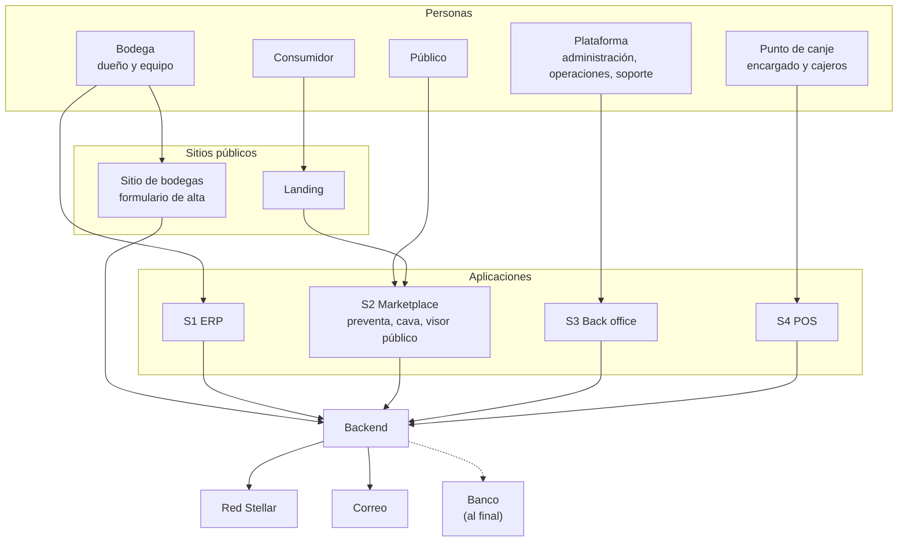

[Abrir en Mermaid Live](https://mermaid.live/edit#pako:eNp1U01vm0AQ_SsjTq3ktPHHKaoiGbuHKE5AwT2VHsbLYG8Cu9tl11UU5b93dnGMqdQL8N5j5s1bhrdE6IqSG0jqRv8RB7QOtmmpADq_21s0B8jJdlphF0iA_Ef6s0zy0l9f17hrpNBl8quXVtkjSyutOt_KStuzkGZrFlI22uO3nf16W3mKDaYaXoF-e2mGLvl6FQy8choqAoHqmWIRKYF2j1WoEfhMVndD0WYbihp0WGvb9i5YtVLJzlkUMtrN1QS0oYC1om4CnTbaOjq1IVWVahS9kE7qjjv3D2AuYg_mm8cQb4Oqkmp_Zos0-ygMOXYxfRcHCyP6Bm2vYOPwvxMsjQn-S8OWp7EHh1kwmMED2hdypkHRH5SxdCTlcMLHdOTrUXbajmYfWkxDiyl8f8oHbh64OaQoXkDXtRQ0aIugLSDPin9HXuZ34SNzUaB6sQhf5YkqKBw1HPhEPyzvNnFTrKWPWdL7WK2Ejhk-YQO1VNh8jnp4gzcPrq5uOXZAvGwR8eFfsLxpPUqzEZzGButVjxYRbbY9msdJ0ywiThHhdIRmIzQfocUl4lvfdHuJQt4z_sJEel-qZAJJS7yrsgq_31uZuAO1fNQ3UCaKPK9tUybv4TX0ThevSrDkrCdmvKnQ0Voib0l7ot__AtnLK08) · [código](diagramas/02-01-actores-y-roles.mmd)

## 3. El ciclo completo del MVP

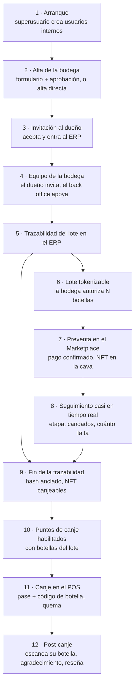

[Abrir en Mermaid Live](https://mermaid.live/edit#pako:eNpllNtu2zAMhl-F8O0SLG7apimGAsOaAgO2Llh7N--CkelEqyy5OnToir57KclWA-yK1oEfyV-kXyphWqouoeqU-SsOaD3cXzcaYFP_aqoamrBY7Fbw2VrUj4E-7ezHKxcGssEFtNKAsIQwLhxI7clq45rqd4KcMOSkQJRHaAkUwo6j7jHROmP7oBLrA-BgzQ6FjB7dUs_AACYvaUl4nLBLxi4n7Ff9JP27DztAGyitapNCoKCBIc9A2luMFzY_txPrlFmnE2vzGORg_k-SjplcZYw4A97lZB_AdJ0UxMmb55LiGWPPJuy9xX-4k0q22DJcgTKeOJtIOErlnH3OJ59v8Yo3D6Ql-6osfckKMHhj-QRueceTUlhEXzFmNWG2lp64bByjfUf7QH5QLEkCDrjnNzS6k7bH1szg9uY-XuVAAp9KNReMvJiQd7QPspdMZVd0Mt73knoWjptBZcE8DqyQQM0lG8dfIXpTHZ26-KYTes3o9YS-kXoU3x9JlogHdAdALVRJk-F_KEpTKq8XsWkXpfbA0VwEpqtwSEAfE0pIrruIV56lsNIAlAn4kghZxO2Pu1E8R9y0IndeK_epc0biDHhe-lJmHUehLrOwNc7PU1ZZLsffPEguvLvj3mJLYlR6xtq6sQMzNGNhPr_iOctmmc1pNme5EfPiPJtVNhfHR-v8xOMiGxYx2zFAfdLoagZVT9wnso1_jJem8gfqWbBLaCpNgZ9MNdVrvBa78-5ZCz7yNhDvhKFFT9cyVtWP269vbMFsrg) · [código](diagramas/02-02-el-ciclo-completo-del-mvp.mmd)

1. **Arranque.** Existe un superusuario (creado en la instalación). Desde el back office crea usuarios internos con sus roles (administración, operaciones, soporte).
2. **Alta de la bodega**, por dos caminos:
   - **A · Formulario** del sitio de bodegas (protegido contra bots). La solicitud llega al back office, que puede aprobarla directamente, rechazarla o **agendar una reunión** antes de decidir.
   - **B · Alta directa** desde el back office, cargando los datos que la bodega envió por cualquier medio (por ejemplo, WhatsApp).
3. **Invitación al dueño.** Al aprobar, el sistema envía una invitación por correo al dueño; al aceptarla define su contraseña y entra al ERP. La bodega recibe su identidad en la red (doc 06).
4. **Equipo de la bodega.** El dueño invita a sus colaboradores con su rol. El back office también puede añadirlos, cambiarles el rol o **bloquearlos** (por ejemplo, un colaborador de mala fe cuando el dueño no tiene acceso). Todo queda en la bitácora.
5. **Trazabilidad del lote.** El equipo registra parcela, vendimia, fermentación, crianza o destilación y embotellado, como hoy, pero con las reglas aplicadas en el servidor.
6. **Lote tokenizable.** En cualquier momento del proceso (desde que el lote existe), la bodega **autoriza** tokenizar ese lote y fija cuántas botellas destina a la preventa. El back office revisa, fija el precio según la configuración y aprueba; entonces se **emiten los NFT** a nombre de la bodega.
7. **Preventa.** El consumidor compra en el Marketplace. Cuando el pago se confirma, recibe **un aviso claro de "pago recibido"** y después ve sus NFT en su cava.
8. **Seguimiento.** El comprador ve en qué etapa está su lote, qué candados tiene y cuánto falta, con una línea de tiempo que se actualiza a medida que la bodega registra.
9. **Fin de la trazabilidad.** Con el embotellado y el laboratorio conformes, el backend calcula el hash del expediente y lo **ancla en la red**; los NFT del lote pasan a **canjeables** y empieza a correr la ventana de canje.
10. **Puntos de canje.** Las botellas llegan a los puntos que la bodega autorizó (la logística la gestiona la bodega). Un punto se habilita de tres formas: lo crea la bodega (si el back office se lo permite), lo crea soporte y le envía credenciales, o el punto **postula** y se enlaza con la bodega.
11. **Canje.** El consumidor genera un **pase de canje** (QR con caducidad en horas). El cajero lo escanea, ve el semáforo verde, **registra el código de la botella** que entrega (opcional o obligatorio según configuración), desliza para confirmar y el NFT se quema.
12. **Post-canje.** Si el consumidor escanea su botella con la sesión iniciada, el sistema lo reconoce como su dueño: le agradece, le invita a disfrutarla y a dejar una reseña. Estas campañas se activan o desactivan desde el back office.

## 4. Ciclos de vida

### 4.1 Lote

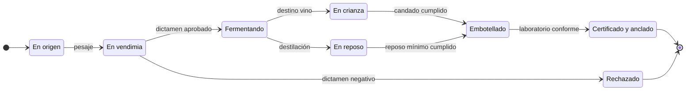

[Abrir en Mermaid Live](https://mermaid.live/edit#pako:eNptk8FOwzAMhl_FyhExaYJbD0howAkJaUhcCAcv9UZQk1RpWmmb9u64SbpmjEsV__nsOL-bo1CuJlGB6AIGetK482gWw520ALX2pIJ2Fl7XYxwRkOLZgvN6R1YKwA7e0voSGMjW2mhMyMcUFdALeUM2oK1dgiZB8Yl_qimv0R5ysVUOLhFPretypXVal4DZuEBNg9NhpVBwK_JBb7ViGfaAVs0Zjzko6DWpbzyciTmM_X_efMFi8VD4k1ZRnBypoKUOf2jcnrQInItVPAcVkK0BSzsMenBXcGldwWPr3Sb3XCIxJ9vIOHVBWwcDf_4lk50ZbFiX_XK5vY9XylUiV3hageLBji6q3rSNTj2kQtdsmh2YsS7VVpvLtIKNuXkSFTS4cR4D_4yc4OzWceNjQgYizFNIR2c7Z1HcgjB8V9T1-ACOUoRv4gIcSGGpDx4bKU4jhn1w73ureCv4nljp23p-L1k-_QKEEiFO) · [código](diagramas/02-03-lote.mmd)

La tokenización no es un estado del lote sino una **marca** que la bodega puede activar en cualquier estado anterior a "Certificado y anclado".

### 4.2 NFT de una botella

```mermaid
stateDiagram-v2
  direction LR
  state "Emitido (inventario de la bodega)" as Emitido
  state "Reservado por un pedido" as Reservado
  state "En la cava, en espera" as EnEspera
  state "En la cava, canjeable" as Canjeable
  state "Con pase activo" as ConPase
  state "Canjeado y quemado" as Quemado
  state "Ventana vencida" as Vencido

  [*] --> Emitido: lote autorizado
  Emitido --> Reservado: pedido creado
  Reservado --> Emitido: pago no confirmado
  Reservado --> EnEspera: pago confirmado
  EnEspera --> Canjeable: lote anclado
  Canjeable --> ConPase: pase generado
  ConPase --> Canjeable: pase caducado
  ConPase --> Quemado: canje confirmado
  Canjeable --> Vencido: pasa la ventana de canje
  Quemado --> [*]
```

[Abrir en Mermaid Live](https://mermaid.live/edit#pako:eNp1k7FSwzAMhl9F5wm4dmHMwFK6MUC5YyEMwhbFXCIHx8kd9Hh35ERJmx6Mkj79ln_ZB2ODI1OAaRMmuvW4j1iv--uSAZyPZJMPDHe7HA8IlGZb--RdgAvPPXHC6AM4ggrhVcT2eFkawBYUO-3cUUuxR-ltQoSOoSGXkYGfi4uzOOta7HEFxEBtQxFVn7dj9A9ukT8IXysa8c0cnvAbuVyDLQHKRXsdRJL3kltwQ7PM_QWfHdU4zfygwQn6lC1hBLHGeqezPg2BcJl8vnqB9fpmMqiAKkgndilE_61qk8eZm40p1C-wkZQ7OrpQbHAfgAUM_OZj_Tes_im9RKfiQM7WTaOyrZSbSyM4OleMnu6JRUG5sXIuN3AWXWf_4NTcYtzk2YDLg9XfQRDzE-h1C47G7tyiekOD7KBkswJTk0h6l7_AoTTpnWp5L4XskalLEavS_GQsb-fxi62UUuxIMl3jjj9G0z-_OvMfNw) · [código](diagramas/02-04-nft-de-una-botella.mmd)

Qué ocurre con un NFT cuya ventana de canje venció (¿se quema, se extiende, se compensa?) es una decisión abierta (doc 04, D-13).

## 5. Flujos entre sistemas

### 5.1 Alta de una bodega (dos caminos) e invitación

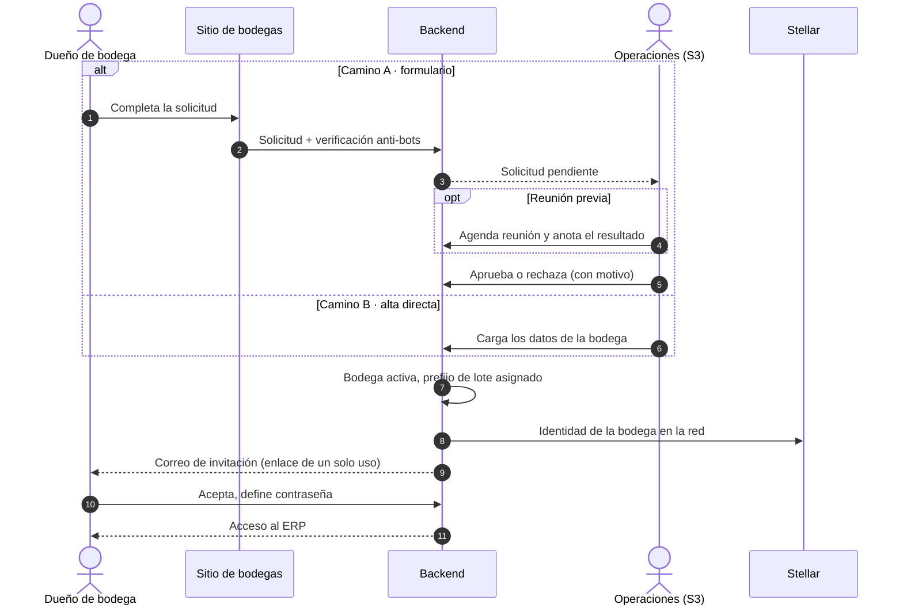

[Abrir en Mermaid Live](https://mermaid.live/edit#pako:eNplU8Fu2zAM_RXCpwxrgBY9DMihQBz30FOKukdfGIlJucmSJ1EBuqL_Psp20rS9GJD4Ht_jo_VWmWCpWkGV6G8mb6hhPETsOw-AWYLP_Y7ieDISIjSACZpMXb6-3t8EsAQ77XDAAhkwChse0Au0dUG2LHwBSl9R68eHAqvR_CFvP2S25XY7UETDwVOCRXv745vE8ygh5ByqxZHtBDbYsw-whuJx9wv2IfZZERwKAqBZ3t219Qo2oR8cCYJDSMFpV8l2grS1YtTbCtpTAX7CkSLv2ailcfpbD-qCl7sgaaIpY6nE7SVt0LmYvNAECYPAE2V_bjFEOjJORYDtSXd9UB5CvIS-ql5Qv-T0PmUnaOeR5uwu-UPMtEMICjUv-A9hYYKHPggfw5gkuUSnrOpTVpofgmXlCH7puMF40KxCAotSvlSC-1j-7KFkMDPqsVY2yke8KpPu-ff4N7ggpLvjg59HmFjt8woerIbFFu0nAe1eDpHOGgpvyg5jpLEl-yPLxWoW5B0aKqXsy34D5DRN3pxDMjSIOrNqzBNoQBIxzf82flZaG0MpaEBw__TY-eoKqp5ij2zL63nrKnmhnjo9dJWnrI1cV70XWHlG7as3WhJdit7kQSM8vbT5-v0__aoopw) · [código](diagramas/02-05-alta-de-una-bodega-dos-caminos-e-invitacion.mmd)

### 5.2 Autorización del lote tokenizable y emisión

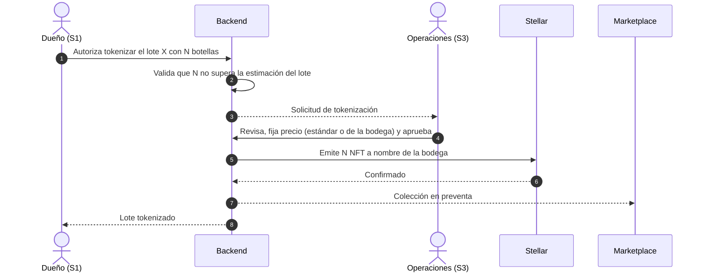

[Abrir en Mermaid Live](https://mermaid.live/edit#pako:eNplUktPwzAM_itWT5vEpD1uPSCtPCQkoIhOiEMvbuJBWJqUNEECtP-OPa3b0G6N_b3s-jdTXlOWQ9bTZyKn6NrgW8C2dgCYonepbSjsXir6AAVgD9eJ6jSdrmceRtVsLN0OQzTKdOgiLJ_uBFWg2pDTR24p1bKjgMp4Rz2TF2fkaiWoKpK1GM6ac2k-YNhQ7Cwqqp1AisnlJZvmsOTEwfwgRM_W_BGALFgfCV5BeQeP0PiddC885gzMF7RGI_AOGOM89ElygkWgPpqWE-8mXjjQe8VBgBXKHCpvOWRMmvsH9wNJsOVg9UxfpscLWJsPhC4QLwNG7CJYmjnNob2osHfDP-cNx_AN2IVEDR5TV6scbloTJe_jLS-NU7dNoH9MgVeryeB85d3ahBa1PwlfzaVhSR1HJCe5vshFPAEWOdzLJofpRCW7gKwlljRajui3zuI7tVTzo84cpRjQ1tlWYHJN1bdT3Io8C1dSpzEOB7cvb_8AflDZMQ) · [código](diagramas/02-06-autorizacion-del-lote-tokenizable-y-emision.mmd)

### 5.3 Compra con confirmación de pago

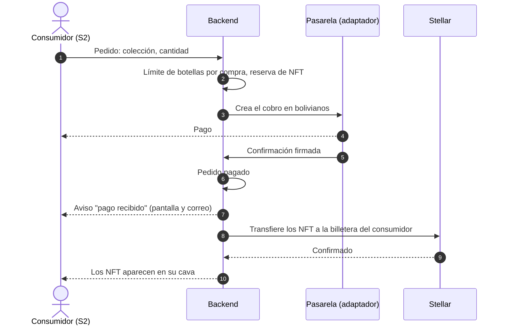

[Abrir en Mermaid Live](https://mermaid.live/edit#pako:eNplUsFqwzAM_RXhUwstjO2Ww6DLWBmMEUiOuSi22pk5dibbhTH675PbZoUOfJHe8_N7sn6UDoZUBSrSVyav6dninnHsPQDmFHweB-JTpVNgqAEj1MHHPFoj9aK9XxZ0Qk5W2wl9gk3zWlhPqD_Jm1u02RawwYhMDmGBBqeEovVPp-0Ks03kHIqFAtfrx0eRr6AhI-9XoIMjrW2f7-52D34FWi5ag6dXhTjT3wqBzGgTgSEYwkk0wiQRdBgnxhUwReIDFvz9pbsKNNsKaiYEcsIdOAB5UXD2YNGHWIjNdi3EWmzhPlwal5dlVjvLI_55hFNp8MbhOZDk38ssZuwsujnYGKBXggVxqe0gzF7BokwJJQd8izFmCsuraNtV0DH6uLPEBC7EkgoQhD5Y5ygRl6wl0_yb5XbbrW-t3_p5m7Xks0jLMOTELKM_SCi1AjWS3LKmrNVPr9IHjdRL0StPOTG6Xh0LrexX--21QIkzSSdPBtO8gpf28Re26t7S) · [código](diagramas/02-07-compra-con-confirmacion-de-pago.mmd)

Mientras no esté la integración con el banco, la pasarela es un **adaptador de prueba** con la misma forma (doc 03 §8).

### 5.4 Seguimiento del lote

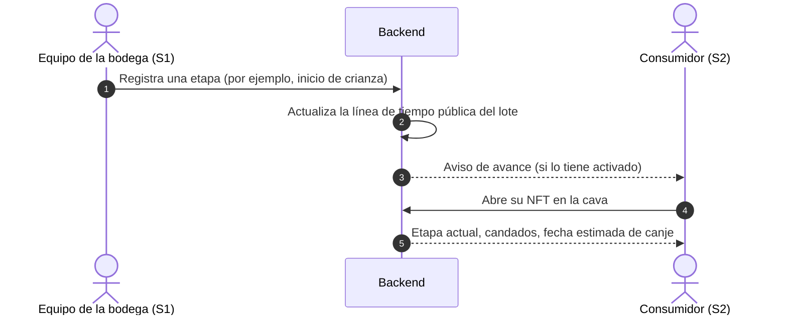

[Abrir en Mermaid Live](https://mermaid.live/edit#pako:eNpVUbtOA0EM_BVrqyAdElCmiBTCIdEgRCiv8e06icO-so9IJMq_4z0REKXH45mxfVY6GFJzUJkOlbymJ8ZtQjd4AKwl-OpGSlOlS0jQA2boD5VjAENgEUYR2CLM1vc3jRYxFdYc0RdYvr00-iPqT_LmT2TV0FXwuTo2Us_WDzLb-v3tYiFTc3inLeeSEKpHoIJRHKJQaU8u2tABe3GZMujE6E84ucvsVWGpS0XLJ2wh7VDv7sh4wjZRWEQCxAZucLSsG2zBhkJXFZFZiciR82SCR5TjwCyzsJqAp7YMH9GEyXn16zsmglzh9fkDyDdzLcP_ZftpIZwSdtL3RmRyBxvSO1k3F3ZopqjS20sm1YFylByyac86D6rsyNEgxaA8VbmUHdSl0drX1l9eS6ukSoLUaLBcH_sDX74BZiCnBQ) · [código](diagramas/02-08-seguimiento-del-lote.mmd)

### 5.5 Fin de la trazabilidad y anclaje

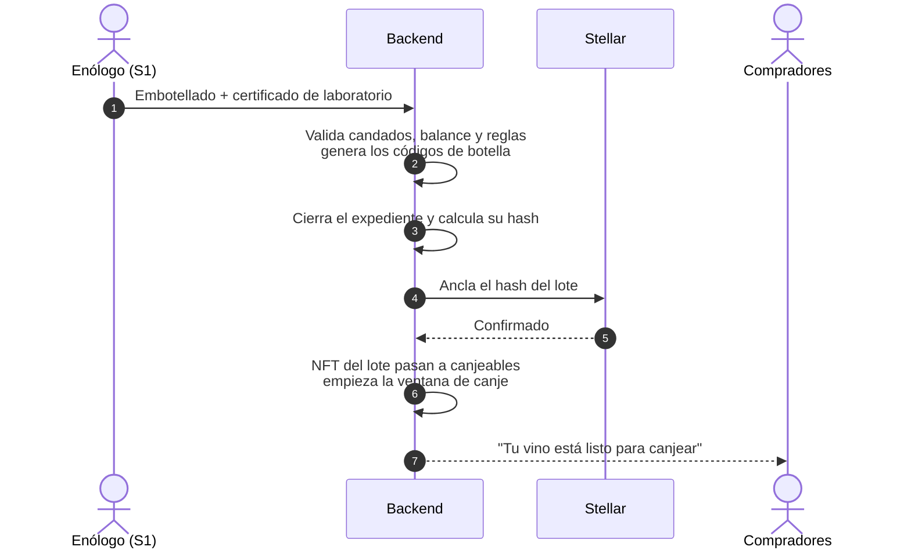

[Abrir en Mermaid Live](https://mermaid.live/edit#pako:eNpdkk9P3EAMxb-KNaeiggritqpWossicUFIiXqaizPjzQ5MPGH-oFLEd68dWIr2aD-_3_glfjUueTIrMIWeGrGj64BjxskyALaauE0D5aVyNWXYAhbYsm3n57vLmMYE37qLE9VnzDW4MCNXuLq_1blf6B6J_bHa9Sp2lWLEL-iNdjdpmjP6lKlYVm17tl4LbgXbaUiLxSf4Do6EtwtOK08QcUgZhRKSmsRwsP3GGDyCQ_YyW05hwIiSE14g0xix_Bzyj_VITBkhpgLuPZsPoxSC_nj1CLsJlMVAEejPTD4QV0U6jK5FhNJgj2X_39T1K7hiFxeLSoKO8l4lnen6s09w4l3Ik-x69OLdTf_pkc9ZkGGJ9UA4RHqPQdMc6K_kQHiWjZBREyxDB5rgNiuwpm_wHDgBlaqB6QJiKDXpjzpgszWWzSmYiWSh4PVMXq2pe5rIGoUwtZoxWvOmY3ov3Qs7kWpuJJ02e6yHk_pov_0D0qPRwQ) · [código](diagramas/02-09-fin-de-la-trazabilidad-y-anclaje.mmd)

### 5.6 Canje en el punto

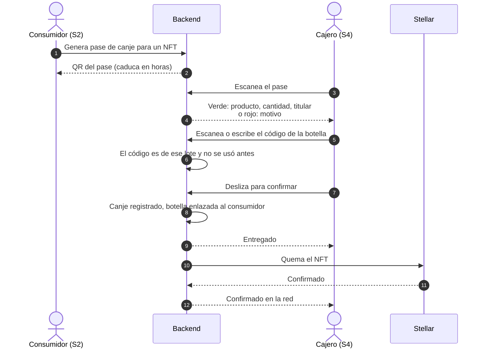

[Abrir en Mermaid Live](https://mermaid.live/edit#pako:eNptUktPG0EM_ivWnkBKVER7WqFI7QJVFakqbNTTXpwZEyadHaeeGSRA_Pd6djekAY62v4dfz5VhS1UNVaS_mYKhS4cbwb4LAJgTh9yvSYbIJBZoACM0HGLundX4pD0_LdUdSnLG7TAk-PrrR0F9Q_OHgj1wlwMXtySsvC_veO2qANpE3qNalnIzXyxUrobvFEhQ4ZHAEhgMWypkhBzg5_WqgBU4V3xTw82tgvyIPjFos0GgAPcsGAfb5V73KqoUaXVE_yezrOE3iaUadsKqkHhWbJOzaGeQXMra5cVaPi0YhLdcQ8_JPfCH8gwUjbg1FSPT5bOzu8_WbbjM4hHWPAy9d9-Tj6EUC5p0JK9weITAoEGOIwa0N4pH7pcUvXvCcU-Gw52THuWNSzOsUmjjYhK0OuXUjW7M4xNaBPSFPZ38eEVXISlVaQfVdqUHyNQPS51O067mr35THwfKqHTIl1OpvZD-TjWDqidNO1u-9Lmr0j311GnQVYGytuy76qXAyru2j8FoKUkmzeSdxbT_6Cn98g88T_YM) · [código](diagramas/02-10-canje-en-el-punto.mmd)

### 5.7 Escaneo público y post-canje

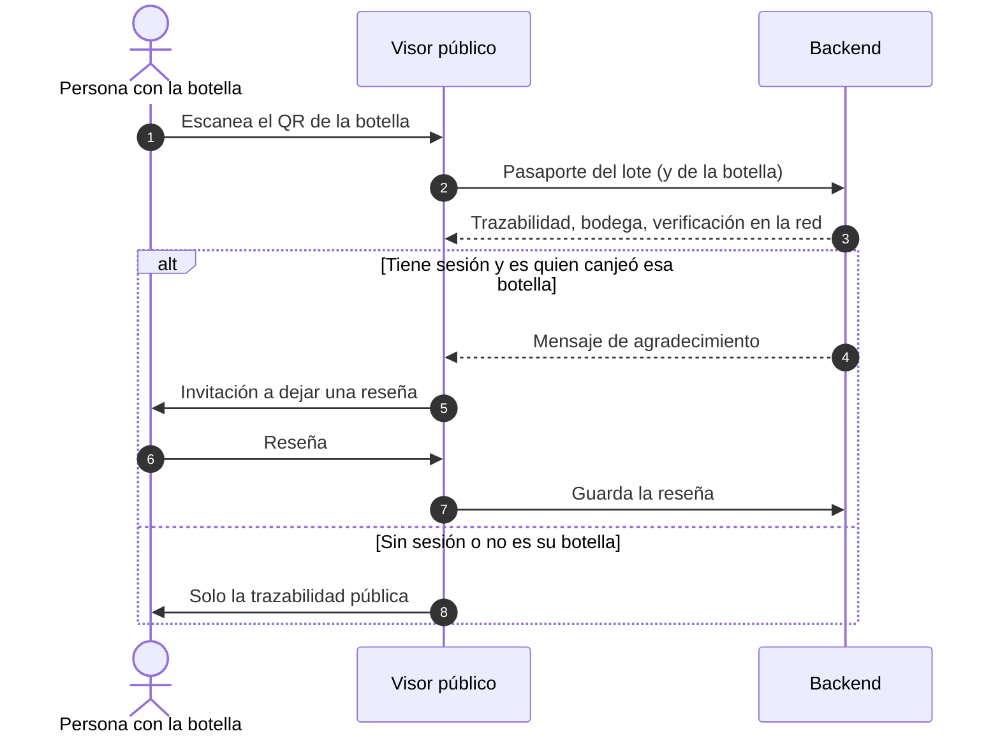

[Abrir en Mermaid Live](https://mermaid.live/edit#pako:eNpdkk1vwjAMhv-KldMmgcTYrQekTZsmDpM6inbqxSSGhaVOyQcSQ_z3JS1slGPsx_b7Oj4KaRWJAoSnXSSW9KJx47CpGQBjsBybFbnuJYN1UAJ6KMl5ywjSMhiElQ1kDGaoRRe01C1ygGqa2U_tU1lbx8lkjSujpb3lnsp5Bp9RfhOrmnO-HM9m1bSAVy-RCYEMfCxA0c24apq4VF9AiR5b6wIlyIBJCNwdhgX3uSLB43PvpcMfXGmjFapRghRtcAR7cnqtJUrdSX5koM6kI9VtwQRYamICT_4POQB52MUUh6R3S308BQdqB9PfiT1us1zIC1ckdZPqg-3JzllZwJz3OlyJwVSwRQeRsyTfT3o4t79sbXGb-N_TW0SnsDc0gMh4gkrzwJcFttmaj0MfF3WVNTb3ClervP7rvnP-VDEC0ZBrUKt8bcdahC9qqE6PWjDF1MHU4pSxfHbVgWVKBRcpRWKrMFwu8xw-_QIjHuU4) · [código](diagramas/02-11-escaneo-publico-y-post-canje.mmd)

## 6. Configuración desde el back office

Casi todas las reglas y límites se configuran desde el back office con **dos niveles**:

- **Estándar general**: el valor que se aplica a todas las bodegas.
- **Ajuste por bodega**: un valor propio para una bodega concreta, que prevalece sobre el estándar.

El back office puede aplicar un valor a **todas o a una selección** de bodegas, y devolver una bodega al estándar. Algunos parámetros son **solo generales** (por ejemplo, la caducidad del pase de canje). Cada cambio queda en la bitácora y los lotes en curso conservan las reglas con las que empezaron (doc 07 §4).

| Grupo | Ejemplos | Niveles |
|---|---|---|
| Reglas de trazabilidad | Altitud mínima D.O., cepa exigida, reposo mínimo del singani, crianza mínima, límites de laboratorio, merma tolerada | General y por bodega |
| Precios | Política de precio de preventa, precio por colección | General y por bodega |
| Compras | Máximo de botellas por compra (10 por defecto, o ilimitado) | General y por bodega |
| Canje | Caducidad del pase (horas), ventana de canje (30 días por defecto), código de botella (desactivado, opcional u obligatorio) | Caducidad: solo general. El resto: general y por bodega |
| Puntos de canje | Si la bodega puede habilitar puntos, máximo de puntos, máximo de cajeros por punto | General y por bodega |
| Campañas | Agradecimiento post-canje, recordatorio de reseña, promociones | General y por bodega |

La lista completa de parámetros, con tipo y valor por defecto, está en `05-catalogo-funcional-backend.md` §4.

## 7. Reglas de negocio

| # | Regla | Configurable |
|---|---|---|
| R1 | Singani D.O.: altitud mínima de la parcela (1.600 m s. n. m.) y cepa Moscatel de Alejandría, calculado en el servidor | Sí, general y por bodega, con aviso si se baja del mínimo legal |
| R2 | Reposo mínimo del singani (180 días desde el fin de la destilación) antes de embotellar | Sí, ídem |
| R3 | Crianza del vino: no se embotella antes de la fecha del candado que fija el enólogo | El candado lo fija el enólogo; se puede configurar un mínimo |
| R4 | La uva sin dictamen fitosanitario aprobado no entra a fermentación | Sí |
| R5 | Botellas × volumen ≤ litros disponibles del origen, con la merma tolerada | Sí (merma tolerada) |
| R6 | NFT emitidos de un lote ≤ cuota autorizada por la bodega; tras el embotellado, ≤ botellas embotelladas | No |
| R7 | Precio de cada colección según la política estándar o la de la bodega; siempre en bolivianos | Sí |
| R8 | Máximo de botellas por compra (10 por defecto, admite "ilimitado") | Sí |
| R9 | El pase de canje caduca en horas; al caducar se puede generar otro | Sí, solo general |
| R10 | Un NFT solo se canjea dentro de su ventana de canje (30 días por defecto desde que es canjeable) | Sí |
| R11 | Un NFT solo se canjea en puntos habilitados para su lote, una sola vez; la confirmación es idempotente | No |
| R12 | El código de botella registrado en el canje debe pertenecer al lote y no haberse usado | Modo configurable |
| R13 | La quema se ejecuta al confirmar el canje; el canje no espera a la red | No |
| R14 | El escaneo de una botella es público; dejar una reseña exige sesión | No |
| R15 | Un registro de trazabilidad no se borra ni se reescribe; se corrige con un registro nuevo | No |
| R16 | Solo bodegas activas operan el ERP; solo puntos habilitados operan el POS; un colaborador bloqueado no entra | No |
| R17 | Toda acción del back office sobre bodegas, colaboradores, puntos, configuración o NFT queda en la bitácora | No |
| R18 | Ninguna clave privada sale del backend; el consumidor nunca paga comisiones de red ni ve cripto | No |

## 8. Alcance del MVP

| Dentro | Preparado, se integra al final | Fuera por ahora |
|---|---|---|
| Back office completo, ERP, preventa, cava, seguimiento, canje, puntos de canje, visor público, reseñas, campañas por correo, bitácora, configuración | Pagos con el banco (adaptador de prueba mientras tanto) | Facturación y notas de venta, liquidación a bodegas, SMS, textos legales definitivos (se tienen presentes), mercado secundario, KYC, cripto como medio de pago, corchos NFC |

Solo bolivianos. Mayoría de edad por declaración, como en las landings.

## 9. Glosario

| Término | Significado |
|---|---|
| Lote | Unidad de producción que recorre la trazabilidad y puede tokenizarse |
| Lote tokenizable | Lote que la bodega autorizó a vender en preventa, con su cuota de botellas |
| Cuota | Número de botellas del lote destinadas a la preventa |
| Colección | Lote tokenizable publicado en el Marketplace con precio |
| NFT | Token único que representa una botella de un lote |
| Cava | NFT que posee un consumidor |
| Código de botella | Código alfanumérico único impreso en cada botella, junto al QR |
| Pase de canje | QR temporal que el consumidor genera para canjear un NFT |
| Ventana de canje | Días durante los que un NFT canjeable puede canjearse |
| Punto de canje | Licorería, cava o bodega habilitada para entregar botellas de ciertos lotes |
| Quema | Destrucción del NFT al confirmar el canje |
| Anclaje | Publicación en la red del hash del expediente del lote |
| Pasaporte | Página pública con la trazabilidad de un lote o botella |
| Estándar general / ajuste por bodega | Los dos niveles de configuración del back office |
| Bitácora | Registro de auditoría de quién hizo qué, cuándo y desde dónde |
