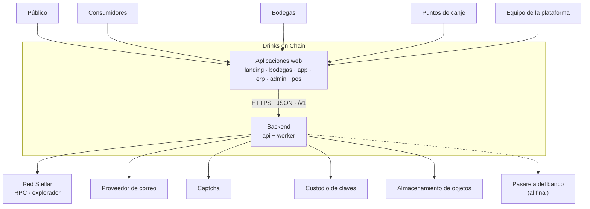
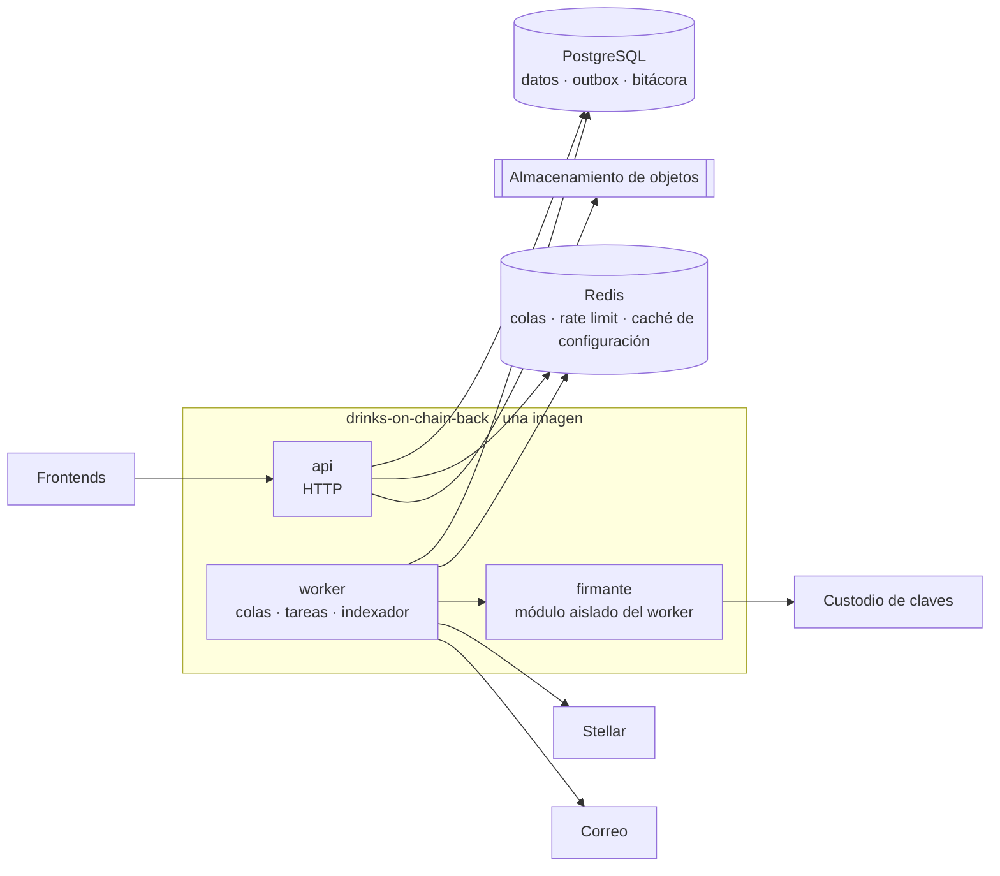
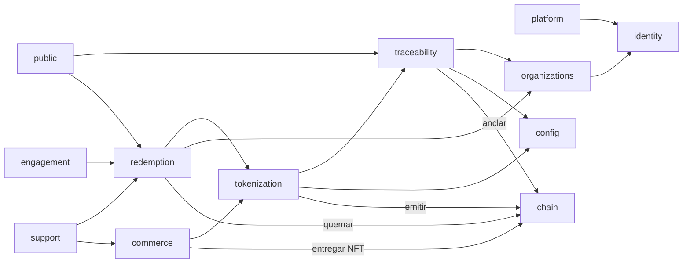
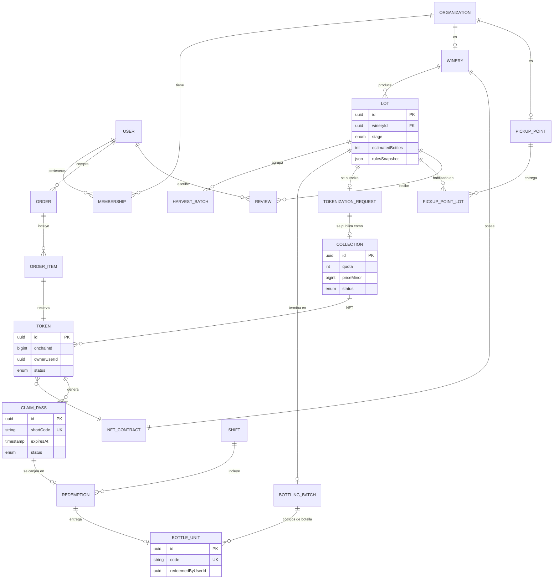
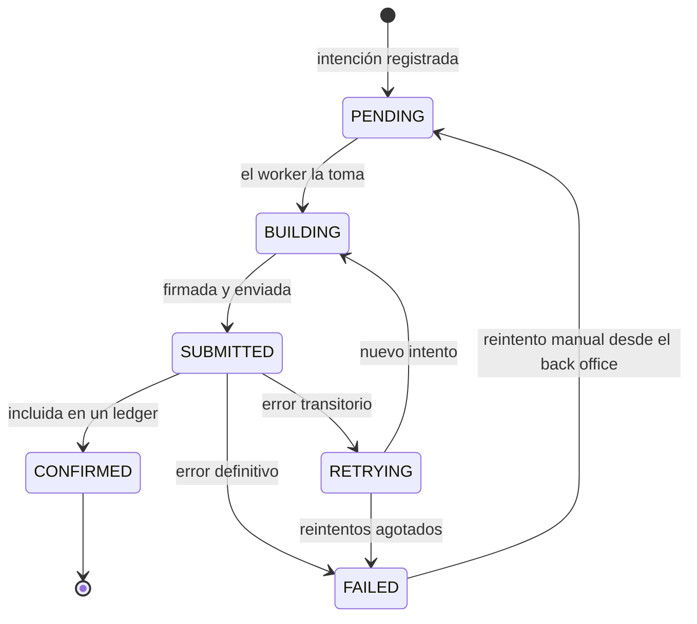
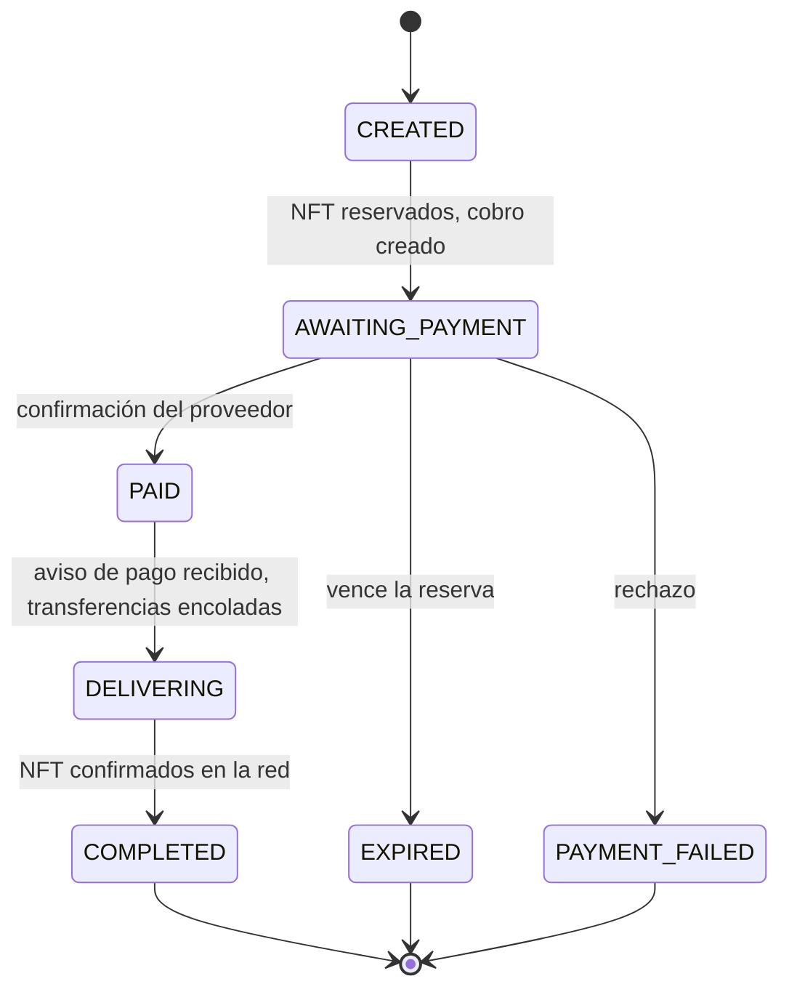
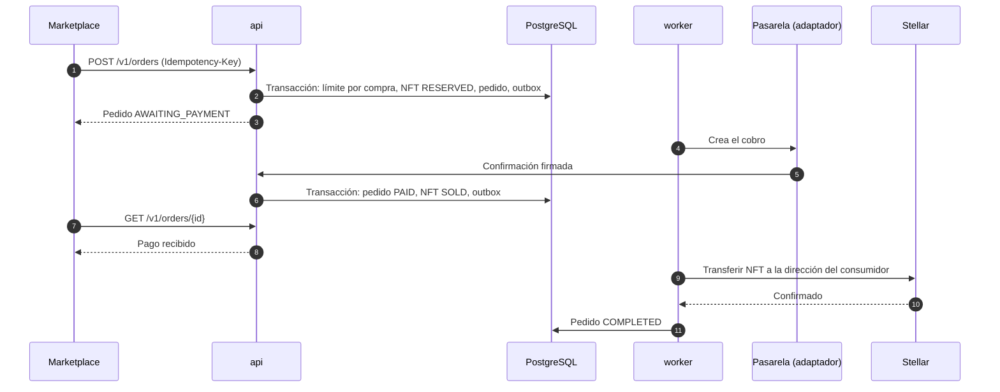
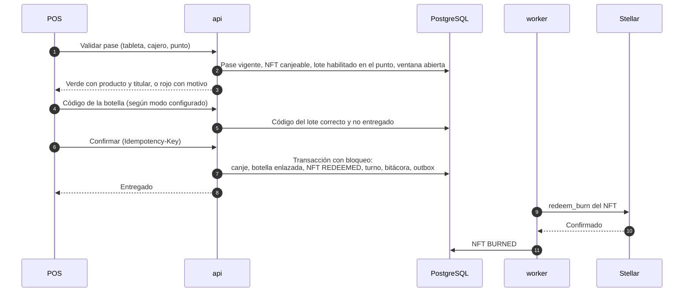
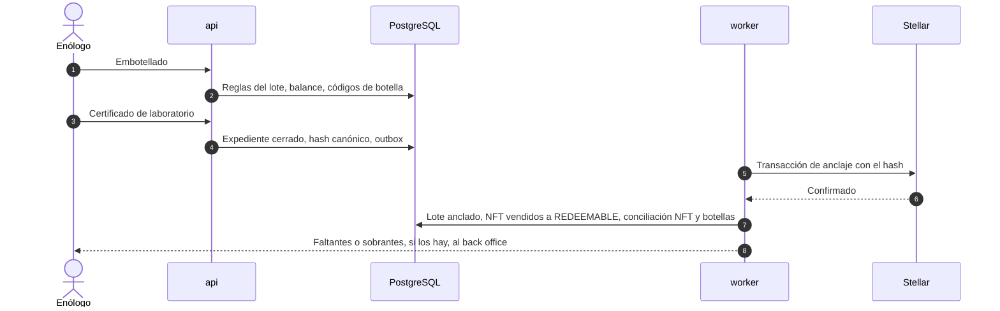

# 03 · Visión del backend

> **BORRADOR** · versión 0.2 · 27 de septiembre de 2026. Sustituye a la v0.1 (en `antiguo/`). Arquitectura propuesta para todo el backend de Drinks on Chain con las decisiones del 27-09-2026: NFT por botella con contrato por bodega, preventa desde el inicio, billeteras gestionadas por el backend, configuración en dos niveles, bitácora, botellas serializadas y pagos al final. Lo funcional está en los docs 02, 05 y 07; la parte en la red, en el 06.

## 0. La propuesta en diez puntos

1. **Un repositorio de backend** (`drinks-on-chain-back`) como **monolito modular**, desplegado como una imagen con dos procesos: `api` y `worker`. Más un repositorio pequeño de **contratos** (`drinks-on-chain-contracts`) para el NFT, y esta documentación.
2. **Se evoluciona lo que hay**, no se reescribe: NestJS, Prisma, PostgreSQL, Redis, el contrato del ERP y las reglas de código del equipo (`docs/rules/`) con algunos ajustes.
3. **PostgreSQL es la fuente operativa; Stellar es la prueba pública.** En la red solo están los NFT, la identidad de cada bodega y el hash de cada lote.
4. **El Lote pasa a existir en el servidor** desde el inicio del proceso: es lo que se tokeniza en preventa y lo que sigue el comprador.
5. **Cada NFT es una fila con su propio estado** (emitido, reservado, vendido, canjeable, con pase, quemado) conciliada con la red.
6. **Configuración en dos niveles** (estándar general y ajuste por bodega) resuelta por un servicio central, con instantánea de reglas en cada lote.
7. **Bitácora inmutable** de toda acción relevante, consultable por el back office y por cada organización.
8. **Todo lo externo sale por outbox + colas**: red, correo y, al final, el banco. Idempotencia en todo lo que mueve valor.
9. **Identidad por audiencia y roles por membresía**: plataforma, bodegas, puntos de canje y consumidores; invitaciones en lugar de contraseñas enviadas.
10. **Operable desde el primer día**: CI, contenedores, entornos declarados, logs JSON, métricas, alertas y copias probadas.

## 1. Principios

| Principio | Qué significa aquí |
|---|---|
| Invariantes en el servidor | Las reglas R1–R18 (doc 02 §7) se validan en el backend con datos del servidor y la configuración vigente del lote |
| La base de datos manda, la red certifica | Registrar un canje no espera a la red; la red recibe emisión, transferencia, quema y anclaje de forma asíncrona |
| Asíncrono, reintentable, idempotente | Toda llamada externa sale por una cola; toda operación de valor acepta `Idempotency-Key` |
| Registro inmutable | Append-only, correcciones compensatorias, bitácora encadenada por hash |
| Configurable sin tocar código | Reglas, precios y límites vienen del servicio de configuración |
| Mínimo privilegio | Roles por organización; el firmante solo acepta intenciones de dominio |
| Monolito primero, fronteras claras | Un módulo no lee tablas de otro; se comunican por servicio público o evento |
| Compatibilidad con el frontend | Cambios aditivos en `/v1`; lo incompatible se acuerda y se anuncia |

## 2. Repositorios

| Repositorio | Contenido | Estado |
|---|---|---|
| `drinks-on-chain-back` | Todo el backend: módulos, API, worker, migraciones, pruebas, Dockerfile, CI; publica el OpenAPI | Existe; se evoluciona |
| `drinks-on-chain-contracts` | Contrato NFT en Rust (Soroban) sobre OpenZeppelin Stellar Contracts, pruebas, scripts de despliegue por red | **Nuevo** (A-01 exige contrato propio) |
| `drinks-on-chain-docsback` | Esta documentación | Existe |
| `drinks-on-chain-mocks` | Tipos y datos de prueba del frontend, generados a partir del OpenAPI del backend | Existe (frontend) |

Por qué no microservicios ni un backend por sistema: los cuatro sistemas comparten el mismo modelo (lote, NFT, pase, organización) y las mismas transacciones (pagar → reservar → entregar NFT; canjear → quemar). Separarlos obligaría a transacciones distribuidas desde el día uno con un equipo pequeño. Las fronteras de §5 permiten extraer un módulo más adelante (por ejemplo, el firmante o el indexador) sin rediseñar.

Estructura objetivo de `drinks-on-chain-back`, evolución de la actual:

```
src/
  main.ts                 # proceso api
  worker.ts               # proceso worker: colas, tareas programadas, indexador
  modules/
    identity/             # cuentas, sesiones, invitaciones, recuperación, PIN, tabletas
    platform/             # usuarios internos y sus roles
    organizations/        # bodegas, solicitudes, puntos de canje, membresías
    config/               # parámetros, estándar general, ajustes por bodega
    audit/                # bitácora
    traceability/         # lote, parcelas → embotellado, laboratorio, códigos de botella, expediente
    tokenization/         # solicitudes de tokenización, colecciones, NFT (estado por token)
    chain/                # firmante, transacciones, contratos, indexador, conciliación
    commerce/             # pedidos, reservas, adaptador de pasarela
    redemption/           # pases, canjes, turnos, entregas asistidas
    public/               # pasaporte público, perfiles públicos
    engagement/           # reseñas, campañas, notificaciones, correo
    support/              # tickets
  shared/                 # outbox, idempotencia, errores, paginación, storage, config de entorno
```

## 3. Contexto (C4 · nivel 1)



<sub>[Abrir en Mermaid Live](https://mermaid.live/edit#pako:eNpNk8Fu2zAMhl-F0GnD1rU7DSiGArGdom3Sxaiz07wDbTGJGlnSZDnZ0PbdR7m24Zt-_jQpfaRfRG0liWsQO23P9QF9gG1SGoD8Z_KrFHnZXV3tsNKqtqX4HY1084ON1Jq2a5S0ntrBSDYZGwnX2-MYy7M0VulMsC1IghrNM43eesve8k-nnI2eRnAaA-6sb7DPiVltV-09ugNkm1gq88ocW7AG0gMqM5QCuF2yuXB8T6yVNdTCmarvlb-80WikMnuIL6m-QfV-v1Gic-OR_HRE2SgzCmfbqU0S2yRYH8nIvjo6BZ_gbP2R_JDF1vvVi_i-J5JQBNIaff_BU55ODf86bT0yw-HLx8X9OuLy9kTE4Z6Y9Z4m9os8skcXeFRDbPVYxFjXBitVD7LWeJqmskkeIhndYE0GG0U8iphkq2cK08uSVeyLLXriMUjSUKGpbX_jD6hhpwzqj9NQeDng4uKGqQ8bMVO8BjPFCzBX6-1M3S6jeC3F3XabFyOVh4LLDefL09dSvDL1vnCfzlRnIhKbSeYzU0xmphjEqL6wTFalEZ9BNMTbpmT8BV5KEQ7U8H5eQykMdcGjLsVbTMMu2OKfqdkKviOOdE5ioEwhr2czhN_-A-4VBfg) · [código](diagramas/03-01-contexto-c4-nivel-1.mmd)</sub>

## 4. Contenedores (C4 · nivel 2)



<sub>[Abrir en Mermaid Live](https://mermaid.live/edit#pako:eNplUsGO0zAQ_RXLJ5CIWMQBgdBKXSpK2a4ISSUONYeJPW1NHU_l2Oyi1f77jp2mFHFK3rw3z_M08yg1GZQfhNw6utd7CFGsGuWFmNV1u1HycyAf0ZtByZ_KZ2JI3S7AcS9uQB-YYZEJ1h-GinzFDtZXHTNCpaur7p1IHoTtYYe-OAiRrZfcBEf7sQuvr7-s1_WZ-tHcMnVP4YChsJocDJNXhIB_kfUGH8BQOHe3ywV3b23ogYcu_X0Wb9-a5EiAHRzrhUEnxidOnZxizFYvNi-UrGmIu4Dt91WxMBDp_Cil2NHDhDob8x--0RRAyZfFrZlnkwaNHf6PECCicLa3capo0Pti8p4HE5r81u5SAG3Hyf1k--3m64bTzVwPGj30Fn3MWQR1v5An5CxFd3uX9_YpDZGMLQLt4DcOp6ztmtk2onMwxb-bLVe5hUJAOu85H4Coquu8rhEvC6wXl6iZXyKeMUPe4oV0QqN0Qryr8uVx_ymvL1GeTHn5SsgeeanW5Et9VDLusUfFQEmPKQZwSj5lGaRI7R-vmYohIVfSkfeHcwt8tP2p_PQMGpXvKQ) · [código](diagramas/03-02-contenedores-c4-nivel-2.mmd)</sub>

- **api**: sin estado; valida, autoriza, escribe en PostgreSQL y en el outbox en la misma transacción y responde. Nunca espera a la red ni al correo.
- **worker**: publica el outbox en colas; envía transacciones a la red, correos y campañas; ejecuta tareas programadas (candados, caducidad de pases y reservas, ventanas de canje, TTL de contratos, conciliación); indexa eventos de nuestros contratos.
- **firmante**: única pieza que pide firmas al custodio; acepta intenciones como "quemar el token 57 del contrato de la bodega B por el canje 8841" y rechaza cualquier otra cosa.
- En el MVP **no hay relayer** (billeteras custodiales derivadas, doc 06 §4); aparece en Fase 2 con las cuentas inteligentes.

## 5. Módulos



<sub>[Abrir en Mermaid Live](https://mermaid.live/edit#pako:eNptks1uwjAQhF8l8rm8QA89lJ-24icohFPdw-JsgtXYTo2tigLv3nVwqJF6nG_tycw6JyZMhewxY3VrvsUerMsWBddZ9jZZvXMmK9ROuiNnHwGuF-WSaNeCq41VkebFC0FjG9DyB5w0-hAn41mYCKNr2URUFmNCzoJA2Mn2z7vM52FgPnFwGUxeQxLKJm8kX_a2SqEVGGExnRC0WKHqktvr7XMf2e9aKSKbrkIs1A00qKhgxJvtmvDBd52xVzZ0zkajp7CR2DaV1KeXhFNJzWOpXhJO5f30TFmUdNJydg5tEx8agRYtpCNqf_XM54kMJtpZbMBmq1mZnKfFpOcHGQNHSde_PKq7D4XVpelvmu7ENaaS1vefpHxcs4eM0WMpkFX42U700HtaPSfBmUZP_0PL2SUcA-_M5qgFjZz1SMR3FTicSGgsqIgvvzCh0pM) · [código](diagramas/03-03-modulos.mmd)</sub>

`audit` no aparece en la figura: todos los módulos le escriben. Tampoco el correo, que está dentro de `engagement` y recibe eventos de casi todos.

| Módulo | Responsabilidad | Entidades propias | Eventos que publica |
|---|---|---|---|
| `identity` | Cuentas, credenciales, sesiones, invitaciones, recuperación, verificación de correo, PIN de cajeros, tabletas | `User`, `Session`, `Invitation`, `Device`, `CashierPin` | `user.registered`, `invitation.accepted`, `session.revoked` |
| `platform` | Usuarios internos y roles de la plataforma, 2FA | `PlatformMembership` | `platform_user.blocked` |
| `organizations` | Solicitudes de alta, bodegas, puntos de canje, membresías y su bloqueo | `WineryApplication`, `Winery`, `PickupPoint`, `Membership`, `PickupPointLot` | `winery.activated`, `member.blocked`, `pickup_point.enabled` |
| `config` | Parámetros, estándar general, ajustes por bodega, instantáneas | `SettingDefinition`, `SettingValue`, `SettingOverride` | `setting.changed` |
| `audit` | Bitácora | `AuditEvent` | — |
| `traceability` | Lote y cadena de producción, laboratorio, códigos de botella, expediente, línea de tiempo | `Lot`, las 11 entidades actuales, `BottleUnit`, `LotDossier`, `LotEvent` | `lot.stage_changed`, `lot.bottled`, `lot.certified` |
| `tokenization` | Solicitudes de tokenización, colecciones, estado de cada NFT, cierre y faltante | `TokenizationRequest`, `Collection`, `Token` | `collection.approved`, `token.sold`, `token.redeemable` |
| `chain` | Contratos por bodega, direcciones, firmante, transacciones, indexador, conciliación, TTL | `ChainAccount`, `NftContract`, `ChainTransaction`, `ChainEvent` | `chain.tx.confirmed`, `chain.tx.failed` |
| `commerce` | Pedidos, reservas, adaptador de pasarela, confirmación de pago | `Order`, `OrderItem`, `Payment` | `order.paid`, `order.expired` |
| `redemption` | Pases, validación, canjes, código de botella, turnos, entregas asistidas | `ClaimPass`, `Redemption`, `Shift`, `AssistedDelivery` | `redemption.confirmed` |
| `public` | Pasaporte de lote y de botella, perfiles públicos, verificación | — (lee de otros) | — |
| `engagement` | Reseñas, campañas, notificaciones, preferencias, correo | `Review`, `Campaign`, `Notification`, `EmailMessage` | `review.created` |
| `support` | Tickets | `Ticket`, `TicketMessage` | `ticket.created` |

## 6. Modelo de datos objetivo (entidades nuevas)

Se conservan las entidades del ERP actual con los ajustes del doc 01 §9. Estas son las principales que se añaden:



<sub>[Abrir en Mermaid Live](https://mermaid.live/edit#pako:eNp9lV1vmzAUhv-KxfUqVdpd7whxW5QEGJBWmyIhB86IK7CZsdtlSf77DDGJk5RKuYiPn_P1-tjsnJwX4DwgB8SUklKQesUQCuMnN_B_uakfBmi_v7vjO7TAiwmOk2c_Qg9o5UgKDFZORy8THI9QDQipudyQt3H36NUPcPyzp6EdxyLfmy2jLAr9IL2Ajb_JPw-Pu43ghRrSdkaz_-zGLzhJs4mbes89qZtWDbkC92gSpuncD54sUoKoKSMI2JG-QkyG3oqzZeAfK8lX6v7-9_eClrxFBaA1l1BVtwnTcIaHprMY_1jqMvsALSCiJBf0n3H6lDRRvHA-x14vnPFt1LqiOUE5r_nR32JMzX3E3iF4TG9k3e-RNmdeGKSx6xl9eQtglYMO_HPwnb7DSTF7UsJ4qhe9QrxuBBmOfnqFZH6KFz1HWV6pLVjgcc_UeG5CQAvi3VZriOjNXX-RRW6S9GCpZ3PIbG0ZLWM8xYvI1jIn7A3OA2AB9tRYhw9MCihNhosRNgXZtmwY3gsva3g_hTdkTSsqScFPdenr93hyuuriQkT7PGL84uNXc7VyQde3l8dCBOSGGJhd9wchpWiB9C-aWesPqnXe-gV6NFZgqkatJCUc15RJBK2kNZFQTLiUlb7e_c5byxkSSq8TRpp2w2VnP5xPdiTvmpZdUM7yDaHMLyyKf-hqlnpEButQjVTtKbh9kiMpWikoK1H3gqKl3a6AAqDWjWzPWQ5XM_Z1TN2nkJ4dWGujBSJ1g-BvQ_WEu3K8eOuGj-TptPmjuCQXajWC5rCgjIux2M435NT6HSS06L4aO_0qbnSrK6cbCgZKClKtnEOHdY9WsmW53pJCgbaoptDna74zxnz4D2iNBa8) · [código](diagramas/03-04-modelo-de-datos-objetivo-entidades-nuevas.mmd)</sub>

Otras entidades: `WineryApplication`, `Invitation`, `Device`, `Shift`, `AssistedDelivery`, `Payment`, `ChainTransaction`, `ChainEvent`, `SettingDefinition`, `SettingValue`, `SettingOverride`, `AuditEvent`, `Campaign`, `Notification`, `EmailMessage`, `Ticket`, `OutboxEvent`, `IdempotencyKey`.

Estados de un NFT (`Token.status`) y su relación con la red:

| Estado | Significado | En la red |
|---|---|---|
| `MINTED` | Emitido, en inventario de la bodega | A nombre de la cuenta de la bodega |
| `RESERVED` | Apartado por un pedido pendiente de pago | Sin cambio |
| `SOLD` | Pagado, en la cava del consumidor, lote aún en proceso | Transferido a la dirección del consumidor |
| `REDEEMABLE` | Lote anclado, dentro de la ventana de canje | Sin cambio |
| `PASS_ACTIVE` | Tiene un pase vigente | Sin cambio |
| `REDEEMED` | Canje confirmado, quema en curso | Quema encolada |
| `BURNED` | Quema confirmada | Quemado |
| `EXPIRED` | Ventana vencida (tratamiento en D-13) | Según D-13 |

Invariantes comprobados por la base de datos: un solo pase activo por NFT; un solo canje por pase y por NFT; un código de botella se entrega una sola vez; NFT emitidos ≤ cuota y, tras el embotellado, ≤ botellas.

## 7. Integración con Stellar (resumen)

El diseño completo está en el doc 06. En resumen:

- **Contrato NFT por bodega** a partir de un código basado en OpenZeppelin Stellar Contracts, con funciones propias mínimas de emisión en lote, transferencia y quema por el operador.
- **Direcciones de consumidor derivadas** de una semilla maestra (SEP-0005), sin fondear; coste cero por usuario.
- **Anclaje** del hash del expediente con una transacción clásica al certificar el lote.
- **Firmante** con claves en Vault Transit o AWS KMS; **indexador** propio sobre Stellar RPC; **tarea de TTL** para mantener vivos los contratos y los NFT.

Estados de una transacción en la red (`ChainTransaction`):



<sub>[Abrir en Mermaid Live](https://mermaid.live/edit#pako:eNplkstOwzAQRX9l5CWiUgW7LJAobVGktqA-FgizMPEkjJqMkWMHVVX_HTuPotKl5557NQ8fRWY0igRE7ZTDKanCqmrU3EkGeL_5gNHoAV5nq2m6ek6A2CFnJP14nN8zWCyodlZpFemeah2TXbroLFjCj7F7tFAqcKZq0UFu2c1usky329k0gZxsFdLgAMgN9blnvaWfXlbzdL2MNHFWego4MniGEnWB9tqxnm3Xb10v1hoLoWGuyRlLJsKD_K9v9tiYbmBnrkPnj-ki9tBFasyJyVFznTiAFvusGlRhnNKmjmwnX275jEKl2KsyxNca4yY_VbYHk-eUYTSfd9H6w7Uki1sQFYYtko5HPUrhvrBCGR5SMPowfCnFKWLKO7M5cBYkZz2Giv_Wf3-gL59-ATHVq2k) · [código](diagramas/03-05-integracion-con-stellar-resumen.mmd)</sub>

## 8. Pagos (preparados, integración al final)

- **Adaptador de pasarela** (`IPaymentProvider`, ya diseñado por el equipo en `docs/analisis/06-interfaz-pagos-y-qr.md`) con una implementación **de prueba** que aprueba, rechaza o demora según el escenario. La integración real con el banco se hace al final (A-14).
- **El pedido se marca pagado solo por la confirmación del proveedor** (notificación firmada o consulta), nunca por la redirección del navegador.
- **Aviso de pago recibido**: el pedido tiene un estado consultable que el Marketplace muestra como "pago recibido" antes de enseñar los NFT, y se envía un correo (A-23).
- Importes en **bolivianos**, en enteros de centavos; los campos en dólares y los métodos `XLM`/`USDC_STELLAR` de la documentación del backend se eliminan (C18).



<sub>[Abrir en Mermaid Live](https://mermaid.live/edit#pako:eNp9Ul1rwjAU_SuXPI4Ksr31YVDWOArqiiv7YB0Sk6sG2kSStrCJ_303UXEbbE9JTs6599yT7Jm0ClkKzHeiw1yLjRPtaLiuDcDb1TuMRrdwt-BZxfMAnbYRzp6zoirm98sye53xeZXCfFKBQ49uEMr6BKRdOQvSIR2D-rcilimzIk-JatbatULquh-P1zcGFDawc3ZAVNb9qeYvZbHgVGBAIxEacTbwT7-4X06yYhqEDuVWfEZ_wUrk5HxaPPEFSVMQg_aW3MBObGxg65VWNoHOCePX6KivFh5osY1QwodCF_0xwIdZOeVV6BYiOs9KGZHs6FnFdM-8qKL4A3ia8Dv0c4TLDUuAtUiVtQpPuq9Zt8UWazrUzGBPlpuaHQJN9J19_DCSrjrXIyH9Tl1-wAk-fAFTZqda) · [código](diagramas/03-06-pagos-preparados-integracion-al-final.mmd)</sub>

## 9. Procesos clave por dentro

### 9.1 Compra



<sub>[Abrir en Mermaid Live](https://mermaid.live/edit#pako:eNqFUl2L2zAQ_CuLn-4gR670zQ8Hudg1pvlQzqalYCgba5OK2pK6ltuGkP9eyUkuveTh3rSa0ezMavdRbSRFMUQd_epJ15Qo3DK2lQbA3hndt2viUFlkp2plUTuYCAHYwRz5JznbYE23jDww0KprJHkOgDCd2zIVq9k1vgrwH-OVb9qKbHiKHTI1CHco0TqUhu-vmUUZmIWjpkEvE2Dv-eHpyfuKQSw9Pv79YWxYEndwl0tqrXE-_-7hM-3uj_zc85PnGEpG3WFdq6p_fNx81DE04USyVY7AGobatJZxBItPJbykRfryJU1GYEkqaUZgerc2f8-agwnhTQwoTL5O8jJfZN_F5Ns8XZSBtvIckcUwZUKgxsuv2QRAZOcIU6M3ilt8NQVDKfE960dTICZ5cvRbLGfJW4-vc8rS_8c03it5uEmBWwNMtVp71bP3ojx13hArHrog-A-TyjMvjuUQTXd9698On12UQXh1iXfRDGlOI5su52KWlmlS6WgEUUueqGRY4n0VuR_UUuWLKtLUO8amig6BFra52OnaQ4578je9lejOC3-6PvwDWAUBHQ) · [código](diagramas/03-07-compra.mmd)</sub>

### 9.2 Canje con código de botella



<sub>[Abrir en Mermaid Live](https://mermaid.live/edit#pako:eNplU99v0zAQ_ldOeSpSJoZ4q1AlSoI0AaNdCk-R0CW-ZS6OLzjnQpn2v3NOGIPwFNnffb9O8X3WsqFsDdlI3yL5lgqLXcC-9gAYhX3sGwrpNGAQ29oBvcDuYwU4ps8Seb27SggOdokU24nCo3SBqv37Jb5P8HcOX_-3qw4Jq4ScQwUTrNYXm426reEzOmswKGMkWAk2jgRzaPFIgXMYohd-ljg6rZxiu4ZdGj3ZjrxQDtdvDzrtj5SoOTgWgjtsrLOChoE8kJtlcjgpBT2CwhQEH2VVVxNpFgqGoGUPQ2ATW2E4g1iJGjwHhsBHnuCexZ540eRNHS8vb18a2zGojENoeCoNq5G6CcRENZPGre1i0ICLbv-KuLlOyyHQnManRhKoU-rSP4mGXne5ujLUD8r07fniHZ0XHoeAfsS2tbOXnyo1jvUX4vWrJjzfTPvM_-Qn7_AnGpyXfVMWZfmhLHKQGLxutbGSlOiF5tQZjtLwj-Vuy79T7_W2OqwhkCHqvzSqM7VV-QRXh0TbP1V6YqX8KcT20811WdQ-yyHrSUesSe_gvs7kjnqq9VBnnqIEdHX2kMbSg6jOvlVIQtR6WRwMyuOb-X398Au7ARvw) · [código](diagramas/03-08-canje-con-codigo-de-botella.mmd)</sub>

### 9.3 Cierre de un lote



<sub>[Abrir en Mermaid Live](https://mermaid.live/edit#pako:eNpdUsFO4zAQ_ZWRz0FC2lsOSJQaaaXuipAcc5nY09Tg2MF2gArx7zvTBsH2Fvu9ee_Niz-UiZZUDSrTy0LB0NbhmHDqAwAuJYZlGiidTqbEBBowgw79cn29_-XjGAWaMRVn3IyhwO3Db6Hg7C6R7UaAh5jLmKhtdpd4I_BbTM9nv59Q2wnWFvIeGRRYX93csFcNehriCbCnLHzHyHZTwyONnqcsefDMqGBAj7xhBeYc37oxCg6rwH-yd8T2e2dYVigeh5iQG3AXLvp9JusoFAJDKTG9ggPmAxhcWwrO8F1cyhDfZbbhybaroUsYMhrjVprYcD6PTywVA3BuEZKRtrvioYZTxbB3aVp3bdYMO85_HhX3v_cdvFKwzvJ2CI96q_Wf281OVyJrnHf47Snk41cB-SzKqrqGe_SFu6cMEXIc0um7guy4zczJjhWg507NM8Q9F0V9UBWoiTies_KkPnpVDjRRz4deBVpKQt-rT6HJ22qPwTBU0sL_RC2zxfL1_Nbrz38vrOB-) · [código](diagramas/03-09-cierre-de-un-lote.mmd)</sub>

## 10. Configuración y bitácora

**Configuración** (`config`):
- Definiciones de parámetros en código (clave, tipo, validación, niveles, límites), valores en base de datos.
- Resolución del valor efectivo (ajuste de la bodega o estándar) con caché en Redis que se invalida al cambiar.
- Al crear un lote se guarda la **instantánea** de las reglas de trazabilidad; las validaciones del lote usan esa instantánea.
- Cambios masivos en una transacción, con motivo, registrados en la bitácora.

**Bitácora** (`audit`):
- Se escribe en la misma transacción que la operación que registra.
- Tabla solo de inserción: el usuario de base de datos de la aplicación no tiene permisos de `UPDATE` ni `DELETE`, y cada entrada guarda el hash de la anterior para detectar manipulaciones.
- Se consulta por índices de fecha, actor, organización, acción y recurso; exportación CSV en segundo plano.

## 11. Identidad y acceso

| Audiencia | Alta | Inicio de sesión | Segundo factor | Sesión |
|---|---|---|---|---|
| Usuarios internos | Invitación de un administrador | Correo + contraseña | TOTP obligatorio | Acceso 15 min, renovación rotativa |
| Personal de bodega | Invitación del dueño o del back office | Correo + contraseña | Opcional | Acceso 15 min, renovación rotativa |
| Encargado de punto | Invitación de la bodega o de soporte | Correo + contraseña | Opcional | Igual |
| Cajero | Invitación del encargado | PIN personal en tableta vinculada | La tableta | Por turno, bloqueo por inactividad |
| Consumidor | Autoregistro con captcha y verificación de correo | Correo + contraseña | — | Acceso 15 min, renovación larga |

- Contraseñas con argon2id (o bcrypt de coste 12, como hoy, hasta migrar).
- La renovación viaja en cookie `HttpOnly; Secure; SameSite` del subdominio de cada aplicación.
- Roles **por membresía** (doc 05 §3); la organización activa se elige en la sesión.
- Bloquear a una persona o una membresía revoca sus sesiones al instante (lista de revocación en Redis).
- Todo con **correo**; sin SMS (A-13).

## 12. Estándares de API

Se adoptan las reglas del equipo (`drinks-on-chain-back/docs/rules/`) como estándar de implementación (ADR-012), con los ajustes propuestos en D-22:

| Tema | Regla |
|---|---|
| Envoltorio | `{ success, statusCode, timestamp, path, data }` y error con `{ code, message, details }` (como hoy) |
| Errores | Códigos con prefijo de dominio; `details: [{ field, message }]` en validación; 404 para recursos de otra organización |
| Listas | `data: { items, total, limit, offset }`, `limit` máximo 100 (ajuste: las reglas del equipo usan `page`) |
| Idempotencia | `Idempotency-Key` en pedidos, pases, canjes, aprobaciones de tokenización y reembolsos; permitida en CORS |
| Tiempo y dinero | ISO 8601 en UTC; importes en centavos de boliviano |
| Contrato | OpenAPI publicado en cada versión, del que se generan tipos y esquemas para el frontend |
| Captcha | Cabecera o campo con el token del captcha en los formularios públicos; lo verifica el backend |
| Límites | Rate limit global y por ruta sensible (inicio de sesión, formularios públicos, visor público, POS) por IP real |

## 13. Datos

- PostgreSQL con migraciones versionadas y cambios *expand/contract*.
- Sin borrado físico en trazabilidad, NFT, pedidos, pases, canjes ni bitácora; claves foráneas con `RESTRICT` en lugar de `CASCADE`.
- Identificadores UUID; códigos legibles aparte (lote, botella, pase corto).
- Códigos de botella: 8 caracteres del alfabeto Crockford (sin letras ambiguas) con dígito de control, generados de forma aleatoria segura y únicos globalmente.
- Datos personales mínimos (nombre, correo; teléfono opcional sin verificar), preferencias de comunicación y consentimiento de promociones guardados con fecha.
- Archivos en almacenamiento de objetos privado con URL firmadas; públicos solo los medios del catálogo.

## 14. Seguridad

| Amenaza | Control |
|---|---|
| Doble canje | Bloqueo de fila, restricciones únicas por pase, NFT y código de botella, confirmación idempotente |
| Pase capturado y usado por otro | Caducidad en horas, un solo pase activo, nombre del titular en el POS, punto habilitado |
| Código de botella adivinado o reutilizado | Códigos aleatorios con dígito de control, un solo uso, deben pertenecer al lote del NFT |
| Aflojar una regla para saltar un candado | Instantánea de reglas en el lote; mínimos legales como piso (D-16); cambios en la bitácora |
| Mal uso de la quema administrada | El firmante solo quema por un canje confirmado; alertas de quemas sin canje |
| Emisión mayor que la cuota | Invariante en base de datos y conciliación con la red |
| Clave comprometida | Custodio sin exportación, firmante con límites, pausa del contrato |
| Escape entre organizaciones | Filtro común por organización, pruebas por endpoint, RLS como defensa en profundidad |
| Abuso de formularios públicos | Captcha, campo trampa, rate limit, verificación de correo |
| Fraude en el mostrador | Canje ligado a cajero y tableta, turnos conciliados, alertas de patrones |
| Abuso de la entrega asistida | Verificación de identidad, límite mensual, alerta por punto |

Objetivo: OWASP ASVS nivel 2 y OWASP API Security Top 10; revisión de seguridad y del contrato antes de mainnet.

## 15. Observabilidad

- Logs JSON con identificador de correlación de `api` a `worker` y a cada transacción en la red (ya previsto en las reglas del equipo).
- Métricas: latencia del POS, colas, confirmación en la red, correos fallidos, saldo de la cuenta de operaciones, TTL próximos a vencer.
- Alertas: transacciones fallidas, diferencias de conciliación, saldo bajo, colas atascadas, quemas sin canje, entregas asistidas anómalas.
- Objetivos iniciales: validar un pase en menos de 500 ms (p95); registrar un canje en menos de 1 s; confirmación en la red en menos de 60 s (p95).

## 16. Entornos y entrega

Desarrollo (testnet, datos de demostración) · staging (testnet) · producción (mainnet). Dónde se aloja cada uno es D7 (doc 04 §4). CI en cada cambio: lint, tipos, pruebas unitarias y e2e con PostgreSQL real, diferencias del OpenAPI, migraciones, auditoría de dependencias, construcción de la imagen. El repositorio de contratos tiene su propio CI (pruebas en Rust y despliegue a testnet).

## 17. Pruebas

| Nivel | Qué cubre |
|---|---|
| Unitarias | Reglas del lote con instantánea, configuración efectiva, estados del NFT, pase, canje |
| Integración | Transacciones, outbox, colas, bitácora inmutable, bloqueo de filas |
| Contrato | Respuestas conforme al OpenAPI |
| e2e | Ciclo completo del MVP (doc 02 §3) contra la red local `stellar/quickstart` |
| Contratos | Pruebas en Rust de emisión, transferencia, quema, roles y pausa |
| Seguridad | Autorización por organización en cada endpoint |
| Carga | Validación y confirmación en el POS |

## 18. Qué se conserva y qué cambia del backend actual

| Se conserva | Se corrige | Se reemplaza | Se añade |
|---|---|---|---|
| NestJS, Prisma, PostgreSQL, Redis, estructura por módulos, DTO, Swagger, envoltorio, correlación, filtro por bodega, patrón *strategy* | Reglas de trazabilidad (EA-01 a EA-08), roles y membresías (SE-01), sesiones (SE-03), subidas (SE-04), bodegas no activas (SE-05), transacciones (OP-01) | Billeteras simuladas por direcciones derivadas reales; hooks on-chain simulados por el módulo `chain`; validación de entorno por *feature flags* | Lote, códigos de botella, tokenización, colecciones, NFT, pedidos, canje, puntos de canje, configuración, bitácora, campañas, soporte, worker, contrato NFT, CI y despliegue |

## 19. Siguiente paso

Con la revisión de los docs 02 a 07, el roadmap del backend se arma sobre el catálogo del doc 05 (cada etapa agrupa funcionalidades por su ID) y se alinea con el roadmap del frontend.
