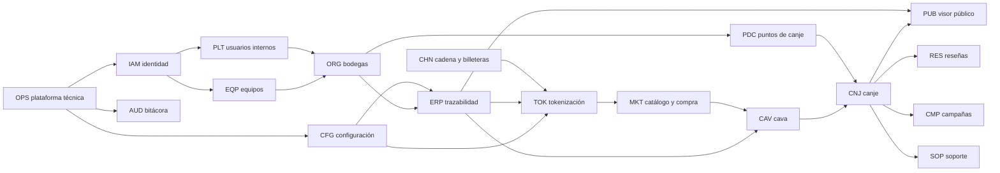

# 05 · Catálogo funcional del backend

> **BORRADOR** · versión 0.1 · 27 de septiembre de 2026. Lista **completa** de lo que el backend debe hacer para el MVP, agrupada por módulo, con identificador estable para poder armar el roadmap sobre ella. Se basa en los docs 02 (visión funcional) y 07 (procesos) y en el estado del código (doc 01).

## 0. Cómo leer este catálogo

- **ID**: `MÓDULO-NN`, estable. El roadmap y los commits lo citarán.
- **Estado frente al backend actual**: ✅ existe y sirve · 🔧 existe pero hay que corregirlo (hallazgo del doc 01) · 🆕 nuevo.
- **Alcance**: **MVP**, **Final** (entra en el MVP pero al final, como la integración con el banco) o **Después** (fuera del MVP, se deja preparado).
- **Sistemas**: S1 ERP · S2 Marketplace y visor público · S3 Back office · S4 POS · P sitios públicos.

Resumen:

| Módulo | Funcionalidades | ✅ | 🔧 | 🆕 |
|---|---|---|---|---|
| PLT Plataforma y usuarios internos | 6 | 0 | 1 | 5 |
| IAM Identidad y sesiones | 13 | 2 | 3 | 8 |
| ORG Bodegas | 12 | 1 | 4 | 7 |
| EQP Equipos y membresías | 10 | 0 | 2 | 8 |
| CFG Configuración | 7 | 0 | 0 | 7 |
| AUD Bitácora | 5 | 0 | 0 | 5 |
| ERP Trazabilidad | 24 | 7 | 11 | 6 |
| TOK Tokenización y preventa | 11 | 0 | 0 | 11 |
| CHN Cadena y billeteras | 13 | 0 | 2 | 11 |
| MKT Catálogo y compra | 12 | 0 | 0 | 12 |
| CAV Cava y seguimiento | 5 | 0 | 0 | 5 |
| PDC Puntos de canje | 10 | 0 | 0 | 10 |
| CNJ Canje | 12 | 0 | 0 | 12 |
| PUB Visor público | 5 | 0 | 1 | 4 |
| RES Reseñas | 4 | 0 | 0 | 4 |
| CMP Campañas y notificaciones | 7 | 0 | 0 | 7 |
| SOP Soporte | 6 | 0 | 0 | 6 |
| OPS Operación y plataforma técnica | 12 | 2 | 2 | 8 |
| **Total** | **174** | **12** | **26** | **136** |

## 1. Módulos y funcionalidades

### PLT · Plataforma y usuarios internos (S3)

| ID | Funcionalidad | Estado | Alcance |
|---|---|---|---|
| PLT-01 | Superusuario creado en la instalación (seeder idempotente con credenciales de entorno) | 🔧 | MVP |
| PLT-02 | Alta de usuarios internos por invitación con rol: administrador, operaciones, soporte | 🆕 | MVP |
| PLT-03 | Cambiar rol, bloquear y desbloquear usuarios internos (con motivo) | 🆕 | MVP |
| PLT-04 | Matriz de permisos por rol interno | 🆕 | MVP |
| PLT-05 | Segundo factor (TOTP) obligatorio para usuarios internos | 🆕 | MVP |
| PLT-06 | Tablero del back office: solicitudes pendientes, lotes por revisar, canjes del día, alertas | 🆕 | MVP |

### IAM · Identidad y sesiones (todos)

| ID | Funcionalidad | Estado | Alcance |
|---|---|---|---|
| IAM-01 | Registro del consumidor con correo y contraseña, captcha y verificación del correo | 🔧 | MVP |
| IAM-02 | Inicio de sesión con correo y contraseña | ✅ | MVP |
| IAM-03 | Tokens de acceso cortos (15 min) y renovación rotativa con detección de reutilización | 🔧 | MVP |
| IAM-04 | Cierre de sesión y cierre de todas las sesiones | 🆕 | MVP |
| IAM-05 | Recuperación de contraseña por enlace de un solo uso | 🆕 | MVP |
| IAM-06 | Verificación de correo (código o enlace) | 🆕 | MVP |
| IAM-07 | Bloqueo progresivo ante intentos fallidos y límite de peticiones por IP real | 🔧 | MVP |
| IAM-08 | Elegir y cambiar la organización activa (bodega o punto) en la sesión | 🆕 | MVP |
| IAM-09 | Perfil propio: nombre, idioma, preferencias de notificación y de promociones | ✅ | MVP |
| IAM-10 | Aceptar invitación: crear cuenta o añadir membresía a una cuenta existente | 🆕 | MVP |
| IAM-11 | Vinculación de tabletas POS con código de un solo uso | 🆕 | MVP |
| IAM-12 | Inicio de sesión del cajero con PIN personal en una tableta vinculada, bloqueo por inactividad | 🆕 | MVP |
| IAM-13 | Revocación inmediata de sesiones al bloquear a una persona o una tableta | 🆕 | MVP |

### ORG · Bodegas (P, S1, S3)

| ID | Funcionalidad | Estado | Alcance |
|---|---|---|---|
| ORG-01 | Solicitud pública de alta de bodega con captcha (camino A) | 🔧 | MVP |
| ORG-02 | Bandeja de solicitudes: tomar, anotar, agendar reunión, aprobar, rechazar con motivo guardado | 🔧 | MVP |
| ORG-03 | Alta directa de bodega desde el back office (camino B) | 🆕 | MVP |
| ORG-04 | Invitación automática al dueño al aprobar o crear | 🆕 | MVP |
| ORG-05 | Activación de la bodega al aceptar el dueño; prefijo de lote único asignado | 🆕 | MVP |
| ORG-06 | Identidad de la bodega en la red al activarse (doc 06 §3) | 🔧 | MVP |
| ORG-07 | Perfil de la bodega (datos legales, comerciales, logo, historia pública) editable por el dueño y el back office | ✅ | MVP |
| ORG-08 | Suspender, reactivar y revocar una bodega, con motivo; el ERP bloquea el acceso de bodegas no activas | 🔧 | MVP |
| ORG-09 | Directorio de bodegas del back office con filtros y estado | 🆕 | MVP |
| ORG-10 | Transferir la titularidad (cambiar de dueño) | 🆕 | MVP |
| ORG-11 | Perfil público de la bodega para el visor y el Marketplace | 🆕 | MVP |
| ORG-12 | Cuenta de la bodega en solo lectura: dirección en la red, NFT emitidos, vendidos y quemados por lote | 🆕 | MVP |

### EQP · Equipos y membresías (S1, S3, S4)

| ID | Funcionalidad | Estado | Alcance |
|---|---|---|---|
| EQP-01 | Roles por membresía: bodega (dueño, enólogo, agrónomo, operario, contador), punto (encargado, cajero), plataforma (admin, operaciones, soporte) | 🔧 | MVP |
| EQP-02 | El dueño invita colaboradores con rol (doc 07 §2) | 🔧 | MVP |
| EQP-03 | Reenviar y anular invitaciones pendientes | 🆕 | MVP |
| EQP-04 | Listado del equipo con estado (activo, bloqueado, invitación pendiente) | 🆕 | MVP |
| EQP-05 | Cambiar rol de un colaborador (dueño o back office) | 🆕 | MVP |
| EQP-06 | Bloquear y desbloquear colaboradores (dueño o back office), con cierre inmediato de sesiones | 🆕 | MVP |
| EQP-07 | El back office gestiona el equipo de cualquier bodega o punto (doc 07 §3) | 🆕 | MVP |
| EQP-08 | Límite de colaboradores por organización según configuración | 🆕 | MVP |
| EQP-09 | Una persona en varias organizaciones con roles distintos | 🆕 | MVP |
| EQP-10 | Aviso al dueño de cada cambio que hace el back office en su equipo | 🆕 | MVP |

### CFG · Configuración (S3)

| ID | Funcionalidad | Estado | Alcance |
|---|---|---|---|
| CFG-01 | Catálogo de parámetros con tipo, valor por defecto, niveles permitidos y límites (§4) | 🆕 | MVP |
| CFG-02 | Editar el estándar general | 🆕 | MVP |
| CFG-03 | Ajustes por bodega y "volver al estándar" | 🆕 | MVP |
| CFG-04 | Aplicar un valor a todas o a una selección de bodegas | 🆕 | MVP |
| CFG-05 | Resolución del valor efectivo (bodega → estándar) con caché | 🆕 | MVP |
| CFG-06 | Instantánea de reglas en el lote al crearlo | 🆕 | MVP |
| CFG-07 | Historial de cambios por parámetro y aviso cuando una regla normativa se configura por debajo del mínimo legal | 🆕 | MVP |

### AUD · Bitácora (S3, S1)

| ID | Funcionalidad | Estado | Alcance |
|---|---|---|---|
| AUD-01 | Registro automático de toda acción relevante con actor, organización, origen, recurso, antes y después, motivo (doc 07 §4) | 🆕 | MVP |
| AUD-02 | Inmutabilidad: solo inserción, sin edición ni borrado, encadenamiento por hash | 🆕 | MVP |
| AUD-03 | Consulta con filtros y exportación CSV en el back office | 🆕 | MVP |
| AUD-04 | Consulta de la bitácora de su propia organización para el dueño | 🆕 | MVP |
| AUD-05 | Motivo obligatorio en acciones del back office sobre terceros | 🆕 | MVP |

### ERP · Trazabilidad (S1)

| ID | Funcionalidad | Estado | Alcance |
|---|---|---|---|
| ERP-01 | **Entidad Lote** en el servidor: creada al iniciar el proceso, con estado, estimación de botellas e instantánea de reglas | 🆕 | MVP |
| ERP-02 | Parcelas con aptitud D.O. **calculada** (altitud y cepa) | 🔧 | MVP |
| ERP-03 | Pesaje de vendimia (bruto, tara, neto) | ✅ | MVP |
| ERP-04 | Análisis de madurez (Brix, pH, acidez) separable del pesaje | 🔧 | MVP |
| ERP-05 | Dictamen fitosanitario que **bloquea** la fermentación si no está aprobado; sin autoaprobación en el alta | 🔧 | MVP |
| ERP-06 | Tanques de fermentación con transiciones de estado | 🔧 | MVP |
| ERP-07 | Lecturas diarias de fermentación (append-only) | ✅ | MVP |
| ERP-08 | Tratamientos enológicos autorizados | ✅ | MVP |
| ERP-09 | Bifurcación vino / singani al terminar la fermentación, coherente con el destino | 🔧 | MVP |
| ERP-10 | Crianza con candado de meses | ✅ | MVP |
| ERP-11 | Destilación con cortes y balance de masa | ✅ | MVP |
| ERP-12 | Reposo mínimo con estado persistido por tarea programada | 🔧 | MVP |
| ERP-13 | Embotellado: tipo derivado del origen, candados validados en el servidor, balance de volumen, estados terminales | 🔧 | MVP |
| ERP-14 | Código de lote con prefijo único de la bodega y secuencia sin colisiones | 🔧 | MVP |
| ERP-15 | **Códigos únicos por botella** generados al embotellar y exportables para la imprenta | 🆕 | MVP |
| ERP-16 | URL del QR configurable por entorno (`app.{dominio}/b/{código}`) | 🔧 | MVP |
| ERP-17 | Certificado de laboratorio con conformidad calculada y unidades explícitas | 🔧 | MVP |
| ERP-18 | Correcciones como registros compensatorios; sin borrados en cascada | 🆕 | MVP |
| ERP-19 | Cierre del expediente del lote y hash canónico | 🆕 | MVP |
| ERP-20 | Línea de tiempo del lote (etapa, candados, fecha estimada) para el ERP, el comprador y el visor | 🆕 | MVP |
| ERP-21 | Panel de la bodega: lotes activos, candados que vencen, alertas de fermentación | ✅ | MVP |
| ERP-22 | Grafo de trazabilidad con datos reales (sin métricas inventadas) | ✅ | MVP |
| ERP-23 | Reportes de producción, mermas y rendimiento para el dueño | 🆕 | MVP |
| ERP-24 | Subida de archivos (informes, certificados, etiquetas) a almacenamiento privado con URL firmadas | 🔧 | MVP |

Nota: ERP-21 y ERP-22 existen en parte; ERP-22 exige quitar los valores fijos del grafo (hallazgo EA-05).

### TOK · Tokenización y preventa (S1, S3)

| ID | Funcionalidad | Estado | Alcance |
|---|---|---|---|
| TOK-01 | La bodega autoriza tokenizar un lote con una cuota (≤ estimación) desde el ERP | 🆕 | MVP |
| TOK-02 | Bandeja de solicitudes de tokenización en el back office | 🆕 | MVP |
| TOK-03 | Precio sugerido por la política (estándar o de la bodega) y precio final por colección | 🆕 | MVP |
| TOK-04 | Datos comerciales de la colección (nombre, descripción, fotos, notas de cata, maridaje) | 🆕 | MVP |
| TOK-05 | Aprobar, pedir cambios o rechazar la solicitud | 🆕 | MVP |
| TOK-06 | Emisión de los NFT al aprobar, a nombre de la bodega | 🆕 | MVP |
| TOK-07 | Publicar, pausar y reanudar la preventa | 🆕 | MVP |
| TOK-08 | Ampliar la cuota con nueva aprobación | 🆕 | MVP |
| TOK-09 | Paso a canjeable de los NFT del lote al anclarse el expediente | 🆕 | MVP |
| TOK-10 | Cierre del lote: conciliación NFT vendidos frente a botellas embotelladas y proceso de faltante | 🆕 | MVP |
| TOK-11 | Métricas por colección: emitidos, reservados, vendidos, canjeados, quemados | 🆕 | MVP |

### CHN · Cadena y billeteras (todos, en segundo plano)

| ID | Funcionalidad | Estado | Alcance |
|---|---|---|---|
| CHN-01 | Contrato NFT (doc 06) desplegado en testnet y mainnet | 🆕 | MVP |
| CHN-02 | Identidad en la red por bodega (doc 06 §3) | 🔧 | MVP |
| CHN-03 | Billetera del consumidor creada por el backend al registrarse (doc 06 §4) | 🔧 | MVP |
| CHN-04 | Firmante aislado con claves en custodio (Vault o KMS) | 🆕 | MVP |
| CHN-05 | Cuenta de operaciones que paga comisiones y renta de almacenamiento | 🆕 | MVP |
| CHN-06 | Transacciones en la red como intenciones con estado, reintentos e idempotencia | 🆕 | MVP |
| CHN-07 | Emitir NFT en lote (preventa) | 🆕 | MVP |
| CHN-08 | Transferir NFT al comprador al confirmarse el pago | 🆕 | MVP |
| CHN-09 | Quemar NFT al confirmar el canje | 🆕 | MVP |
| CHN-10 | Anclar el hash del expediente del lote | 🆕 | MVP |
| CHN-11 | Indexador propio de eventos de nuestros contratos | 🆕 | MVP |
| CHN-12 | Conciliación periódica base de datos ↔ red, con alertas | 🆕 | MVP |
| CHN-13 | Mantenimiento de la vida del almacenamiento de los contratos (extensión de TTL) y alerta de saldo | 🆕 | MVP |

### MKT · Catálogo y compra (S2, P)

| ID | Funcionalidad | Estado | Alcance |
|---|---|---|---|
| MKT-01 | Catálogo público de colecciones en preventa y en venta | 🆕 | MVP |
| MKT-02 | Ficha de colección: bodega, lote, etapa actual, precio, disponibles | 🆕 | MVP |
| MKT-03 | Búsqueda y filtros (bodega, tipo de bebida, estado) | 🆕 | MVP |
| MKT-04 | Pedido con límite de botellas por compra según configuración | 🆕 | MVP |
| MKT-05 | Reserva de NFT durante la ventana de pago y liberación al vencer | 🆕 | MVP |
| MKT-06 | Adaptador de pasarela con implementación de prueba (aprueba, rechaza, demora) | 🆕 | MVP |
| MKT-07 | Confirmación de pago solo por notificación firmada o consulta al proveedor (idempotente) | 🆕 | Final |
| MKT-08 | **Aviso de "pago recibido"** en pantalla (estado consultable) y por correo, antes de mostrar los NFT | 🆕 | MVP |
| MKT-09 | Historial de pedidos del consumidor | 🆕 | MVP |
| MKT-10 | Pedidos en el back office (búsqueda, estado, detalle) | 🆕 | MVP |
| MKT-11 | Integración real con la pasarela del banco | 🆕 | Final |
| MKT-12 | Reembolsos y anulaciones con plazo configurable | 🆕 | Después |

### CAV · Cava y seguimiento (S2)

| ID | Funcionalidad | Estado | Alcance |
|---|---|---|---|
| CAV-01 | Mi cava: NFT del consumidor agrupados por lote, con estado (en espera, canjeable, con pase, canjeado, vencido) | 🆕 | MVP |
| CAV-02 | Detalle del NFT con la línea de tiempo del lote casi en tiempo real | 🆕 | MVP |
| CAV-03 | Verificación en el explorador de la red (enlace al NFT y a las transacciones) | 🆕 | MVP |
| CAV-04 | Avisos de avance, lote listo y ventana por vencer (según preferencias) | 🆕 | MVP |
| CAV-05 | Historial de canjes y botellas recibidas | 🆕 | MVP |

### PDC · Puntos de canje (S1, S3, S4, P)

| ID | Funcionalidad | Estado | Alcance |
|---|---|---|---|
| PDC-01 | La bodega crea un punto si tiene permiso y no superó su máximo (camino A) | 🆕 | MVP |
| PDC-02 | Soporte crea un punto a pedido de la bodega y envía la invitación al encargado (camino B) | 🆕 | MVP |
| PDC-03 | Postulación pública de un punto con captcha y enlace con bodegas que lo autorizan (camino C) | 🆕 | MVP |
| PDC-04 | Perfil del punto: nombre, dirección, horario, contacto, bodegas | 🆕 | MVP |
| PDC-05 | Lotes que puede entregar cada punto (los decide la bodega) | 🆕 | MVP |
| PDC-06 | El encargado invita cajeros hasta el máximo configurado | 🆕 | MVP |
| PDC-07 | PIN personal por cajero y vinculación de tabletas | 🆕 | MVP |
| PDC-08 | Suspender o reactivar un punto, un cajero o una tableta | 🆕 | MVP |
| PDC-09 | Directorio público de puntos por lote (para elegir dónde canjear) | 🆕 | MVP |
| PDC-10 | Directorio de puntos en el back office con actividad | 🆕 | MVP |

### CNJ · Canje (S2, S4)

| ID | Funcionalidad | Estado | Alcance |
|---|---|---|---|
| CNJ-01 | Generar pase de canje para un NFT canjeable, con caducidad en horas (configuración general) | 🆕 | MVP |
| CNJ-02 | Código corto del pase para escribir si el QR no se lee | 🆕 | MVP |
| CNJ-03 | Regenerar el pase al caducar; un solo pase activo por NFT | 🆕 | MVP |
| CNJ-04 | Ventana de canje en días desde que el NFT es canjeable (30 por defecto, configurable) | 🆕 | MVP |
| CNJ-05 | Validación en el POS con semáforo y motivo de rechazo (ya canjeado, caducado, punto no habilitado, anulado, no encontrado, ventana vencida) | 🆕 | MVP |
| CNJ-06 | Registro del código de botella entregada, con modo desactivado, opcional u obligatorio | 🆕 | MVP |
| CNJ-07 | Confirmación idempotente del canje, con bloqueo contra dobles canjes | 🆕 | MVP |
| CNJ-08 | Enlace botella ↔ consumidor al canjear | 🆕 | MVP |
| CNJ-09 | Quema del NFT en segundo plano y estado "confirmado en la red" | 🆕 | MVP |
| CNJ-10 | Turno del cajero: apertura, canjes, cierre y resumen para conciliar | 🆕 | MVP |
| CNJ-11 | Historial de canjes por punto, bodega y lote | 🆕 | MVP |
| CNJ-12 | Anulación de un pase por el consumidor o soporte | 🆕 | MVP |

### PUB · Visor público (S2, P)

| ID | Funcionalidad | Estado | Alcance |
|---|---|---|---|
| PUB-01 | Pasaporte público del lote sin cuenta, con datos reales | 🔧 | MVP |
| PUB-02 | Pasaporte por código de botella (`/b/{código}`) | 🆕 | MVP |
| PUB-03 | Verificación en la red: hash del expediente, transacción de anclaje, recálculo | 🆕 | MVP |
| PUB-04 | Reconocimiento del dueño: si la botella se canjeó a la persona con sesión, mensaje de agradecimiento e invitación a reseñar | 🆕 | MVP |
| PUB-05 | Límite de peticiones y caché del visor público | 🆕 | MVP |

### RES · Reseñas (S2, S3)

| ID | Funcionalidad | Estado | Alcance |
|---|---|---|---|
| RES-01 | Reseña (estrellas y comentario) solo con sesión, una por persona y lote | 🆕 | MVP |
| RES-02 | Marca de "reseña verificada" si la persona canjeó una botella de ese lote | 🆕 | MVP |
| RES-03 | Reseñas públicas por lote y colección con promedio | 🆕 | MVP |
| RES-04 | Moderación en el back office (ocultar con motivo) | 🆕 | MVP |

### CMP · Campañas y notificaciones (S3, correo)

| ID | Funcionalidad | Estado | Alcance |
|---|---|---|---|
| CMP-01 | Servicio de correo con plantillas y cola de envío con reintentos | 🆕 | MVP |
| CMP-02 | Correos transaccionales (doc 07 §11) | 🆕 | MVP |
| CMP-03 | Campaña de agradecimiento tras el canje, activable general y por bodega | 🆕 | MVP |
| CMP-04 | Recordatorio de reseña a los N días del canje | 🆕 | MVP |
| CMP-05 | Promociones a consumidores que canjearon una colección y aceptaron recibirlas | 🆕 | MVP |
| CMP-06 | Preferencias y baja de comunicaciones por consumidor | 🆕 | MVP |
| CMP-07 | Notificaciones dentro de las aplicaciones (lista de avisos) | 🆕 | MVP |

### SOP · Soporte (S2, S3, S4)

| ID | Funcionalidad | Estado | Alcance |
|---|---|---|---|
| SOP-01 | Tickets desde la app del consumidor, el ERP y el POS, con referencia a pedido, NFT o canje | 🆕 | MVP |
| SOP-02 | Bandeja de tickets con estado, prioridad y asignación | 🆕 | MVP |
| SOP-03 | Consulta de la cuenta de un consumidor: pedidos, NFT, pases, canjes | 🆕 | MVP |
| SOP-04 | Entrega asistida con verificación de identidad (doc 07 §9) | 🆕 | MVP |
| SOP-05 | Extender la ventana de canje de un NFT con motivo | 🆕 | MVP |
| SOP-06 | Corrección de un canje erróneo con registro compensatorio | 🆕 | MVP |

### OPS · Operación y plataforma técnica

| ID | Funcionalidad | Estado | Alcance |
|---|---|---|---|
| OPS-01 | Healthcheck de API, base de datos, Redis y red | ✅ | MVP |
| OPS-02 | Envoltorio de respuesta, catálogo de errores y `details` por campo | 🔧 | MVP |
| OPS-03 | Identificador de correlación y logs JSON saneados | ✅ | MVP |
| OPS-04 | Transacciones de base de datos y patrón outbox | 🆕 | MVP |
| OPS-05 | Colas (BullMQ) y tareas programadas: candados, caducidades, ventanas, conciliación | 🆕 | MVP |
| OPS-06 | Almacenamiento de objetos privado con URL firmadas | 🔧 | MVP |
| OPS-07 | CI: lint, tipos, pruebas, OpenAPI, migraciones, auditoría de dependencias | 🆕 | MVP |
| OPS-08 | Dockerfile y despliegue reproducible por entorno | 🆕 | MVP |
| OPS-09 | Datos de demostración para el entorno de desarrollo | 🆕 | MVP |
| OPS-10 | Métricas, trazas, alertas y errores centralizados | 🆕 | MVP |
| OPS-11 | Copias de seguridad con restauración probada | 🆕 | MVP |
| OPS-12 | OpenAPI publicado como contrato y cliente tipado para el frontend | 🆕 | MVP |

## 2. Dependencias entre módulos

[Abrir en Mermaid Live](https://mermaid.live/edit#pako:eNp1k01P20AQhv_KaM9FAvVUDpVCQkuBJK5DuNQ9TNabsK29667XVID4731n2URuql5eaXae-bZflPa1Ueekto3_rR84RLotK0e0LFbfKgWlruHIWx9aplgNp6fmg3ZWc6W-08nJR_oymQOEkq2Ni7bmGq6cIhGT9QwElDb2LcOZ9oGPqOmnz6CgpL3b2t0QWFuht-9dRqWIoMXtHVAoDf3AwfqerIsmON8fkZdfC5BQMr8G2x38Eiv-ZSlFobTBHna890tE9ospXaV0ZUpXFhQDP_PGNuNxywM0NovZVJqdTakbXESrtSHN7ofJYdOrhcx9tcArFsj0hDU1jcE8qZ2U5G55AwhK0f80zj7_sxtpKpPjjrMpkWLOb2RzUBTLp2j8zqOm9m13uIkA6SaTe-ltcg_8kY8q4XlsFusLmXN9QY-294G61B9vGqv9futYQopcXEvaxfXfi0CZ7E0m3Dnv2Cwv5buEUjC9STXODmfbQ9O53AmKAm3H_6FWS6Gg1PvOh_jWiHpHqjX42m0t_8VLpeKDaeE7p0o5M-DyTaVeBeMh-tWT03DFMBi8DF3N0cws7wK3-fn1D9h-Axk) · [código](diagramas/05-01-dependencias-entre-modulos.mmd)

`AUD` y `CMP` (correo) son transversales: casi todos los módulos escriben en la bitácora y varios envían correos.

## 3. Roles y permisos (resumen)

| Capacidad | Admin | Operaciones | Soporte | Dueño bodega | Enólogo | Agrónomo | Operario | Contador | Encargado punto | Cajero | Consumidor |
|---|---|---|---|---|---|---|---|---|---|---|---|
| Usuarios internos | ✅ | — | — | — | — | — | — | — | — | — | — |
| Configuración | ✅ | Lectura | Lectura | — | — | — | — | — | — | — | — |
| Solicitudes y alta de bodegas | ✅ | ✅ | Lectura | — | — | — | — | — | — | — | — |
| Equipo de una bodega | ✅ | ✅ | ✅ | ✅ propia | — | — | — | — | — | — | — |
| Bloquear colaboradores | ✅ | ✅ | ✅ | ✅ propia | — | — | — | — | ✅ su punto | — | — |
| Parcelas | Lectura | Lectura | Lectura | ✅ | Lectura | ✅ | — | Lectura | — | — | — |
| Pesaje y lecturas diarias | Lectura | Lectura | Lectura | ✅ | ✅ | ✅ | ✅ | Lectura | — | — | — |
| Dictamen, bifurcación, candados, embotellado, laboratorio | Lectura | Lectura | Lectura | ✅ | ✅ | Dictamen | — | Lectura | — | — | — |
| Autorizar lote tokenizable | — | — | — | ✅ | — | — | — | — | — | — | — |
| Aprobar tokenización y precio | ✅ | ✅ | — | — | — | — | — | — | — | — | — |
| Crear puntos de canje | ✅ | ✅ | ✅ | ✅ si está habilitada | — | — | — | — | — | — | — |
| Cajeros del punto | ✅ | ✅ | ✅ | — | — | — | — | — | ✅ | — | — |
| Validar y confirmar canjes | — | — | — | — | — | — | — | — | ✅ | ✅ | — |
| Comprar, cava, pases, reseñas | — | — | — | — | — | — | — | — | — | — | ✅ |
| Entrega asistida, extender ventana | ✅ | — | ✅ | — | — | — | — | — | — | — | — |
| Bitácora | ✅ toda | ✅ toda | ✅ toda | ✅ su bodega | — | — | — | — | ✅ su punto | — | — |

El superusuario tiene todos los permisos de administrador y no se puede bloquear desde la aplicación.

## 4. Parámetros configurables

Niveles: **G** = solo estándar general · **G+B** = estándar general y ajuste por bodega. "Cuándo" indica si se fija en el lote al crearlo (**lote**), en la colección al aprobarla (**colección**) o aplica de inmediato (**inmediato**).

| Clave | Descripción | Tipo | Por defecto | Niveles | Cuándo |
|---|---|---|---|---|---|
| `trazabilidad.singani.altitudMinimaMsnm` | Altitud mínima de la parcela para D.O. Singani | número | 1600 | G+B | lote |
| `trazabilidad.singani.variedadesExigidas` | Cepas admitidas para D.O. Singani | lista | Moscatel de Alejandría | G+B | lote |
| `trazabilidad.singani.reposoMinimoDias` | Reposo mínimo tras la destilación | número | 180 | G+B | lote |
| `trazabilidad.vino.crianzaMinimaMeses` | Mínimo de meses de crianza que puede fijar el enólogo | número | 0 | G+B | lote |
| `trazabilidad.fitosanitario.exigirAprobado` | Exigir dictamen aprobado para fermentar | sí/no | sí | G+B | lote |
| `trazabilidad.embotellado.mermaMaximaPorcentaje` | Merma tolerada entre litros disponibles y embotellados | número | 5 | G+B | lote |
| `trazabilidad.laboratorio.limites` | Límites de metanol, cobre y otros parámetros con su unidad | objeto | Norma vigente | G+B | lote |
| `precio.politica` | Cómo se sugiere el precio de preventa (por ejemplo, descuento sobre el precio de referencia de la bodega) | objeto | Descuento 20 % | G+B | colección |
| `compra.maxBotellasPorCompra` | Máximo por pedido; vacío = ilimitado | número o ilimitado | 10 | G+B | inmediato |
| `compra.minutosReserva` | Tiempo que un pedido reserva los NFT mientras se paga | número | 30 | G | inmediato |
| `canje.pase.caducidadHoras` | Caducidad del pase de canje | número | 24 (propuesta) | G | inmediato |
| `canje.ventanaDias` | Días para canjear desde que el NFT es canjeable | número | 30 | G+B | inmediato |
| `canje.codigoBotella.modo` | Registro del código de botella en el canje | desactivado / opcional / obligatorio | opcional | G+B | inmediato |
| `canje.entregaAsistida.maxPorClienteMes` | Límite de entregas asistidas por consumidor | número | 2 | G | inmediato |
| `puntos.bodegaPuedeHabilitar` | Si la bodega puede crear sus puntos de canje | sí/no | no | G+B | inmediato |
| `puntos.maxPorBodega` | Máximo de puntos que puede crear una bodega | número | 3 | G+B | inmediato |
| `puntos.maxCajerosPorPunto` | Máximo de cajeros por punto | número | 5 | G+B | inmediato |
| `equipo.maxColaboradoresPorBodega` | Máximo de colaboradores de una bodega; vacío = ilimitado | número o ilimitado | ilimitado | G+B | inmediato |
| `tokenizacion.requiereAprobacion` | La tokenización necesita aprobación del back office | sí/no | sí | G+B | inmediato |
| `invitacion.caducidadHoras` | Caducidad de las invitaciones | número | 72 | G | inmediato |
| `campanas.agradecimiento.activa` | Mensaje de agradecimiento tras el canje | sí/no | sí | G+B | inmediato |
| `campanas.recordatorioResena.dias` | Días tras el canje para recordar la reseña; vacío = desactivado | número | 7 | G+B | inmediato |
| `campanas.promociones.activas` | Envío de promociones | sí/no | no | G+B | inmediato |

Los valores por defecto marcados como propuesta se confirman en el doc 04.

## 5. Qué queda fuera del catálogo del MVP

Facturación y notas de venta · liquidación a bodegas · SMS · textos legales definitivos (se tienen presentes) · reembolsos (MKT-12, preparado) · mercado secundario · KYC · pagos en cripto · exportación internacional · corchos NFC · planes de suscripción para bodegas (propuestos en el roadmap v4 del equipo; ver doc 04).
