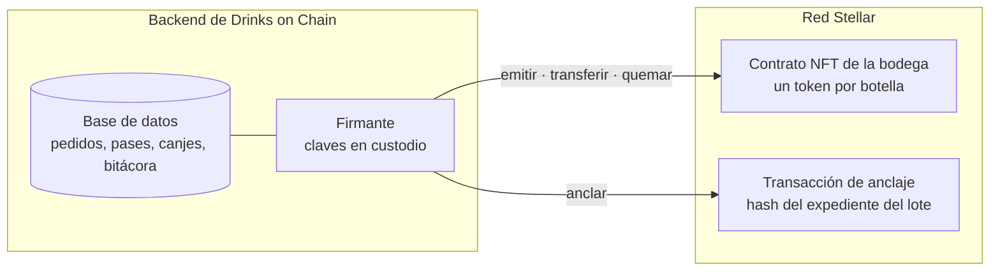
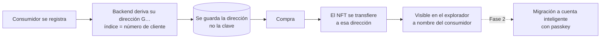
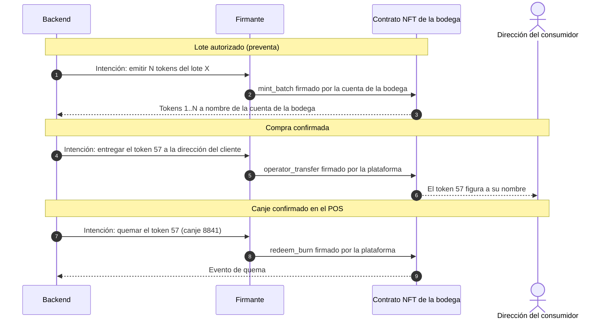

# 06 · Tokens, billeteras y cadena

> **BORRADOR** · versión 0.1 · 27 de septiembre de 2026. Explica en detalle lo que se pidió ampliar: **C3** (modelo de token), **C7** (registro del productor en la red) y **D1** (qué billetera crea el backend), y propone el diseño completo de la parte en la red con las decisiones ya tomadas: NFT por botella (A-01), emisor por bodega (A-02), preventa desde el inicio (A-03), billeteras gestionadas por el backend (A-04) y anclaje al final (A-22). Datos de Stellar verificados en fuentes primarias el 27-09-2026 (lista al final).

## 0. En pocas palabras

- En la red hay **tres cosas**: el **NFT de cada botella**, la **identidad de cada bodega** y el **hash del expediente de cada lote**. Todo lo demás (pedidos, pases, canjes, configuración, bitácora) vive en nuestra base de datos.
- Cada bodega tiene **su propio contrato de NFT**, creado a partir de un código estándar y auditado (OpenZeppelin para Stellar), del que la plataforma es operadora.
- El consumidor tiene una **dirección en la red que gestiona el backend** y que no cuesta nada mantener: no hay que fondearla ni el usuario tiene que firmar nada.
- Quien firma en la red es siempre el backend: la **bodega** (a través de su clave custodiada) emite, y la **plataforma** transfiere al comprador y quema al canjear.
- Coste aproximado en la red: unas **0,05 XLM por botella** emitida, más un mantenimiento pequeño mientras el NFT exista.

[Abrir en Mermaid Live](https://mermaid.live/edit#pako:eNpVkU1LAzEQhv_KkJOCxYoHoUjBdlEE8dD21niYTabd1N1kzYcftP3vzixF6WWzmXfyzJs3e2WCJTUBtWnDl2kwZnhZaA-QSr2N2DewILvWir-wzNS2GLV6kwaA18cVK_Pgc8QcZAuWoEWombnF-zpeT4uHHN7JQx8i1wfCH-Dhdc6AVUSf0Biny3i8ufUCQW9a3NGAaDA1XGuBvnuyjnymYdsy7YQib888z9DwTPF9-hNmFZ1_TxA8zBt0_s9FNVtfSGMSLFi-ShrmyjAb0hX0LPFi0O9krV0Wp3RjQuS7XJ4wy-cnnvfoYofscCDwHT4psTswJeVgXTj3y0dgNJoetKLOZRdBuPUdZElkQ_G_8lGok-QPkvL50SGqQeI4RapmrIykQ3t1BaojtuSsPPJeq9xQx7FNQCtPhSe1Wh2lDUsOyx9vWMqxEFdKz2FQ5ZBD7U7l4y-GG7jD) · [código](diagramas/06-01-en-pocas-palabras.mmd)

## 1. C3 explicado: qué era la contradicción y cómo queda

### 1.1 Qué decía cada documento
- **Documentación del frontend** (docs 04 y 11 de `drinks-on-chain-docsfront`): proponía no escribir contratos y usar un **activo clásico de Stellar por lote** (un token fungible como una moneda, con código tipo `CVJ26SGR001`), donde **1 unidad = 1 botella** y la quema se hacía con la función nativa `clawback` del emisor. Ventaja: cero contratos que programar y auditar. Límite: las botellas de un lote son intercambiables; no hay identidad por botella.
- **Documentación del backend** (`docs/analisis/contratos-stellar.md` y `.env`): proponía **seis contratos propios** en Soroban (el lenguaje de contratos de Stellar): registro de productores (C-01), anclaje de lotes (C-02), **NFT por unidad de producto** (C-03), mercado (C-04, Fase 2), escrow de pases de canje (C-05) y gobernanza (C-06, Fase 3), con billeteras de Dynamic.

La contradicción era de fondo: **fungible por lote sin contratos** frente a **NFT por botella con seis contratos**.

### 1.2 Cómo se resuelve
El cliente decidió **un NFT por botella** (A-01). Eso da la razón al backend en el tipo de token, pero no hace falta todo su conjunto de contratos:

| Pieza del backend | ¿Hace falta en el MVP? | Motivo |
|---|---|---|
| C-03 NFT por unidad | **Sí** | Es el token (A-01). Se construye sobre la librería estándar de OpenZeppelin en lugar de escribirlo desde cero |
| C-02 Anclaje de lotes | **No como contrato** | El anclaje es un hash por lote al final del proceso (A-22): basta una transacción de la red con ese hash (§6) |
| C-01 Registro de productores | **No en el MVP** | La identidad de la bodega ya la da su contrato y su cuenta (§3) |
| C-05 Escrow de pases | **No** | Los pases viven en la base de datos: el canje tiene que responder en menos de un segundo y los pases cambian cada pocas horas (§7). La prueba en la red es la quema |
| C-04 Mercado · C-06 Gobernanza | No | Fase 2 y 3, como ya decía el propio backend |

Resultado: **un solo tipo de contrato** (NFT) desplegado **una vez por bodega**, y un repositorio de contratos (`drinks-on-chain-contracts`) pequeño.

## 2. El contrato NFT

### 2.1 Base estándar
- **Librería**: OpenZeppelin Stellar Contracts, versión estable 0.7.x (la 0.7.0 tiene auditoría publicada), módulo de tokens no fungibles.
- **Interfaz**: sigue SEP-0050 (el estándar de NFT de Stellar, aún en borrador): `owner_of`, `balance`, `transfer`, `name`, `symbol`, `token_uri`, etc. Así cualquier explorador o billetera compatible lo entiende.
- **Tipo**: `Consecutive` (pensado para emitir muchos tokens de una vez con identificadores seguidos) o `Enumerable` (permite listar los tokens de un dueño). Propuesta: `Consecutive`, porque se emiten lotes enteros en la preventa; los listados salen del indexador.

### 2.2 Qué añadimos (lo mínimo y revisado)
La librería estándar solo deja quemar al dueño del token o a quien él autorice. Como el consumidor no firma nada (A-04), añadimos funciones protegidas por rol:

| Función | Quién puede llamarla | Qué hace |
|---|---|---|
| `mint_batch(to, cantidad, lote)` | Rol emisor (la bodega) | Emite N tokens seguidos para un lote |
| `operator_transfer(id, to)` | Rol operador (la plataforma) | Entrega el token al comprador tras el pago |
| `redeem_burn(id)` | Rol operador (la plataforma) | Quema el token al confirmar el canje |
| `set_token_uri_base(url)` | Dueño del contrato | Dónde están los metadatos públicos |
| `pause` / `unpause` | Dueño del contrato | Detiene operaciones ante un incidente |

`redeem_burn` es una facultad de quema administrada, equivalente al *clawback*: hay que **explicarla en los términos del servicio** (el NFT representa el derecho a retirar una botella y la plataforma lo anula al entregarla). Estas funciones son la única parte no auditada y deben ser cortas, con pruebas y revisión externa antes de mainnet.

### 2.3 Metadatos
Cada token apunta a un JSON público servido por nosotros (`token_uri`) con: bodega, lote, número de botella en la preventa, bebida, añada, imagen y enlace al pasaporte del lote. El JSON se genera por lote; no hace falta subir un archivo por token.

## 3. Identidad de la bodega y C7 explicado

### 3.1 Qué era C7
El backend preveía un contrato **ProducerRegistry** (C-01): una lista en la red de productores certificados por la plataforma, que los demás contratos consultaban antes de dejar operar a una bodega. La documentación del frontend no lo contemplaba: para ella, la bodega quedaba identificada por **su cuenta emisora** en la red y por el archivo público `stellar.toml` del dominio (el estándar SEP-1, donde una organización declara sus cuentas y activos).

La pregunta de C7 era: **¿hace falta un contrato de registro, o basta con la cuenta y el `stellar.toml`?**

### 3.2 Cómo queda con las decisiones tomadas
Con un **contrato NFT por bodega** (propuesta de D-12), la identidad de la bodega en la red son dos cosas:

1. **La cuenta de la bodega**: una cuenta de Stellar cuya clave custodia el backend. Es la **dueña** de su contrato y quien firma las emisiones. Por eso "la bodega aparece como origen del activo" (A-02).
2. **Su contrato NFT**: creado por la plataforma a partir del mismo código auditado. En la red, cualquiera ve qué cuenta lo emite y qué tokens tiene.

Para que el público sepa que ese contrato es **oficial** de Drinks on Chain hay tres niveles, de menos a más:

| Opción | Cómo se verifica | Coste | Recomendación |
|---|---|---|---|
| a · `stellar.toml` + API | El dominio de Drinks on Chain publica la lista de bodegas con su cuenta y su contrato | Nulo | **MVP** |
| b · Contrato creado por una fábrica | La plataforma despliega cada contrato desde un contrato "fábrica" que guarda la lista de los oficiales | Un contrato más | Si se quiere verificación totalmente en la red |
| c · ProducerRegistry (C-01) | Registro separado que además activa y revoca productores | Un contrato más con lógica propia | No hace falta: revocar una bodega es pausar su contrato |

**Propuesta**: opción a en el MVP y b si el cliente valora que la verificación no dependa de nuestro dominio.

### 3.3 D-12: ¿un contrato por bodega o uno de plataforma?

| | Un contrato por bodega | Un contrato de plataforma |
|---|---|---|
| "La bodega es el origen" (A-02) | Directo: la bodega es la dueña del contrato | Indirecto: un campo "productor" dentro de cada token |
| Coste | Despliegue de una instancia por bodega (≈ 0,05–0,1 XLM) sobre un código subido una vez | Un solo despliegue |
| Aislamiento | Un incidente o una pausa afecta solo a esa bodega | Afecta a todas |
| Exploradores | Cada bodega aparece como su propia colección | Todo aparece como una colección |
| Operación | Una dirección de contrato por bodega que gestionar | Una sola |

**Propuesta: un contrato por bodega.** Es lo que pide A-02 y el coste es marginal.

## 4. D1 explicado: qué billetera crea el backend

### 4.1 Qué necesita la billetera en el MVP
En el MVP el consumidor **no firma nada en la red**: no transfiere, no vende (sin mercado secundario) y no quema (lo hace la plataforma al canjear). La billetera solo tiene que ser una **dirección donde el NFT figure como suyo**, verificable en un explorador. Esto abre opciones mucho más baratas que las que se barajaban cuando el token era un activo clásico (que exigía cuentas fondeadas y líneas de confianza).

Dato clave verificado: un token de contrato (como nuestro NFT) **puede estar a nombre de una dirección `G…` que no existe en la red**, es decir, sin fondear. El saldo vive dentro del contrato. Esa dirección no puede firmar hasta que se cree, pero en el MVP no lo necesita.

### 4.2 Opciones

| | a · Dirección custodial derivada | b · Cuenta inteligente (smart account) | c · Ómnibus |
|---|---|---|---|
| Qué es | Una dirección `G…` por usuario, derivada de una semilla maestra (estándar SEP-0005), **sin fondear** | Un contrato-cuenta `C…` por usuario (`smart-account-kit`), con el backend o una passkey como firmante | Todos los NFT en una sola dirección de la plataforma; la titularidad solo en nuestra base de datos |
| Quién guarda la clave | El backend (una sola semilla maestra en el custodio; las claves de usuario se derivan cuando hacen falta) | El backend (o el dispositivo, si se usa passkey) | El backend |
| ¿El NFT figura a nombre del usuario en la red? | **Sí** | **Sí** | **No** |
| Coste por usuario | **0 XLM** (nada que crear ni mantener) | Despliegue de un contrato por usuario y su renta (cifra exacta no verificada) + *relayer* | 0 XLM |
| Infraestructura extra | Ninguna | Relayer (OpenZeppelin Relayer, autoalojado o su servicio gratuito con límites) | Ninguna |
| El usuario firma | Nunca en el MVP | Opcional (passkey) | Nunca |
| Paso a autocustodia en el futuro | Se crea la cuenta y se entrega o se transfiere a una billetera del usuario | Añadir la passkey del usuario como firmante | Transferir desde la ómnibus |
| Madurez | Estándar final (SEP-0005), práctica habitual de custodios | Kit activo pero "software de integración sin auditar" según su propio README | Simple |
| Riesgo regulatorio | Custodial | Custodial si firma el backend | El más parecido a un depósito |

### 4.3 Decisión: opción a, con camino a la b (acordada el 28-09, A-28)

- **MVP: dirección custodial derivada (a).** Cumple A-04 (el backend crea y gestiona la billetera), cuesta cero por usuario, no necesita relayer y el NFT aparece a nombre del usuario en el explorador. Solo existe **una** clave maestra que proteger (en el custodio), no una por usuario.
- **Fase 2 (mercado secundario, autocustodia): cuenta inteligente (b)** con `smart-account-kit` y relayer propio, como acordó el cliente para ese caso (A-05). La migración es una transferencia administrada del NFT de la dirección antigua a la nueva cuenta.
- La **c** queda como contingencia si hiciera falta simplificar aún más, a costa de perder la titularidad visible en la red.

[Abrir en Mermaid Live](https://mermaid.live/edit#pako:eNpdkV1LwjEUxr_KYVcFWWLQhZSQrzdZohGB6-K4HXW4_ybbf5aI372zKQXejfPye87z7CCU1yTaIJbWf6s1hhpeptIBTAejuRQ972KqjPYBIkGglYl1QCm-oNHoQH8w5Zkuqg05DZqC2SHEBNoEUsrI1Gwu7x2MZGo1Ww-Pi3DXyTXSThtF8ASujGBFwfM6KGvI1cT4fAHTTyrd-ZUUM4JVwqARLF4IFLDzuaEs7nj_-gTolv3e23gyfS5mqm05PjdP1TLwOnzn7sDmR7bJDl1cGgpUyAgULyXPkLyQCYPPCRM-TDQLS0AOyAL9bK0PyNGdKc5Xi0Ds04L6i_UMYgA0bkGKIfIBLSnglrGzfPXYrAL-h8keE4eEYDgpa1Y5sCLATNhijBvaF6i4AcHBVmh0_t-DFPWaKg6nzTKOEru0UhzzGKbaz_ZOcasOibiSthpr6htk7epcPv4C_3O0Bw) · [código](diagramas/06-02-decision-opcion-a-con-camino-a-la-b-acordada-el-28.mmd)

## 5. Ciclo de un NFT en la red

[Abrir en Mermaid Live](https://mermaid.live/edit#pako:eNqNk29LHDEQxr_KsK8UVJS2VPaF0J5aDspVOIW-WDhmk9kz7WaynU2EVvzunVmv13q12JfJ_Hme30xyX7nkqaqhGulbIXZ0HnAtGBsGwJITl9iS2GlAycGFATnDu6s54Ajv0X0l9rvR5fyDRS-DRD3SbnhmwVniLJgTLC6vwRP0CK06WeMk7HISuLG88yDkXGjK8XH3ijWzB5d4LDH4pLYse5EyQbojMVsHsxo-2oWZl_ADfYK9QeiOOOO-pWvS4dmZeqxhru5427wGiiEHgQXkpFzjpNZbs89WqCVaqP1j4LxqMbtb6IxRJQb1qwiumMxfPLNDLVTdGq4fG58cHS0AgVNshTbp_6h9SndT6-TiIGhTeBTHl6B00NpLQGEmLnjzVrVVxD8z2z7QZmVb3DSQbUpWujAeO3WyQz30mLFLereFVZ8Xf8h1YV3UM8JYNtDPoyF_od9kSb2b66tPyxcY9enGHcI9NzU7PX19sv8ER8gTxVVbhP8DZNrahb2eZKuZhBquDqCKpHnB29-5b6p8S5EaPTQVU9FJ9U31YGn2Dpff2WkoSyG9KYPH_Oufba4ffgIuly3H) · [código](diagramas/06-03-ciclo-de-un-nft-en-la-red.mmd)

- Si el lote es canjeable o no, si un pase está activo o si la ventana venció se decide **en la base de datos**, no en el contrato. El contrato solo registra de quién es cada token y cuándo se quema.
- Todas las comisiones las paga la cuenta de operaciones de la plataforma.

## 6. Anclaje del expediente (al final del proceso)

- **Qué se ancla**: el hash SHA-256 del expediente completo del lote (parcela → embotellado → laboratorio, más la lista de códigos de botella), serializado en JSON canónico (RFC 8785), cuando el lote se certifica (A-22).
- **Cómo**: una transacción clásica de la **cuenta de anclaje** de la plataforma con el hash en el campo `memo` (32 bytes). Cuesta unas 100 *stroops* (0,00001 XLM) y no ocupa reserva. Desde el Protocolo 25 las transacciones de contratos no admiten `memo`, por eso va en una transacción aparte.
- **Verificación**: el pasaporte público muestra el hash, el enlace a la transacción en el explorador y un botón que recalcula el hash con los datos publicados.
- **El contrato `trazabillidad.rs`** del backend registra cada etapa en la red con roles on-chain. Con A-22 no hace falta: se sustituye por esta transacción. Si más adelante se quiere consultar el anclaje desde otros contratos, se añade una función `anchor(lote, hash)` al contrato de la bodega.

## 7. Por qué los pases de canje no van a la red

| Requisito | En la base de datos | En la red (C-05) |
|---|---|---|
| Validar en el mostrador en menos de medio segundo | Sí | No: una transacción tarda segundos |
| Pases que caducan cada pocas horas y se regeneran | Gratis | Una transacción por pase |
| Privacidad (quién retira qué, dónde) | Privado | Público |
| Evitar dobles canjes | Bloqueo de fila y restricción única | Sí, pero más lento |
| Prueba pública del canje | La **quema** del NFT en la red | — |

El pase es un código firmado por el backend que apunta a un registro de la base de datos. La prueba pública de que la botella se entregó es la quema del NFT.

## 8. Claves y custodia

| Cuenta | Para qué | Dónde está la clave |
|---|---|---|
| Operaciones de la plataforma | Paga comisiones y renta; firma como operador (transferir y quemar) | Custodio |
| Anclaje | Publica los hashes de los expedientes | Custodio |
| Una por bodega | Dueña de su contrato; firma las emisiones | Custodio |
| Semilla maestra de consumidores | Deriva las direcciones de los consumidores | Custodio (solo se usa si alguna vez hay que firmar por un consumidor) |

Custodios que firman Ed25519 (el tipo de clave de Stellar) sin exportar la clave, verificado el 27-09-2026: **AWS KMS** (desde noviembre de 2025) y **HashiCorp Vault Transit**; Google Cloud KMS solo en nivel software; Azure Key Vault no. Propuesta: **Vault Transit** si se queda en servidor propio (D7), **AWS KMS** si se va a nube. El firmante es un módulo aislado que solo acepta **intenciones validadas** (doc 03 §7).

## 9. Costes estimados

Estimaciones propias con los parámetros de red vigentes (Stellar Lab, septiembre de 2026). Son órdenes de magnitud, no precios cerrados; el precio del XLM varía.

| Operación | Coste aproximado |
|---|---|
| Subir el código del contrato (una vez) | ≈ 1,5 XLM |
| Crear el contrato de una bodega | ≈ 0,05–0,1 XLM |
| Emitir un NFT (incluye renta de 120 días) | ≈ 0,05 XLM |
| Mantener vivo un NFT un año más | ≈ 0,07 XLM |
| Transferir o quemar | ≈ 0,001–0,005 XLM |
| Anclar un lote | ≈ 0,00001 XLM |
| Dirección de un consumidor | 0 XLM |

Ejemplo: una preventa de 1.000 botellas que tarda un año en canjearse cuesta del orden de **120 XLM** en la red (emisión + mantenimiento + transferencias + quemas). La renta de lo quemado no se devuelve.

**Mantenimiento de la vida de los datos**: en Stellar los datos de contratos tienen fecha de caducidad (TTL: mínimo ≈ 120 días, máximo ≈ 180 días en mainnet); si no se extienden, se **archivan** (no se pierden, pero hay que restaurarlos pagando). Un trabajo programado del backend extiende el TTL de los contratos y de los NFT vivos (CHN-13).

## 10. Red, indexación y versiones

- **Stellar RPC** es la puerta de entrada recomendada; **Horizon** está "cerca del fin de su vida útil" según la documentación oficial y no se usará para funciones nuevas.
- RPC guarda unos **7 días** de eventos: el indexador propio (A-12) consulta `getEvents` cada pocos minutos y guarda en PostgreSQL los eventos de nuestros contratos.
- Protocolo vigente verificado: 27. El 28 se votó el 16-09-2026 (no confirmado en fuente primaria); no afecta a este diseño.
- **Testnet** en desarrollo y staging; **mainnet** en producción tras auditoría de las funciones propias.

## 11. Riesgos

| Riesgo | Mitigación |
|---|---|
| Funciones propias del contrato sin auditar | Mínimas, con pruebas, revisión externa antes de mainnet, pausa de emergencia |
| SEP-0050 aún en borrador | Seguir la implementación de OpenZeppelin, que lo implementa y se mantiene |
| Datos archivados por no extender el TTL | Trabajo programado de extensión y alerta de saldo de la cuenta de operaciones |
| Compromiso de una clave | Custodio sin exportación, firmante con límites por intención, alertas de operaciones no originadas por el sistema, pausa del contrato |
| Quema administrada percibida como falta de control del usuario | Términos del servicio claros; el NFT es un derecho de retiro, no un activo de libre disposición en el MVP |
| Normativa sobre activos virtuales en Bolivia | Revisión con asesoría legal antes de mainnet (no verificado en este análisis) |

## 12. Fuentes (consultadas el 27-09-2026)

- SEP-0050 NFT: https://github.com/stellar/stellar-protocol/blob/master/ecosystem/sep-0050.md
- SEP-0005 derivación de claves: https://github.com/stellar/stellar-protocol/blob/master/ecosystem/sep-0005.md
- OpenZeppelin Stellar Contracts (versiones y auditorías): https://github.com/OpenZeppelin/stellar-contracts
- NFT de OpenZeppelin: https://docs.openzeppelin.com/stellar-contracts/tokens/non-fungible/non-fungible
- Activos y tokens de contrato: https://developers.stellar.org/docs/tokens/anatomy-of-an-asset
- Comisiones y límites: https://developers.stellar.org/docs/learn/fundamentals/fees-resource-limits-metering · https://lab.stellar.org/network-limits
- Archivo de estado: https://developers.stellar.org/docs/learn/fundamentals/contract-development/storage/state-archival
- smart-account-kit: https://github.com/stellar/smart-account-kit · OpenZeppelin Relayer: https://github.com/OpenZeppelin/openzeppelin-relayer
- AWS KMS EdDSA: https://aws.amazon.com/about-aws/whats-new/2025/11/aws-kms-edwards-curve-digital-signature-algorithm/
- Vault Transit: https://developer.hashicorp.com/vault/docs/secrets/transit
- Horizon y RPC: https://developers.stellar.org/docs/data/apis/horizon · https://developers.stellar.org/docs/data/apis/rpc
- Indexadores: https://developers.stellar.org/docs/data/indexers
