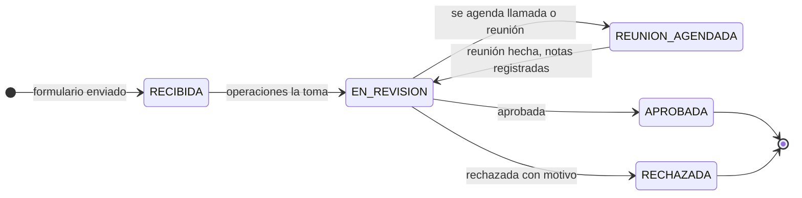
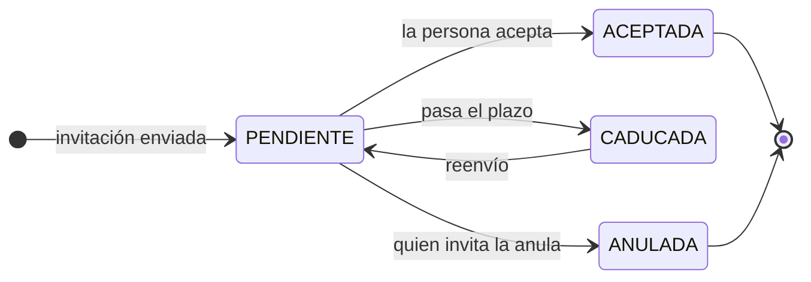
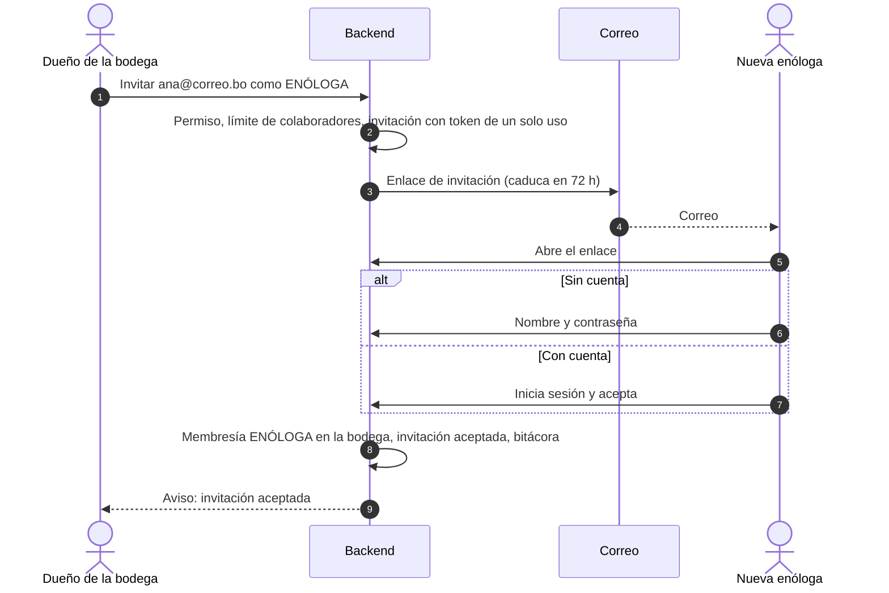
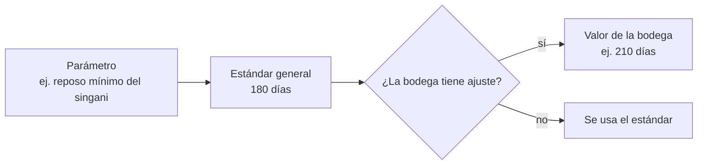
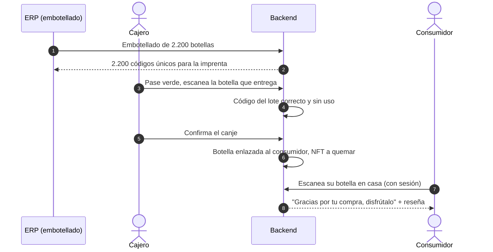

# 07 · Procesos detallados

> **BORRADOR** · versión 0.1 · 27 de septiembre de 2026. Define los procesos que el ciclo del MVP (doc 02 §3) daba por hechos: alta de bodegas, invitaciones, gestión de colaboradores desde el back office, bitácora, configuración en dos niveles, lote tokenizable, puntos de canje, código de botella, soporte y entrega asistida, y protección contra bots. Criterio: estándares de la industria sin complicarnos más de lo necesario.

## 1. Alta de una bodega

### 1.1 Dos caminos, un mismo resultado

| | Camino A · Formulario | Camino B · Alta directa |
|---|---|---|
| Quién inicia | La bodega, en `bodegas./unirse` | Operaciones, en el back office |
| Datos | Razón social, nombre comercial, NIT, categoría (vino, singani…), región, contacto (nombre, correo, teléfono), mensaje | Los mismos, más los que el equipo ya tenga (registro SENASAG, logo, dirección) |
| Protección | Anti-bots (§9) y verificación del correo de contacto | Usuario interno autenticado |
| Revisión | Operaciones aprueba, rechaza con motivo o agenda una reunión | No hace falta: el alta la hace el propio equipo |
| Resultado | Bodega **activa** + invitación al dueño | Igual |

### 1.2 Estados de una solicitud

[Abrir en Mermaid Live](https://mermaid.live/edit#pako:eNptUctqwzAQ_JVFxxJDaG8-FJzEtIbiFIf20LqErb2xBZZk9DC0If9eyXFISnKSdnd2Zpjds0rVxGJgxqKlFcdGo4iG-1IC1FxTZbmS8FKE-vPuC6LoEYp0mS2yVRLDTmnhOtRcAcmBY60C7jQfwWm-LdL3bJOt8xhUTxorz0gGOgSrBIaFC8wk8Jb7_zZ5SvNVEoQMATYka4SuQ4H-VaDJSV66-Xz3II-y_7eu5S83oKWqxRlIZdH4ScON1Z7Y3DKUvBbrxWgEe62-Pey27eVz8jHCdCD_DT4rH59Qlg9jNCeiEe_znOI6rp2bbAZMkBbI63CbfclsS4JKX5RMkvNOu5IdAgydVZsfWfmR1Y58x_X1-ZRT-_AH-HWYHQ) · [código](diagramas/07-01-estados-de-una-solicitud.mmd)

Al aprobar (camino A) o al guardar (camino B) se crea la **bodega** en estado `INVITADA` y se envía la invitación al dueño. Cuando el dueño la acepta, la bodega pasa a `ACTIVA`. Después, el back office puede `SUSPENDER` (bloqueo temporal: nadie de la bodega opera el ERP, los datos siguen visibles) o `REVOCAR` (baja definitiva). La solicitud, la reunión, la aprobación, el rechazo y cada cambio de estado quedan en la bitácora.

Al activarse la bodega el backend también le asigna su **prefijo de código de lote** (único y definitivo) y crea su **identidad en la red** (doc 06 §3).

## 2. Invitaciones

Proceso estándar de la industria (*invitation-based onboarding*), el mismo para el dueño de una bodega, sus colaboradores, los encargados y cajeros de un punto de canje y los usuarios internos.

### 2.1 Cómo funciona

1. Quien invita indica **correo, rol y organización**. El sistema comprueba que tiene permiso para asignar ese rol en esa organización y que no se supera el límite de colaboradores configurado.
2. Se crea la invitación con un **token aleatorio de un solo uso** (se guarda solo su hash) que **caduca** (72 horas por defecto, configurable) y se envía un correo con el enlace.
3. Al abrir el enlace:
   - si el correo **no tiene cuenta**, la persona define su nombre y contraseña; la cuenta nace con el correo ya verificado (el enlace llegó a ese buzón);
   - si **ya tiene cuenta** (por ejemplo, trabaja en otra bodega), inicia sesión y acepta: se le añade la **membresía**, sin cambiar sus otros roles.
4. La invitación queda `ACEPTADA` y la persona entra a la organización con el rol asignado.

Quien invitó (o el back office) puede **reenviar** (genera un token nuevo e invalida el anterior) o **anular** una invitación pendiente.

[Abrir en Mermaid Live](https://mermaid.live/edit#pako:eNptkEFLAzEQhf_KkKO4UPS2B2HZ3YNQlqLtyXgYklED2SRmJwUt_e8msbUgPb43X968zEEor0m0IBZGpsHge8S52d9JB6BNJMXGO1g_Ff1y8wpN8wCbcRoex2k7tmDc3jAqI9Nq9XbvgLJGjYX-o-qbrh83227oWrAIgeLiHQIqCnwF7rth11c44IJAFoLFb38lddqtK_eZDLlTm7IBXbI1-Bz1v3ikXLW0Jl1zz_0qlz9avd_0iyVuQcwUZzS6nOwgBX_QTDILKRwljmilOBYME_vnL6fyiGOi7KSgLxc-2ccfL-51RQ) · [código](diagramas/07-02-como-funciona.mmd)

[Abrir en Mermaid Live](https://mermaid.live/edit#pako:eNp1Uk1PKzEM_CvWnnhSQXwckPaAKG_RUyVYkLjuxZsYiF42LvmoVCH-O3baQgFxTDwz9nj82hi21LTQJHopFAx1Dp8iTkMAwJI5lGmkWF8mc4QOMEFXaCjHx48nDJbAI4wi8oSKWmLMzrglhgzz-4Wir9D8p2C_V2_nixst_-UYiT879PrZF1ohUKhtzjyruEK6w4sLkW1hEVYuYwQMeGmqwtHIYHhiuO6VZc9u7v7NlSP4Heue4uQSz8ArhOzkMqkFwx5Hjmg5UpqBq-LGbboHKQfILCYUWwIk9gwl8ae6mmnhOng0VfC7woFBW4w6gvNTeP6jTOUcCrdv93bQ70adj5GAvDBUs67HZ3hwMo3klOuy9-A9T0pY66w5YtoGVGHkE0mLX5iLIIkgJEof064lClpukNvk9pZ4S9oqbTaIX9at_j7O4eceN6pWKqPLlX8i2eFOXxp0YnwlCbW_cofQzKCZJEh0Vg_3dWjyM000yGNoAhWx74fmTWF6wQ_rYKSUYyH5KUuLeXfk2--3d1P3_Sk) · [código](diagramas/07-03-como-funciona.mmd)

### 2.2 Reglas
- Nunca se envían contraseñas por correo ni se crean contraseñas "temporales": la persona define la suya.
- El rol **dueño** solo lo asigna el back office (al alta de la bodega o al transferir la titularidad).
- Un colaborador puede pertenecer a varias bodegas; al iniciar sesión elige con cuál trabaja.
- El back office puede invitar a cualquier organización; el dueño de una bodega solo a la suya; el encargado de un punto solo a su punto.

## 3. Colaboradores gestionados desde el back office

Para dar soporte a bodegas y puntos de canje, soporte y administración pueden, sobre cualquier organización:

| Acción | Efecto | Requisitos |
|---|---|---|
| Invitar colaborador | Igual que §2, en nombre de la bodega | Motivo opcional |
| Cambiar rol | Cambia la membresía en esa organización | Motivo |
| **Bloquear** colaborador | La membresía queda `BLOQUEADA`: no puede operar en esa organización y **sus sesiones se cierran al instante** | Motivo obligatorio |
| Bloquear la cuenta completa | La persona no entra a ningún sistema | Motivo obligatorio; solo administración |
| Desbloquear | Restablece el acceso | Motivo |
| Enviar recuperación de contraseña | Enlace de un solo uso al correo de la persona | — |
| Transferir la titularidad | Cambia quién es el dueño de la bodega | Motivo obligatorio; solo administración |

Cada acción avisa por correo al dueño de la organización (salvo que sea el afectado) y se registra en la bitácora con el usuario interno que la hizo y el motivo. El dueño también puede bloquear a sus colaboradores; no puede bloquearse a sí mismo ni desbloquear a quien bloqueó el back office.

## 4. Bitácora (auditoría)

### 4.1 Qué se registra

Toda acción que **crea, modifica, aprueba, rechaza, bloquea o ejecuta** algo relevante, en cualquier sistema:

- Back office: usuarios internos, bodegas, solicitudes, colaboradores, puntos de canje, configuración, lotes tokenizables, colecciones, soporte.
- ERP: cada registro y corrección de trazabilidad, autorizaciones de tokenización, gestión del equipo.
- Marketplace: pedidos, pases de canje, reseñas.
- POS: validaciones, canjes, rechazos, apertura y cierre de turno.
- Cadena: cada transacción enviada y su resultado.
- Seguridad: inicios de sesión, fallos, bloqueos, recuperaciones de contraseña.

### 4.2 Qué guarda cada entrada

| Campo | Ejemplo |
|---|---|
| Cuándo | 2026-10-02 14:31:07 UTC |
| Quién | Usuario, rol y organización desde la que actuó |
| Desde dónde | Sistema (S1–S4), IP, dispositivo (en el POS) |
| Qué | Acción con código estable: `MEMBER_BLOCKED`, `SETTING_CHANGED`, `LOT_TOKENIZATION_APPROVED`… |
| Sobre qué | Tipo e identificador del recurso, y organización afectada |
| Cambio | Valores antes y después (sin datos sensibles) |
| Motivo | Texto obligatorio en las acciones del back office sobre terceros |
| Correlación | Identificador de la petición para seguir la operación completa |

### 4.3 Cómo se consulta
- Desde el back office, con filtros por fecha, persona, organización, acción y recurso, y exportación a CSV. No se muestra todo el tiempo: se consulta cuando se quiere auditar algo concreto.
- Cada organización ve la bitácora de lo suyo (el dueño ve lo que pasó en su bodega, incluido lo que hizo el back office en ella).
- **Inmutable**: solo se inserta; nadie la edita ni la borra, tampoco el administrador (permisos de base de datos y encadenamiento por hash, doc 03 §13).
- Retención: indefinida en el MVP; política de archivo cuando el volumen lo pida.

## 5. Configuración en dos niveles

### 5.1 Modelo

[Abrir en Mermaid Live](https://mermaid.live/edit#pako:eNplkE1LAzEQhv_KkLPVbk8iUkEqe-mhbMGL8TC7mW5TNkmZJIh0-9-d7KoIHjPzfjyTi-qCIfUA6jCEj-6InGDbaA-we9Nqh6zzckmVo8ThseW7NZ1ugekcYgA37Yy3LoChAaL1PXqr1TssFmuoJeAlpjnAG2ToyRPjMOVU90swcwBGsZTKevI1F63Koj1sEVqh6xGSFSvgKcdET1pdi7op6jHOGSM8S90rDoGFBYYf5y_zqvrfNyf4MEK9EveeIEcEuYT-Yk9idQPKETu0pnyWIKYjOdLy0MpTTnKXcBUZ5hT2n76TVeJMMslng4k2FntG9z2-fgFldHoK) · [código](diagramas/07-04-modelo.mmd)

- Cada parámetro tiene: clave, descripción, tipo, valor por defecto, **niveles permitidos** (solo general, o general y por bodega) y, si aplica, **límites** (por ejemplo, un mínimo legal).
- **Valor efectivo** para una bodega = su ajuste si existe; si no, el estándar general.
- Acciones masivas: aplicar un valor a todas o a una selección de bodegas (crea ajustes) y "volver al estándar" (borra ajustes).
- Cada cambio guarda versión, autor, fecha y motivo en la bitácora.

### 5.2 Cuándo se aplica un cambio

| Tipo de parámetro | Momento | Motivo |
|---|---|---|
| Reglas de trazabilidad | Se **fija en el lote al crearlo**: un lote en curso conserva sus reglas aunque cambie la configuración | Nadie puede aflojar una regla a mitad de proceso para saltarse un candado; el pasaporte muestra con qué reglas se hizo |
| Precios | Se fijan en la colección al aprobarla; cambiar la política no cambia precios publicados salvo que operaciones lo haga explícitamente | El comprador paga lo que vio |
| Límites de compra, caducidad del pase, ventana de canje, campañas | Efecto inmediato para operaciones nuevas | Son parámetros operativos |

Para las reglas que vienen de una norma (altitud y cepa D.O., reposo del singani), el **mínimo legal es un piso**: no se puede configurar un valor más laxo. Si fuera necesario, administración puede autorizar una **excepción** para una bodega concreta, con motivo obligatorio; queda en la bitácora y el pasaporte del lote lo indica (A-31).

## 6. Lote tokenizable (preventa)

1. **La bodega autoriza** desde el ERP: elige el lote, indica cuántas botellas destina a la preventa (la cuota) y, opcionalmente, datos comerciales (nombre, descripción, fotos, notas). La cuota no puede superar la estimación de botellas del lote.
2. **Operaciones revisa** en el back office: trazabilidad registrada hasta el momento, cuota, precio (sugerido por la política estándar o de la bodega) y fecha estimada de canje. Aprueba, pide cambios o rechaza.
3. **Emisión**: al aprobar, el backend emite los N NFT a nombre de la bodega (doc 06 §5) y publica la colección en preventa.
4. **Seguimiento**: la línea de tiempo pública del lote alimenta la vista del comprador.
5. **Ajustes**: la bodega puede pedir ampliar la cuota (nueva aprobación) y el back office puede pausar la venta.
6. **Cierre**: al embotellar, el sistema compara botellas embotelladas con NFT vendidos. Si faltan botellas (mala cosecha, merma), el caso entra en el proceso de **faltante** (NFT no vendidos se queman; para los vendidos sin botella, doc 04 D-14). Los NFT no vendidos pueden seguir a la venta como venta normal o quemarse, según decida operaciones.

## 7. Puntos de canje

### 7.1 Tres caminos de habilitación

| Camino | Quién | Condición | Resultado |
|---|---|---|---|
| A · La bodega crea el punto | Dueño de la bodega desde el ERP | La bodega tiene permiso de habilitar puntos y no superó su máximo (configuración) | Punto activo enlazado a la bodega; su encargado recibe una invitación |
| B · Soporte crea el punto | Soporte desde el back office, a pedido de la bodega | — | Igual; soporte registra quién lo pidió |
| C · El punto postula | Una licorería o cava desde un formulario público (anti-bots) | Operaciones la enlaza con una o varias bodegas, que deben autorizarla | Punto activo tras la autorización de la bodega |

La logística de las botellas hasta el punto la gestiona la bodega (fuera del sistema en el MVP).

### 7.2 Dentro de un punto
- El **encargado** invita a sus cajeros hasta el máximo configurado (general y por bodega).
- Cada punto tiene la lista de **lotes que puede entregar**; la bodega decide qué lotes envía a cada punto.
- Cada tableta se **vincula** al punto con un código de un solo uso; cada cajero entra con su **PIN** personal en una tableta vinculada. Así el canje queda asociado a una persona concreta.
- El back office puede suspender un punto, un cajero o una tableta en cualquier momento.

## 8. Identificación de cada botella (el dilema del canje)

### 8.1 El problema
Un NFT representa "una botella del lote X", pero la botella física que se entrega no queda enlazada a nadie. Sin ese enlace, cuando el consumidor escanea su botella en casa, el sistema no sabe que es suya y no puede agradecerle, pedirle la reseña ni incluirlo en campañas.

### 8.2 Solución propuesta: botellas serializadas
Es lo que hace la industria con la **serialización de unidades** (GS1, antifalsificación en vinos y licores): cada botella lleva un identificador único.

1. **Al embotellar**, el ERP genera un **código único por botella** (8 caracteres alfanuméricos sin caracteres ambiguos, con dígito de control; no se puede adivinar ni recorrer) y los exporta para la imprenta.
2. **La etiqueta** lleva el QR de trazabilidad de **esa botella** (`app.{dominio}/b/{código}`) y el mismo código impreso debajo, legible.
3. **En el canje**, tras el semáforo verde, el cajero **escanea el QR de la botella** que va a entregar (la tableta ya tiene la cámara abierta) o, si no se puede, **escribe el código**. El sistema comprueba que la botella es del lote del NFT y que no se entregó antes, y la enlaza con el consumidor.
4. **En casa**, al escanear el QR con sesión iniciada, el sistema reconoce la botella como suya: agradecimiento, invitación a la reseña y, si están activas, campañas.
5. Cualquier otra persona que escanee esa botella ve la trazabilidad pública, sin datos del comprador.

[Abrir en Mermaid Live](https://mermaid.live/edit#pako:eNpdUstOAzEM_JVRTiAKKnDrAQmWghASqoDjXkzilpRNsuSBBIh_x1m2LXDarD3jscf-VDoYVjOoxK-FveZLS6tIrvUAlRx8cU8c619PMVtte_IZ8_sFKA2fPXZPIXPXkQn7A0vnEHFb8w2tOYb_5PPFTU1ekH5hb3aUZqAEn4qzJohmTYnE4dmZUGaY74RgGCdHJ9MpxlCqWEEdClgoszGr2zKdLk-NXYWE4U3eanlLP4SOYF0f2Weq9NuN0IIS442j4Qk4afI8YEcpiE8QTuQVbVRHYrOTkw47dMKADjGyDIh3JOtRUvgjJgMvbXQEwYvUmv_VvBhV2Xf0QYZAgtuaNMHd1SOGnhwNa2q2do2dp7LtnL1IJMKeFEDiZH_69fu_3GtmaNV1JG1lG72sJRfRE5toAmPTMv7YmKkLrcIBIiceQsfihppAOZZprKk39dmq_MyOW1WLei45Uteqrwqrx_Xw7rWkcizitCq9oby5vzH89Q2MMt2M) · [código](diagramas/07-05-solucion-propuesta-botellas-serializadas.mmd)

### 8.3 Por qué así

| Alternativa | Por qué no |
|---|---|
| Solo el QR del lote | No identifica la botella: el problema sigue |
| Escribir siempre el código | Funciona, pero es más lento y propenso a errores; se deja como respaldo |
| Chip NFC por botella | Es la solución de Fase 2 (corchos inteligentes); caro para el MVP |
| Enlazar al cliente en el QR del pase | El pase identifica el NFT, no la botella física entregada |

Beneficios adicionales: detecta botellas falsificadas o duplicadas (un código usado dos veces), da el dato exacto de qué botella salió de qué punto y habilita campañas y reseñas **verificadas** (de quien realmente recibió la botella).

### 8.4 Configuración
Modo del código en el canje: `DESACTIVADO`, `OPCIONAL` (el cajero puede saltarlo) u `OBLIGATORIO`, general y por bodega. Recomendación: `OPCIONAL` al inicio y `OBLIGATORIO` cuando las etiquetas serializadas estén en todas las bodegas.

### 8.5 Campañas
Con la botella enlazada, el back office puede activar o desactivar por correo: agradecimiento tras el canje, recordatorio de reseña a los N días, y promociones o descuentos para quienes canjearon una colección. Los correos promocionales solo se envían a quien aceptó recibirlos (casilla en su perfil) e incluyen enlace para darse de baja.

## 9. Soporte y entrega asistida

### 9.1 Cuándo aplica

La mayoría de problemas en el mostrador se resuelven **sin soporte**:

| Situación | Solución | ¿Soporte? |
|---|---|---|
| El QR del pase no se lee (pantalla rota, brillo, cámara) | El pase lleva un **código corto** que el cajero escribe | No |
| El pase caducó | El consumidor genera otro en el momento | No |
| El consumidor no tiene batería, datos o su teléfono | Soporte verifica su identidad y crea una **entrega asistida** | **Sí** |
| El POS muestra "ya canjeado" y el consumidor dice que no recibió nada | Soporte revisa la bitácora y el canje (cajero, hora, botella); si hubo error, corrige con un registro compensatorio | **Sí** |
| La botella está dañada o es de otro lote | El cajero no confirma; si ya confirmó, soporte registra la incidencia y la bodega repone | **Sí** |
| La ventana de canje venció por una causa justificada (por ejemplo, el punto no tenía stock) | Soporte **extiende** la ventana de ese NFT | **Sí** |
| El punto no tiene conexión | No se puede confirmar un canje sin conexión (evita dobles canjes); el cajero puede esperar o derivar a soporte | Según caso |

### 9.2 Cómo funciona la entrega asistida
1. El consumidor contacta a soporte (ticket desde la app o canal de atención).
2. Soporte verifica que la persona es la titular (correo de la cuenta y un dato que solo ella conoce, o su documento contra el nombre de la cuenta) y que el NFT está canjeable.
3. Soporte crea una **autorización de entrega asistida** para ese NFT, en ese punto, válida por horas, con motivo.
4. En el POS, el cajero busca la autorización por el **nombre y documento** del titular (no necesita el teléfono del cliente), la verifica y confirma igual que un canje normal, código de botella incluido.
5. Se quema el NFT; la bitácora registra a soporte, al cajero y el motivo.

Es un mecanismo de excepción: se limita por configuración (por ejemplo, máximo de entregas asistidas por cliente al mes) y genera una alerta si se usa demasiado en un mismo punto.

## 10. Protección contra bots

Sí, es un **captcha**, más un par de medidas complementarias. Se aplica en todo formulario público que crea algo o envía correos:

| Dónde | Formulario |
|---|---|
| Sitio de bodegas | Solicitud de alta de bodega (`/unirse`) y postulación de punto de canje |
| Marketplace | Registro de cuenta, inicio de sesión tras varios fallos, "olvidé mi contraseña", formulario de ayuda |
| Landing y sitio de bodegas | Formularios de contacto |

Medidas:
1. **Captcha** invisible o de un clic (propuesta: Cloudflare Turnstile, gratuito y sin puzzles para la mayoría; alternativas: hCaptcha, reCAPTCHA). El frontend obtiene un token y **el backend lo verifica** con el proveedor antes de procesar.
2. **Campo trampa** (*honeypot*) oculto que un humano no rellena.
3. **Límite de peticiones** por IP y por correo.
4. **Verificación del correo** antes de que la solicitud se considere válida.

## 11. Correos que envía el sistema

| Correo | Destinatario | Configurable |
|---|---|---|
| Invitación (dueño, colaborador, encargado, cajero, usuario interno) | Invitado | No |
| Solicitud de alta recibida / aprobada / rechazada | Contacto de la bodega | No |
| Recuperación de contraseña, verificación de correo | Usuario | No |
| Colaborador bloqueado o cambio de rol hecho por el back office | Dueño de la organización | No |
| Pago recibido y NFT en la cava | Consumidor | No |
| Avance de etapa del lote | Compradores del lote | Sí (el consumidor puede desactivarlo) |
| Lote listo para canjear, ventana a punto de vencer | Compradores | Sí |
| Agradecimiento tras el canje, recordatorio de reseña | Consumidor | Sí (back office y consumidor) |
| Promociones | Consumidores que aceptaron | Sí |
| Solicitud de tokenización para revisar, alertas operativas | Operaciones | Sí |
