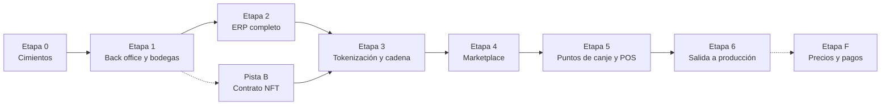

# 08 · Roadmap del backend

> **BORRADOR** · versión 0.1 · 28 de septiembre de 2026. Orden de construcción del backend de Drinks on Chain, paso a paso, sobre el catálogo del doc 05 (cada paso cita los ID de las funcionalidades que entrega). Sigue el ciclo del MVP del doc 02 §3, en el orden que propuso el cliente: **back office y bodegas → ERP → tokenización → Marketplace → POS**, precedido de unos cimientos y seguido de la salida a producción.

## 0. Cómo se usa

- Cada etapa tiene **objetivo**, **pasos** (con los ID del doc 05 y los hallazgos del doc 01 que cierra), **"terminado cuando"** y una lista **Avance** con casillas.
- Al terminar un paso se marca su casilla con la fecha y el PR: `- [x] 1.3 Alta directa · 2026-10-20 (PR #12)`.
- Una etapa se cierra con una **demo** del recorrido que habilita y una **etiqueta de versión** en `drinks-on-chain-back` (`v0.1.0` al cerrar la Etapa 1, `v0.2.0` la 2, etc.).
- Si una decisión cambia el alcance, se actualizan primero los docs 04 y 05 y después este roadmap.
- Las estimaciones suponen **dos personas de backend**, una de ellas con dedicación parcial a los contratos a partir de la Etapa 1. Son orientativas: se recalculan al cerrar la Etapa 0 con la velocidad real.

## 1. Tablero

- [ ] Etapa 0 · Cimientos
- [ ] Etapa 1 · Back office y alta de bodegas
- [ ] Etapa 2 · ERP completo y trazabilidad confiable
- [ ] Etapa 3 · Tokenización y cadena
- [ ] Etapa 4 · Marketplace
- [ ] Etapa 5 · Puntos de canje y POS
- [ ] Etapa 6 · Salida a producción
- [ ] Pista B · Contratos (en paralelo)
- [ ] Etapa F · Precios y pagos (cuando el negocio y el banco lo definan)

## 2. Orden y motivo

[Abrir en Mermaid Live](https://mermaid.live/edit#pako:eNo9kTtvwjAQgP_KyXNpEwIMqGJIG6Y-ImBrOhz2BVwSOzKOKor473Vs4vHO33cvXxnXgtgSWN3oX35EY-FtUymAIvmqWGGxQ0ie9-Zp9SJbScrqc8W-YTJZQZFGIvVEjvwEuq4lJ7jA3hU-4ED7cmlwptGZeqfYlMB12zVk9YhOA5pFNPPoTp9IyT_ksuqTpM6Ua8JRkMJRzII4i-LMi-9oTmS7BjmN5CyQ80jOPVn2w4IgyBVWP8MW5ed2dObBWURn4Z0tNlIgIHRGi57H6e5a7vBSni1CHs6olTVoNXysd_GS2XiiRxflPliEYB27rcOEhrh0I16gw4MO12UPwFoyLUox_OS1YvZIrdt1CRVT1Lt-TcVuA4a91duL4u7Jmp5cpu8EWnqVeDDY3tO3f0eFpG4) · [código](diagramas/08-01-orden-y-motivo.mmd)

- **Etapa 0 primero** porque hay piezas que usan todos los módulos y que cuesta mucho añadir después: roles por membresía, bitácora, configuración, outbox y colas, sesiones seguras, CI y despliegue reproducible. Construirlas al principio evita rehacer cada módulo.
- **Después, el ciclo del MVP en orden** (doc 02 §3): sin bodegas activas no hay ERP; sin lote no hay tokenización; sin NFT no hay Marketplace; sin NFT vendidos no hay canje. Cada etapa termina en algo que se puede demostrar de punta a punta.
- **Pista B en paralelo**: el contrato NFT (Rust, repositorio aparte) no depende de la API y es lo más lento de revisar; empieza durante la Etapa 1 para estar listo en la Etapa 3.
- **Correcciones críticas donde corresponden**: SE-01 (roles) en la Etapa 0; EA-01 a EA-08 (trazabilidad) en la Etapa 2, **antes** de emitir NFT (ADR-011).
- **Precios y pagos al final** (A-14, A-32): la estructura existe desde las Etapas 3 y 4 con un adaptador de prueba; la integración real se hace cuando esté definida.

### Calendario orientativo

| Semanas | Pista A · API (2 personas) | Pista B · Contratos | Pista C · Frontend (referencia) |
|---|---|---|---|
| 1–2 | Etapa 0 | — | Adaptar el ERP a sesiones cortas y organización activa |
| 3–5 | Etapa 1 | B.1 y B.2 | Back office 4A–4B, formulario real de `/unirse`, equipo en el ERP |
| 6–8 | Etapa 2 | B.3 | ERP contra el backend real (lote, códigos de botella), visor público |
| 9–11 | Etapa 3 | Soporte a la integración | Tokenización en el ERP y en el back office (4C) |
| 12–14 | Etapa 4 | — | Marketplace 2A–2F |
| 15–17 | Etapa 5 | — | POS 3A–3D, soporte 4D |
| 18–19 | Etapa 6 | B.4 (revisión externa y mainnet) | Integración y salida |

≈ 19 semanas hasta producción con dos personas.

## 3. Etapa 0 · Cimientos (≈ 2 semanas)

**Objetivo**: dejar la base sobre la que se construye todo lo demás, sin romper el ERP que ya consume el frontend.
**Referencias**: doc 01 §8–§9, doc 03 §2, §4, §10–§12, doc 04 A-33 y §4 (D7).

| Paso | Entregable | Funcionalidades · hallazgos |
|---|---|---|
| 0.1 Acceso y servidor | Cambiar la contraseña del servidor y la del superadministrador (circularon por chat); acceso por llave SSH con un usuario revocable; inventario del despliegue actual; copia de la base de datos actual | D7, OP-02 |
| 0.2 Flujo de trabajo y entrega | Rama `dev`, CI (lint, tipos, pruebas, migraciones, auditoría de dependencias), Dockerfile, `docker-compose` por entorno, despliegue reproducible a desarrollo, copias diarias fuera del servidor | OPS-07, OPS-08, OPS-11 |
| 0.3 Estándares de API | `details` por campo, listas `{ items, total, limit, offset }` con máximo, cabecera `Idempotency-Key` (también en CORS), actualización de `docs/rules/` con los cinco ajustes | OPS-02, A-33 |
| 0.4 Outbox, worker y colas | Tabla outbox escrita en la misma transacción, proceso `worker`, BullMQ, tareas programadas, transacciones en operaciones de varios pasos | OPS-04, OPS-05, OP-01 |
| 0.5 Sesiones seguras | Acceso de 15 min, renovación rotativa en cookie con detección de reutilización, cierre de sesión, revocación inmediata, rate limit por IP real | IAM-02, IAM-03, IAM-04, IAM-07, IAM-13, SE-03, SE-06 |
| 0.6 Organizaciones y membresías | Modelo de organización y membresía con rol, organización activa en la sesión, migración de los datos actuales; se elimina la escritura del rol global desde una bodega | EQP-01, EQP-09, IAM-08, SE-01, OP-05 |
| 0.7 Bitácora base | Registro automático en la misma transacción, tabla solo de inserción, encadenamiento por hash | AUD-01, AUD-02 |
| 0.8 Configuración base | Definiciones de parámetros (doc 05 §4) y resolución del valor efectivo con caché | CFG-01, CFG-05 |
| 0.9 Servicios comunes | Correo con plantillas y cola, almacenamiento de objetos privado con URL firmadas (sin SVG), OpenAPI publicado como contrato, healthcheck y logs JSON | CMP-01, OPS-06, OPS-12, OPS-01, OPS-03, SE-04, SE-08 |
| 0.10 Datos de demostración | Semilla determinista para desarrollo, alineada con los datos de prueba del frontend | OPS-09 |

**Terminado cuando**: cada PR pasa CI; `dev` se despliega solo al entorno de desarrollo; el inicio de sesión usa tokens cortos y organización activa; una acción de prueba deja su entrada en la bitácora y un correo sale por la cola; el ERP del frontend sigue funcionando (cambios aditivos o coordinados).

**Avance**
- [ ] 0.1 Acceso y servidor
- [ ] 0.2 Flujo de trabajo y entrega
- [ ] 0.3 Estándares de API
- [ ] 0.4 Outbox, worker y colas
- [ ] 0.5 Sesiones seguras
- [ ] 0.6 Organizaciones y membresías
- [ ] 0.7 Bitácora base
- [ ] 0.8 Configuración base
- [ ] 0.9 Servicios comunes
- [ ] 0.10 Datos de demostración

## 4. Etapa 1 · Back office y alta de bodegas (≈ 3 semanas)

**Objetivo**: que la plataforma pueda arrancar y dar de alta bodegas con su equipo, por los dos caminos, con todo en la bitácora. Cubre las etapas 1 a 4 del ciclo del MVP.
**Referencias**: doc 02 §3 (1–4) y §5.1, doc 07 §1–§5, doc 05 PLT, ORG, EQP, CFG, AUD.

| Paso | Entregable | Funcionalidades |
|---|---|---|
| 1.1 Usuarios internos | Superusuario por seeder, usuarios internos por invitación con rol, permisos por rol, 2FA TOTP | PLT-01, PLT-02, PLT-03, PLT-04, PLT-05 |
| 1.2 Cuentas | Aceptar invitación (cuenta nueva o membresía añadida), recuperación de contraseña, verificación de correo, perfil | IAM-05, IAM-06, IAM-09, IAM-10 |
| 1.3 Solicitudes de alta | Formulario público con captcha, bandeja con estados, reunión agendada, aprobar o rechazar con motivo | ORG-01, ORG-02 |
| 1.4 Alta directa y activación | Alta desde el back office, invitación automática al dueño, activación al aceptar, prefijo de lote único | ORG-03, ORG-04, ORG-05 |
| 1.5 Gestión de bodegas | Perfil editable, suspender, reactivar y revocar (el ERP bloquea bodegas no activas), directorio, transferir titularidad, perfil público | ORG-07, ORG-08, ORG-09, ORG-10, ORG-11, SE-05 |
| 1.6 Equipo de la bodega | El dueño invita; reenviar y anular; listado con estado; cambiar rol; bloquear y desbloquear (dueño y back office); límite de colaboradores; aviso al dueño | EQP-02, EQP-03, EQP-04, EQP-05, EQP-06, EQP-07, EQP-08, EQP-10 |
| 1.7 Configuración en el back office | Estándar general, ajustes por bodega, cambios masivos, historial, mínimos legales como piso con excepción autorizada | CFG-02, CFG-03, CFG-04, CFG-07 |
| 1.8 Bitácora y tablero | Consulta con filtros y exportación, bitácora propia para el dueño, motivo obligatorio, correos de la etapa, tablero del back office | AUD-03, AUD-04, AUD-05, CMP-02, PLT-06 |

**Terminado cuando** (demo "de cero a bodega con equipo"): el superusuario invita a una persona de operaciones; una bodega envía el formulario, operaciones la aprueba y el dueño acepta la invitación; el dueño invita a una enóloga, que acepta; soporte bloquea a un operario y sus sesiones se cierran; otra bodega se da de alta directamente; el dueño y el back office ven todo en la bitácora.

**Avance**
- [ ] 1.1 Usuarios internos
- [ ] 1.2 Cuentas
- [ ] 1.3 Solicitudes de alta
- [ ] 1.4 Alta directa y activación
- [ ] 1.5 Gestión de bodegas
- [ ] 1.6 Equipo de la bodega
- [ ] 1.7 Configuración en el back office
- [ ] 1.8 Bitácora y tablero

## 5. Etapa 2 · ERP completo y trazabilidad confiable (≈ 3 semanas)

**Objetivo**: un ERP cuyas reglas no se pueden eludir, con el lote como entidad, códigos por botella, expediente con hash y pasaporte público real. Es la base de la tokenización.
**Referencias**: doc 01 §5 y §9.1, doc 02 §4.1 y §5.4–§5.5, doc 07 §5 y §8, doc 05 ERP y PUB.

| Paso | Entregable | Funcionalidades · hallazgos |
|---|---|---|
| 2.1 Lote | Entidad `Lot` creada al iniciar el proceso, estimación de botellas, instantánea de reglas, migración de los datos existentes | ERP-01, CFG-06 |
| 2.2 Origen y vendimia | Aptitud D.O. calculada, análisis separable del pesaje, dictamen que bloquea la fermentación y sin autoaprobación | ERP-02, ERP-03, ERP-04, ERP-05, EA-03, EA-04 |
| 2.3 Vinificación | Tanques con transiciones, lecturas, tratamientos, bifurcación coherente con el destino | ERP-06, ERP-07, ERP-08, ERP-09 |
| 2.4 Crianza, destilación y reposo | Candados con reglas del lote, balance de masa, reposo persistido por tarea programada | ERP-10, ERP-11, ERP-12 |
| 2.5 Embotellado seguro | Tipo derivado del origen, balance de volumen, estados terminales, código de lote sin colisiones, URL de QR configurable | ERP-13, ERP-14, ERP-16, EA-01, EA-02, EA-07, OP-06 |
| 2.6 Códigos de botella | Un código único por botella al embotellar, exportación para la imprenta | ERP-15 |
| 2.7 Laboratorio y correcciones | Conformidad calculada con unidades, correcciones compensatorias, fin de los borrados en cascada | ERP-17, ERP-18, EA-06, EA-08 |
| 2.8 Expediente | Cierre del expediente y hash canónico (el anclaje llega en la Etapa 3) | ERP-19 |
| 2.9 Vistas del lote | Línea de tiempo, panel de la bodega, grafo con datos reales, reportes de producción, archivos privados | ERP-20, ERP-21, ERP-22, ERP-23, ERP-24, EA-05 |
| 2.10 Pasaporte público | Pasaporte de lote y de botella sin cuenta, con límite de peticiones y caché | PUB-01, PUB-02, PUB-05 |

**Terminado cuando**: el caso "Singani Gran Reserva 2026" del documento maestro se recorre de la parcela a los códigos de botella; las pruebas que intentan eludir candados, D.O., dictamen o número de botellas fallan con 422; el pasaporte público muestra solo datos registrados; el ERP del frontend funciona contra el backend real (su Etapa 1G pendiente).

**Avance**
- [ ] 2.1 Lote
- [ ] 2.2 Origen y vendimia
- [ ] 2.3 Vinificación
- [ ] 2.4 Crianza, destilación y reposo
- [ ] 2.5 Embotellado seguro
- [ ] 2.6 Códigos de botella
- [ ] 2.7 Laboratorio y correcciones
- [ ] 2.8 Expediente
- [ ] 2.9 Vistas del lote
- [ ] 2.10 Pasaporte público

## 6. Pista B · Contrato NFT (en paralelo, desde la Etapa 1)

**Objetivo**: el contrato NFT por bodega listo en testnet para la Etapa 3.
**Referencias**: doc 06 §2, §3, §9, §11.

| Paso | Entregable |
|---|---|
| B.1 Repositorio | `drinks-on-chain-contracts`: espacio de trabajo Rust/Soroban, dependencia fijada de OpenZeppelin Stellar Contracts (versión auditada), CI con pruebas |
| B.2 Contrato | NFT `Consecutive` con `mint_batch`, `operator_transfer`, `redeem_burn`, `token_uri`, pausa y roles; pruebas de cada función y de roles no autorizados |
| B.3 Testnet | Código subido una vez, script de despliegue por bodega, direcciones registradas por entorno, prueba de ida y vuelta (emitir, transferir, quemar) |
| B.4 Revisión y mainnet | Revisión externa de las funciones propias, despliegue en mainnet (en la Etapa 6) |

**Avance**
- [ ] B.1 Repositorio
- [ ] B.2 Contrato
- [ ] B.3 Testnet
- [ ] B.4 Revisión y mainnet

## 7. Etapa 3 · Tokenización y cadena (≈ 3 semanas)

**Objetivo**: que una bodega autorice un lote para la preventa, el back office lo apruebe y se emitan los NFT en su contrato; que al certificar el lote se ancle el hash y los NFT pasen a canjeables. Cubre la etapa 6 y la 9 del ciclo.
**Referencias**: doc 02 §5.2 y §5.5, doc 06, doc 07 §6, doc 05 CHN y TOK.

| Paso | Entregable | Funcionalidades |
|---|---|---|
| 3.1 Firmante y transacciones | Custodio de claves (Vault Transit o AWS KMS según D7), firmante que solo acepta intenciones, cuenta de operaciones, transacciones con estados y reintentos | CHN-04, CHN-05, CHN-06 |
| 3.2 Identidad de la bodega | Al activarse una bodega: su cuenta y su contrato NFT (de la Pista B), publicados en `stellar.toml`; se regeneran las billeteras simuladas actuales | CHN-01, CHN-02, ORG-06, SE-02 |
| 3.3 Solicitud de tokenización | La bodega autoriza lote y cuota desde el ERP; bandeja en el back office; datos comerciales; aprobar, pedir cambios o rechazar; precio como estructura (sin política, A-32) | TOK-01, TOK-02, TOK-03, TOK-04, TOK-05 |
| 3.4 Emisión y preventa | Emisión en lote al aprobar, publicar, pausar y reanudar, ampliar la cuota | CHN-07, TOK-06, TOK-07, TOK-08 |
| 3.5 Anclaje | Transacción de anclaje al certificar el lote, NFT a canjeables, verificación pública del hash | CHN-10, TOK-09, PUB-03 |
| 3.6 Conciliación y cierre | Indexador de eventos, conciliación con alertas, mantenimiento del TTL, cierre del lote con faltante (A-30), métricas por colección, cuenta de la bodega en el ERP | CHN-11, CHN-12, CHN-13, TOK-10, TOK-11, ORG-12 |

**Terminado cuando** (demo en testnet): una bodega autoriza 100 botellas de un lote; operaciones aprueba y aparecen 100 NFT en el contrato de la bodega, visibles en el explorador; al certificar el lote, el hash queda anclado y el pasaporte lo verifica; la conciliación no encuentra diferencias.

**Avance**
- [ ] 3.1 Firmante y transacciones
- [ ] 3.2 Identidad de la bodega
- [ ] 3.3 Solicitud de tokenización
- [ ] 3.4 Emisión y preventa
- [ ] 3.5 Anclaje
- [ ] 3.6 Conciliación y cierre

## 8. Etapa 4 · Marketplace (≈ 3 semanas)

**Objetivo**: que un consumidor se registre, compre en preventa con la pasarela de prueba, vea el aviso de pago recibido, reciba sus NFT y siga su lote. Cubre las etapas 7 y 8 del ciclo.
**Referencias**: doc 02 §5.3–§5.4, doc 03 §8–§9.1, doc 06 §4–§5, doc 05 MKT, CAV, RES.

| Paso | Entregable | Funcionalidades |
|---|---|---|
| 4.1 Cuenta del consumidor | Registro con captcha y verificación de correo; dirección custodial derivada (A-28) | IAM-01, CHN-03 |
| 4.2 Catálogo | Colecciones en preventa y venta, ficha con etapa actual y disponibles, búsqueda y filtros | MKT-01, MKT-02, MKT-03 |
| 4.3 Pedido | Límite por compra, reserva con caducidad, adaptador de pasarela de prueba | MKT-04, MKT-05, MKT-06 |
| 4.4 Pago recibido y entrega | Estado "pago recibido" y correo, transferencia de los NFT, historial de pedidos, pedidos en el back office | MKT-08, MKT-09, MKT-10, CHN-08 |
| 4.5 Cava y seguimiento | Mi cava con estados, detalle con línea de tiempo, verificación en el explorador, avisos, notificaciones en la app | CAV-01, CAV-02, CAV-03, CAV-04, CAV-05, CMP-07 |
| 4.6 Reseñas | Reseña con sesión, marca de verificada, reseñas públicas, moderación | RES-01, RES-02, RES-03, RES-04 |

**Terminado cuando**: un consumidor se registra, compra dos botellas de un lote en preventa, ve "pago recibido", sus dos NFT figuran a su nombre en testnet y la línea de tiempo cambia cuando la bodega registra una etapa; deja una reseña.

**Avance**
- [ ] 4.1 Cuenta del consumidor
- [ ] 4.2 Catálogo
- [ ] 4.3 Pedido
- [ ] 4.4 Pago recibido y entrega
- [ ] 4.5 Cava y seguimiento
- [ ] 4.6 Reseñas

## 9. Etapa 5 · Puntos de canje y POS (≈ 3 semanas)

**Objetivo**: cerrar el ciclo del MVP: puntos habilitados, canje con código de botella, quema, post-canje, campañas y soporte. Cubre las etapas 10 a 12 del ciclo.
**Referencias**: doc 02 §5.6–§5.7, doc 07 §7–§9, doc 03 §9.2, doc 05 PDC, CNJ, SOP, CMP.

| Paso | Entregable | Funcionalidades |
|---|---|---|
| 5.1 Puntos de canje | Los tres caminos (bodega, soporte, postulación), perfil, lotes habilitados por punto, directorio público y del back office | PDC-01, PDC-02, PDC-03, PDC-04, PDC-05, PDC-09, PDC-10 |
| 5.2 Cajeros y tabletas | Invitación de cajeros con límite, PIN personal, vinculación de tabletas, suspensión | PDC-06, PDC-07, PDC-08, IAM-11, IAM-12 |
| 5.3 Pase de canje | Pase con caducidad en horas, código corto, regeneración, un pase activo por NFT, ventana de canje con acción al vencer (A-29), anulación | CNJ-01, CNJ-02, CNJ-03, CNJ-04, CNJ-12 |
| 5.4 Canje | Validación con semáforo y motivos, código de botella según modo, confirmación idempotente, botella enlazada al consumidor, quema | CNJ-05, CNJ-06, CNJ-07, CNJ-08, CNJ-09, CHN-09 |
| 5.5 Turnos | Apertura, cierre, resumen, historial por punto, bodega y lote | CNJ-10, CNJ-11 |
| 5.6 Post-canje y campañas | Reconocimiento del dueño en el pasaporte, agradecimiento, recordatorio de reseña, promociones con consentimiento y baja | PUB-04, CMP-03, CMP-04, CMP-05, CMP-06 |
| 5.7 Soporte | Tickets desde las tres aplicaciones, bandeja, consulta de la cuenta de un cliente, entrega asistida, extensión de ventana, corrección de un canje | SOP-01, SOP-02, SOP-03, SOP-04, SOP-05, SOP-06 |

**Terminado cuando**: el ciclo completo del doc 02 §3 se recorre en testnet de la etapa 1 a la 12, incluida una entrega asistida y un pase caducado que se regenera.

**Avance**
- [ ] 5.1 Puntos de canje
- [ ] 5.2 Cajeros y tabletas
- [ ] 5.3 Pase de canje
- [ ] 5.4 Canje
- [ ] 5.5 Turnos
- [ ] 5.6 Post-canje y campañas
- [ ] 5.7 Soporte

## 10. Etapa 6 · Salida a producción (≈ 2 semanas)

**Objetivo**: pasar de testnet a producción con seguridad, observabilidad y copias probadas.
**Referencias**: doc 03 §14–§17, doc 04 §4 (D7), doc 06 §11.

| Paso | Entregable | Funcionalidades |
|---|---|---|
| 6.1 Observabilidad | Métricas, trazas, alertas (transacciones fallidas, conciliación, saldo de operaciones, colas, quemas sin canje) | OPS-10 |
| 6.2 Seguridad | Revisión contra OWASP ASVS nivel 2 y API Top 10, pruebas de autorización entre organizaciones, pruebas de carga del POS | — |
| 6.3 Infraestructura de producción | Decisión D7 aplicada: base de datos gestionada o equivalente, staging, dominio, restauración probada | — |
| 6.4 Mainnet | Revisión externa del contrato (B.4), cuentas y custodio de producción, despliegue del código y de los contratos de las bodegas | — |
| 6.5 Pruebas entre aplicaciones | Recorrido completo con los cuatro frontends contra staging | — |

**Terminado cuando**: la lista de salida (copias restauradas, alertas activas, revisión de seguridad sin hallazgos críticos, contrato revisado, recorrido completo en staging) está completa y el cliente aprueba el paso a producción.

**Avance**
- [ ] 6.1 Observabilidad
- [ ] 6.2 Seguridad
- [ ] 6.3 Infraestructura de producción
- [ ] 6.4 Mainnet
- [ ] 6.5 Pruebas entre aplicaciones

## 11. Etapa F · Precios y pagos (cuando esté definido)

**Objetivo**: activar lo que el negocio dejó para el final (A-14, A-32). La estructura ya existe desde las Etapas 3 y 4.

| Paso | Entregable | Funcionalidades |
|---|---|---|
| F.1 Política de precio | Implementar la política que se decida sobre `precio.politica` (estándar y por bodega) | TOK-03 (política) |
| F.2 Pasarela del banco | Implementación real de `IPaymentProvider`, confirmación firmada o por consulta, sandbox y producción | MKT-07, MKT-11 |
| F.3 Reembolsos | Plazo configurable, anulaciones por la API del banco | MKT-12 |
| F.4 Textos legales | Términos (incluida la quema administrada del NFT), privacidad, consentimiento | — |

**Avance**
- [ ] F.1 Política de precio
- [ ] F.2 Pasarela del banco
- [ ] F.3 Reembolsos
- [ ] F.4 Textos legales

## 12. Alineación con el frontend

El roadmap del frontend (`drinks-on-chain-docsfront`, doc 03) construye ERP → Marketplace → POS → Backoffice. El ERP ya está hecho contra datos de prueba; el Backoffice va último. Como el backend empieza por el back office, **conviene adelantar las sub-etapas 4A y 4B del Backoffice del frontend** (el propio roadmap del frontend lo contempla como "alternativa aceptable").

| Etapa del backend | Qué consume el frontend | Estado del frontend | Acción recomendada |
|---|---|---|---|
| 0 | ERP: sesiones cortas con renovación en cookie, organización activa, `details` por campo | ERP terminado con datos de prueba | Ajustar el cliente de API del ERP y `@drinks-on-chain/mocks` |
| 1 | Back office 4A–4B (usuarios, bodegas, equipo, configuración, bitácora); `/unirse` del sitio de bodegas con captcha; equipo en el ERP | 4A–4B sin empezar; `/unirse` es un formulario de demostración | Adelantar 4A–4B; conectar `/unirse` |
| 2 | ERP: lote, dictamen separado, códigos de botella, reportes; visor público (Marketplace 2E) | ERP con el contrato actual | Actualizar el ERP a los cambios y hacer su integración real (1G) |
| 3 | ERP: autorizar lote tokenizable y cuenta de la bodega; back office 4C | Sin pantallas de autorización | Añadirlas al ERP; construir 4C |
| 4 | Marketplace 2A–2D y 2F | Sin empezar | Construir contra el OpenAPI de la Etapa 4 |
| 5 | POS 3A–3D; pase en el Marketplace; soporte 4D; postulación de punto en el sitio de bodegas | Sin empezar | Construir |
| 6 | Integración y salida (Etapa 5 del frontend) | — | Pruebas cruzadas en staging |

Regla de convivencia: cada etapa del backend publica su OpenAPI (OPS-12); `@drinks-on-chain/mocks` se regenera desde ahí para que el frontend pueda avanzar con datos de prueba antes de que el endpoint esté desplegado.

## 13. Definición de terminado

Una funcionalidad está terminada cuando:

1. Hace lo que describe el doc 05, con las reglas del doc 02 §7 validadas en el servidor.
2. Tiene pruebas unitarias y e2e, incluida la de "otra organización no puede verla ni tocarla".
3. Deja su entrada en la bitácora si es una acción relevante (doc 07 §4).
4. Usa la configuración en lugar de valores fijos cuando el doc 05 §4 lo prevé.
5. El OpenAPI está actualizado y el cambio es aditivo, o está acordado con frontend.
6. Las migraciones se aplican sin pérdida de datos y hay datos de demostración para probarla.
7. Pasa CI y está desplegada en el entorno de desarrollo.
8. Su casilla está marcada en este roadmap con fecha y PR.

## 14. Flujo de trabajo en `drinks-on-chain-back`

- Rama `dev` para el trabajo diario y ramas cortas por paso (`feat/e1-invitaciones`) con PR a `dev`; `dev` se despliega al entorno de desarrollo.
- Al cerrar una etapa: PR `dev → main`, etiqueta `v0.N.0` y demo.
- Conventional Commits con el paso y los ID en el cuerpo (`feat(organizations): alta directa de bodega` · `Refs: ORG-03, ORG-04`).
- Lo que no esté terminado al cerrar una etapa queda detrás de un *feature flag*, no en una rama larga.
- Los cambios incompatibles en endpoints que ya usa el frontend se anuncian en el PR y en el doc 04.

## 15. Riesgos del plan

| Riesgo | Mitigación |
|---|---|
| El frontend del back office va último en su roadmap | Adelantar 4A–4B (§12); mientras tanto, cada etapa se demuestra con Swagger y pruebas e2e |
| Cambios del contrato del ERP rompen el frontend ya construido | Cambios aditivos, OpenAPI publicado, mocks regenerados, aviso en el PR |
| La migración a membresías y a la entidad Lote toca datos existentes | Migraciones probadas sobre una copia (0.1) y reversibles |
| Revisión del contrato más lenta de lo previsto | Pista B empieza en la Etapa 1; mainnet solo tras la revisión |
| Custodio de claves sin decidir (depende de D7) | Firmante con interfaz única; en desarrollo, claves de testnet en un gestor de secretos |
| Crece el alcance de la configuración | Solo los parámetros del doc 05 §4; los nuevos pasan por el doc 04 |
| Estimación con dos personas | Se recalcula al cerrar la Etapa 0 |

## 16. Mapa de funcionalidades por etapa

Todas las funcionalidades del doc 05 tienen una etapa:

| Etapa | Funcionalidades |
|---|---|
| 0 | OPS-01, OPS-02, OPS-03, OPS-04, OPS-05, OPS-06, OPS-07, OPS-08, OPS-09, OPS-11, OPS-12, IAM-02, IAM-03, IAM-04, IAM-07, IAM-08, IAM-13, EQP-01, EQP-09, AUD-01, AUD-02, CFG-01, CFG-05, CMP-01 |
| 1 | PLT-01, PLT-02, PLT-03, PLT-04, PLT-05, PLT-06, IAM-05, IAM-06, IAM-09, IAM-10, ORG-01, ORG-02, ORG-03, ORG-04, ORG-05, ORG-07, ORG-08, ORG-09, ORG-10, ORG-11, EQP-02, EQP-03, EQP-04, EQP-05, EQP-06, EQP-07, EQP-08, EQP-10, CFG-02, CFG-03, CFG-04, CFG-07, AUD-03, AUD-04, AUD-05, CMP-02 |
| 2 | ERP-01, ERP-02, ERP-03, ERP-04, ERP-05, ERP-06, ERP-07, ERP-08, ERP-09, ERP-10, ERP-11, ERP-12, ERP-13, ERP-14, ERP-15, ERP-16, ERP-17, ERP-18, ERP-19, ERP-20, ERP-21, ERP-22, ERP-23, ERP-24, CFG-06, PUB-01, PUB-02, PUB-05 |
| 3 | CHN-01, CHN-02, CHN-04, CHN-05, CHN-06, CHN-07, CHN-10, CHN-11, CHN-12, CHN-13, TOK-01, TOK-02, TOK-03, TOK-04, TOK-05, TOK-06, TOK-07, TOK-08, TOK-09, TOK-10, TOK-11, ORG-06, ORG-12, PUB-03 |
| 4 | IAM-01, CHN-03, CHN-08, MKT-01, MKT-02, MKT-03, MKT-04, MKT-05, MKT-06, MKT-08, MKT-09, MKT-10, CAV-01, CAV-02, CAV-03, CAV-04, CAV-05, CMP-07, RES-01, RES-02, RES-03, RES-04 |
| 5 | IAM-11, IAM-12, PDC-01, PDC-02, PDC-03, PDC-04, PDC-05, PDC-06, PDC-07, PDC-08, PDC-09, PDC-10, CNJ-01, CNJ-02, CNJ-03, CNJ-04, CNJ-05, CNJ-06, CNJ-07, CNJ-08, CNJ-09, CNJ-10, CNJ-11, CNJ-12, CHN-09, PUB-04, CMP-03, CMP-04, CMP-05, CMP-06, SOP-01, SOP-02, SOP-03, SOP-04, SOP-05, SOP-06 |
| 6 | OPS-10 |
| F | MKT-07, MKT-11, MKT-12 |
