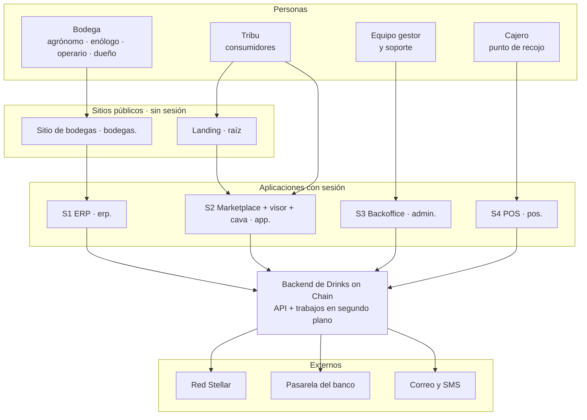
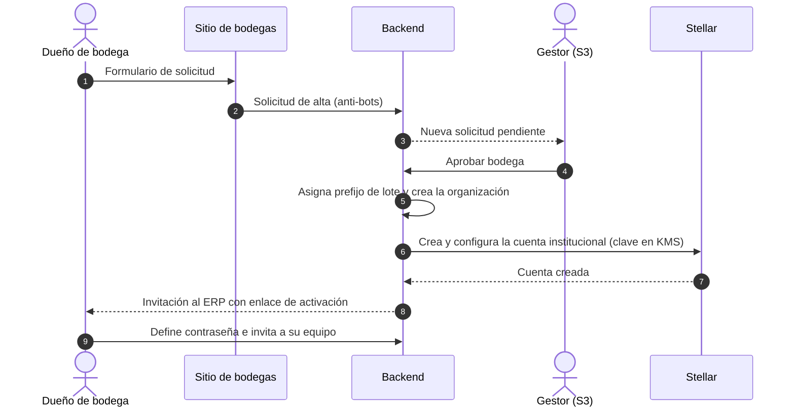
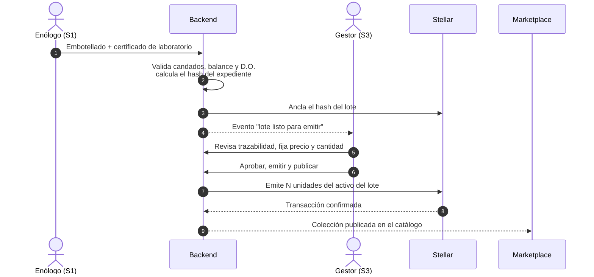
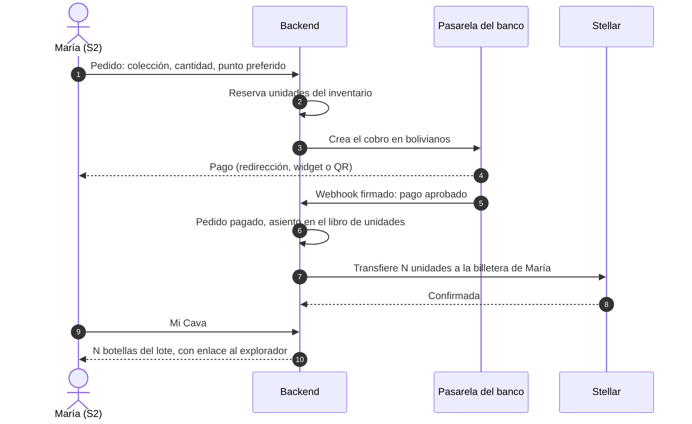
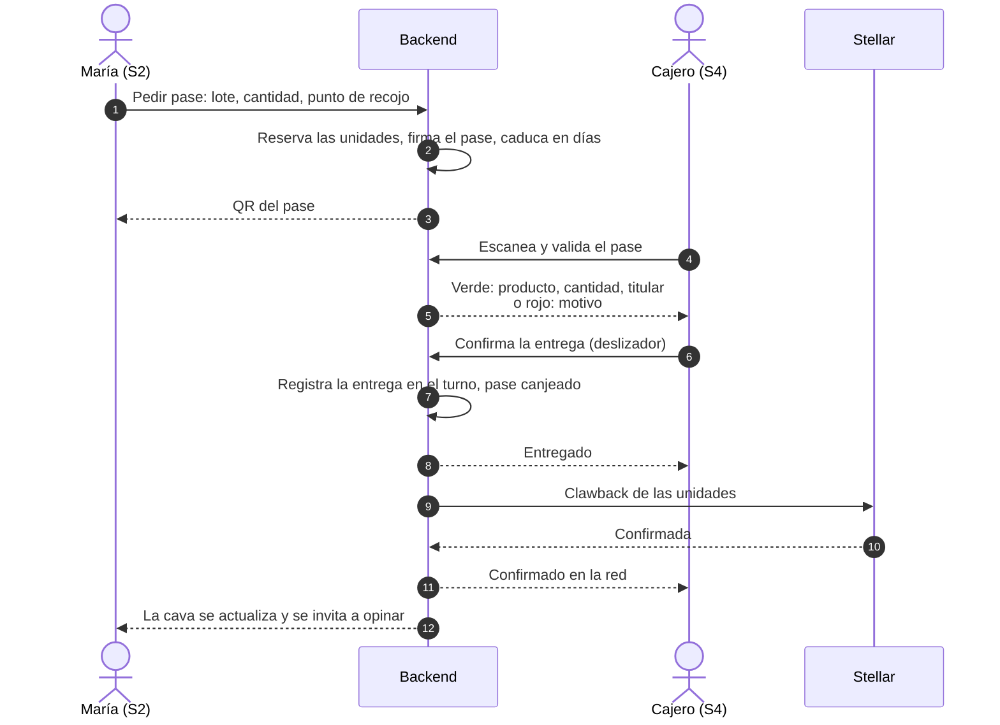
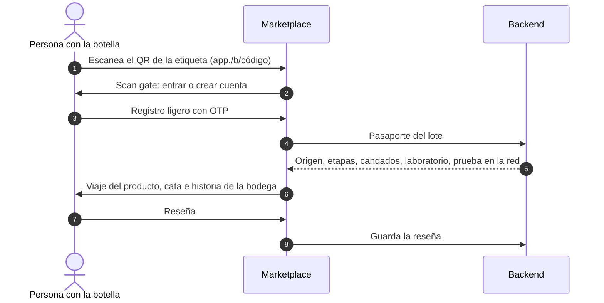
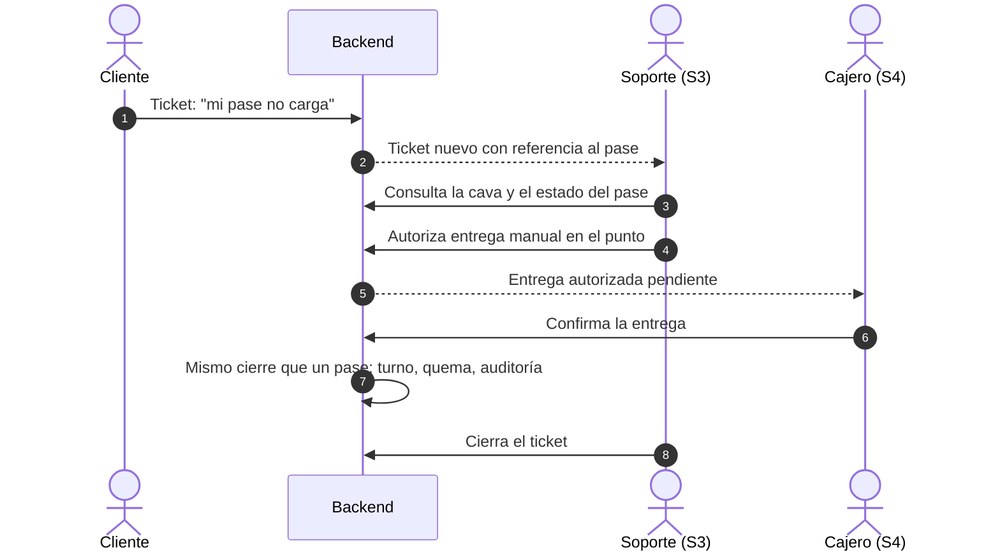

# 02 · Visión funcional del ecosistema

> **SUSTITUIDO** el 27-09-2026 por la versión 0.2 en la raíz del repositorio. Se conserva como registro y no se edita.
>
> BORRADOR · versión 0.1 · 26 de septiembre de 2026. Qué hace Drinks on Chain de punta a punta, visto desde el backend: actores, sistemas, capacidades, flujos entre sistemas, ciclo de vida de una botella y reglas de negocio. Se basa en el documento maestro, en la documentación de frontend (`drinks-on-chain-docsfront`, docs 01, 04, 06, 08, 11) y en el estado real del backend (doc 01 de este repositorio).

## 1. Propósito

Drinks on Chain registra la vida de un vino o singani boliviano **desde la parcela hasta la botella**, convierte cada botella de un lote terminado en un **activo digital** que el consumidor compra a precio de bodega y guarda en su **cava digital**, y cierra el ciclo en el mostrador de un punto de recojo, donde el activo **se quema** al entregar la botella física.

La promesa en una frase: *lo que dice el pasaporte de la botella es lo que pasó, y cada token está respaldado por una botella real que solo se puede retirar una vez.*

De esa promesa salen los dos invariantes que el backend debe garantizar por encima de todo:

1. **Veracidad de la trazabilidad**: ningún dato del pasaporte es inventado, ningún registro se reescribe sin dejar rastro, y las reglas de denominación y de tiempos no se pueden saltar.
2. **Respaldo uno a uno**: unidades emitidas ≤ botellas embotelladas y certificadas; cada unidad se entrega como máximo una vez; lo quemado en la red cuadra con lo entregado en los puntos.

## 2. Actores y sistemas

| Actor | Qué hace | Sistema | Cómo se autentica |
|---|---|---|---|
| Consumidor anónimo | Mira vinos, lee sobre las bodegas | Landing, sitio de bodegas, catálogo | No se autentica |
| Miembro de la tribu | Escanea botellas, compra, guarda, pide retirar, opina | S2 Marketplace + visor + cava | Cuenta ligera (teléfono y correo, OTP) |
| Agrónomo | Registra parcelas y recepción de uva | S1 ERP | Correo y contraseña |
| Enólogo | Dictamina, fermenta, decide el destino, fija candados, embotella | S1 ERP | Correo y contraseña |
| Operario de bodega | Registra lecturas diarias y pesajes | S1 ERP | Correo y contraseña |
| Dueño de bodega | Supervisa, gestiona su equipo y sus datos | S1 ERP | Correo y contraseña |
| Equipo gestor | Aprueba bodegas y puntos, emite y publica colecciones | S3 Backoffice | Correo, contraseña y 2FA |
| Soporte | Atiende tickets, resuelve disputas, autoriza entregas manuales | S3 Backoffice | Correo, contraseña y 2FA |
| Cajero del punto de recojo | Valida pases y entrega botellas | S4 POS | Dispositivo vinculado + PIN |

[Abrir en Mermaid Live](https://mermaid.live/edit#pako:eNp1U01v2zAM_SuED7ts7ZomwIBhKNAkRTG0XYM6t3kH2mYctbaoUXK3ruh_H2XHTrqPi009PZKPH3pOCi4p-QjJpuYfxRYlwHqeWQDf5pWg28KKxLNFH0GAxdcsWYvJ20-5vD8r2Pq2MSUL-Sz51lPmSplr1Ao7DlaStScnm6nlhiGa-Qcg22M1VyPGjgTFjOeypY404TH0pYa--N4ax1CRDyxdhifw7FgCjbwr5S3wnoQ7gmttYCgJhAq-H8KRLTP7utQ2r03BXr1TEwx7cJ0C7OFBmDcWPHmzK2vMev1lqZ7XaEtjq4EsGA0qf-37c7scEkRNedeqMfjuePxfkefORYHnTjVhYdiSB53DPxWlpzHTKdygPFBwNRYEb-HReBb9F_iIQ1p07njvNoluE7i4W40Dk8P7abyfwhyLB95sjEYdwpSNsQfEWSTOYHWbDgzHf9d2vvocd0ajKRR7shRjHzxoVYstGtsNUUmqOQjmeK-zoFhx1dqSQeuy_VBfNeriZyCxvFvcdK0p7qiENFBdo-zHEZdlhR6FatTkNeRoi_3O3aRx6xYsQgxPkN6kf8pfwNHRWZx-909P91hvzztbx95jk4hd9fYs2pe9PY22dv2NusXPNH5m3Z3WvutTT10fnuZXhyeVm9nkHSQNSYOmjG_7OUvClhp9Hx8hSyy12sU6S14iDdvA6ZMt9CpIS4q0rsRAS6MPF5sd_PIbKahKOw)

## 3. Alcance: MVP y Fase 2

| Área | Fase 1 · MVP | Fase 2 |
|---|---|---|
| Trazabilidad | ERP completo vino y singani, QR por lote, pasaporte público | Corchos NFC / RFID, gemelo digital por botella |
| Venta | Precio fijo pactado con la bodega (≈ 20 % bajo el precio de distribuidor), pago en bolivianos por la pasarela del banco | Preventas con fases de precio, mercado secundario P2P |
| Identidad del consumidor | Registro ligero (teléfono y correo), sin KYC | KYC estricto con biometría |
| Billetera | Creada en segundo plano, invisible para el usuario | Firma del usuario para operar en P2P |
| Retiro | Pase de retiro con QR, quema al entregar en el POS | Quema al descorchar con NFC, API para cadenas de tiendas |
| Finanzas | Ninguna tesorería | Tesorería, escrow, rendimientos, regalías |
| Cadena | Testnet hasta la integración, luego mainnet | Contratos propios si el modelo lo exige |

Todo lo de la columna Fase 2 queda **fuera** del diseño detallado del backend del MVP, pero la arquitectura no debe impedirlo (doc 03 §1).

## 4. Capacidades por sistema

### S1 · ERP de trazabilidad (bodegas)
- Parcelas con geolocalización, altitud, cepa y **aptitud D.O. calculada**.
- Recepción de uva: pesaje (bruto, tara, neto), análisis de madurez (Brix, pH, acidez), **dictamen fitosanitario** que habilita o bloquea el lote.
- Vinificación: tanques, lecturas diarias, tratamientos enológicos autorizados, **bifurcación** vino / singani.
- Crianza del vino con **candado de meses**; destilación del singani con cortes (cabeza, corazón, cola) y **reposo mínimo de 180 días**.
- Embotellado con dilución, **conciliación kilos → litros → botellas** y mermas; código de lote internacional; exportación de QR (por lote y, más adelante, por botella).
- Certificado de laboratorio; reportes de producción y rendimiento para el dueño.
- Gestión del equipo de la bodega; panel de solo lectura de la cuenta Stellar y de los activos de sus lotes.
- Aviso automático al Backoffice cuando un lote queda **listo para emitir**.

### S2 · Marketplace + visor + cava (consumidores)
- Catálogo público de colecciones con ficha de producto, bodega y terroir.
- Cuenta ligera con OTP; billetera creada en segundo plano.
- Checkout en bolivianos con la pasarela del banco (tarjeta o QR interoperable); estado del pedido.
- **Mi Cava**: unidades en propiedad por lote, con enlace de verificación al explorador.
- **Pase de retiro**: elige cantidad y punto de recojo habilitado; QR firmado con caducidad en días; historial.
- **Visor QR**: escaneo con registro obligatorio (*scan gate*), viaje del producto, cata, historia de la bodega.
- Reseñas tras escanear o retirar; ayuda que abre tickets.

### S3 · Backoffice (equipo gestor)
- Alta y aprobación de bodegas (con su cuenta Stellar institucional) y de puntos de recojo y sus dispositivos.
- Credenciales del ERP para el personal de las bodegas.
- **Pipeline de emisión**: lote listo → revisión de trazabilidad → precio y metadatos → emisión → publicación; estado de cada transacción en la red.
- Soporte: tickets, consulta de la cava de un cliente, anulación de pases, autorización de entregas manuales, auditoría de retiros.
- Tablero con indicadores y alertas (errores de emisión, saldo bajo de la cuenta que paga comisiones).

### S4 · POS (puntos de recojo)
- Vinculación del dispositivo con un código de un solo uso emitido desde el Backoffice; PIN de cajero.
- Escáner continuo del pase; **semáforo** verde (producto, cantidad, titular) o rojo (motivo).
- Confirmación deslizante que registra la entrega y **dispara la quema**; "Entregado" al instante y "Confirmado en la red" cuando llega el hash.
- Turno: listado de entregas y cierre para conciliar inventario; tolerancia a cortes de red en la lectura, nunca en la confirmación.

### Sitios públicos
- Solo lectura de contenido, red de bodegas y puntos, trazabilidad pública; formularios de contacto y de solicitud de alta que el backend recibe con protección anti-bots. Nunca autentican.

## 5. Ciclo de vida de una botella

Las primeras etapas pertenecen al **lote**; desde la emisión, cada **unidad** (una botella) tiene su propio recorrido.

```mermaid
stateDiagram-v2
  direction LR
  state "Parcela registrada" as Parcela
  state "Uva recibida" as Vendimia
  state "Rechazada" as Rechazada
  state "Fermentando" as Fermentacion
  state "En crianza (vino)" as Crianza
  state "En reposo (singani)" as Reposo
  state "Embotellada" as Embotellada
  state "Certificada" as Certificada
  state "Emitida (token)" as Emitida
  state "En venta" as Publicada
  state "En la cava del cliente" as EnCava
  state "Reservada por un pase" as Reservada
  state "Entregada" as Entregada
  state "Quemada en la red" as Quemada

  [*] --> Parcela
  Parcela --> Vendimia: pesaje
  Vendimia --> Rechazada: dictamen negativo
  Vendimia --> Fermentacion: dictamen aprobado
  Fermentacion --> Crianza: destino vino
  Fermentacion --> Reposo: destilación
  Crianza --> Embotellada: candado cumplido
  Reposo --> Embotellada: 180 días cumplidos
  Embotellada --> Certificada: laboratorio conforme
  Certificada --> Emitida: Backoffice aprueba
  Emitida --> Publicada: colección publicada
  Publicada --> EnCava: pago confirmado
  EnCava --> Reservada: pase emitido
  Reservada --> EnCava: pase caducado o anulado
  Reservada --> Entregada: cajero confirma
  Entregada --> Quemada: clawback confirmado
  Quemada --> [*]
  Rechazada --> [*]
```

[Abrir en Mermaid Live](https://mermaid.live/edit#pako:eNptlE9v1DAQxb_KKKddRKUFLigHDixw4gBFcCEcJvbs1q1jR44TRKt-d8Z_kji7Pfr55_H4zZOfKmElVTVUg0dPnxSeHXY309vGAEjlSHhlDXy9DeuIQFN9QydIIzg6q8E7lNhUgANkvUR_TgETqlUz9IuMVJ3aULck7vBxqbMuC-YLuY6MRyNtomZBcIMl-NmAcArNI8JuUsbuE35M2gXpqLeDhd2gzBmN2s8NBHWDdq31pPXSYykU3JGcVyclFq4UNvWUZ0tg5-0Dmf1cM4oXLU7hkdngsdXXpQzwLASy05I0CK34AOWK5sj61uqB3MQloLcORgM9DjS_Om9tq3se8_rsZVkw30fqQkWKnTiSic1yE6fz-9UfuLn5UGZkjlGQ51TU0NOA9xT2Zy0CSyZqjqXwyKMHw514NdkruIxGwWPvbIsy8iUSz-R8ME6D59hAyM6LZEpHBjXrzXg4nN7FZ-YqkSsiUvN8jOSrQYxdr1XqIRW6Zt-8P4AMRUmyjfOJIRwpuNT1Gq-azW-tQ2-d4nusOVluPDa1QvmymLMaPqJ4sCfeoeDNSC2mO1I247jmxPELrCaxPBb6MosLlurH1PEo8ZwaUa7LtqetbGOOWx0zCBSvzcbMId2WY4ovGUUw0gKaUePLB3JIg-335NYmUgt5N7I5pExq_NuyHxcNz9kOLGc4XZajuIrVa6g6zgkqGf7Sp6byd8Tm86KpDI38Seqmeg4Yjt7--GcEb3m2nJWxl-vXm-Xn_2o-6D4)

## 6. Flujos que cruzan sistemas

### 6.1 Alta de una bodega

La bodega pide el alta desde el sitio de bodegas (`/unirse`) o el gestor la crea directamente; el gestor aprueba y el backend crea su cuenta institucional.

[Abrir en Mermaid Live](https://mermaid.live/edit#pako:eNpdUsFO3EAM_RUrp63ESiBuOSABKStUtaBmj7l4J95gOvGkE89KFPHv9Qyku-WWsZ_fe37xa-VCT1UN1Uy_E4mjhnGIOHYCgEmDpHFHsbychggN4AxNoi6dn-8vAvQEO2MYMEMmjMqOJxSFm4cCbVn5BDV_hl0_3mfYDbpfJP1RZ5OrG5rz96q9_PJ5rt0WdiXv0ezldrO-ujLVGu5CHJOV34Xn4G1IUyG3vqFMtIZ2qWcQekVYGTGvd0HnImeotYE3NfxIdMAjEUxmlUmUMmyzEF5PMewwnuSRGZbmzIMgTJH2_Fx8-aAEL-AiIXiEEAcU_oOOS7SXciRotzXcZpihg-x5SLGMOPthZptlVrPlOAh6WDmPBwIS-Pa9LXu02_Xi4vZ9Imv2eLKjhXYvB9ajuiUCX38-ZkHj8uioxOSUD_9b_JdnY5sJ5QGNOH8cCAKZv8wMFmACOzKeQifVGVQjxRG5z8f32lX6RCN19ugqoWQUvqveMixfYfsizloaE1klTT3qcqgf5be_3FXtUA)

### 6.2 Lote listo → emisión → publicación

[Abrir en Mermaid Live](https://mermaid.live/edit#pako:eNplUk1v2zAM_SuETi2aft-CIUC2GsEO24o52EkXWmIarrLkylKwtuh_H5klSLPeLL4PPT3z1bjkyUzBjPRUKTq6Y3zI2NsIgLWkWPuO8vbkSsrQAI7QRFuvrla3IT0kOGmvTxUfMBd2PGAsML__qrzP6B4p-oN6odMFjfp90t5-0LVLJbSFQsD8AbxR8BvmRypDQEc2KqU5n83kvik0fZe2Sp_gDByJcsVOT54gYJcyyr2cVCSCvewXBvYIDqMX7jiBDgNKEfAMdxc_Lj51-XLmMLgaECjAGse1GAagPwN5pljoYNgupzCP7j9mSAeOkBYSdSO6BNYoBIGlEH2qyHounK1R-mKf8CdteEQoGV-wY03rJ7Di3whDJsdJkkr6ovMj3XzIqcM82bkKbahdkEryceJGYILvUKNa0LgNLT-MN-kof7s831svM8YRneN_ixDBpbji3KPHdy9tb6bwJQV6x9slkMIpakkOi0J0rbtko5mA6Ul82OtSvlpT1tSTlYM1kap0EKx5U5puZ_scnUAlV5JJHTyW_QLvxm9_AYiS9bk)

### 6.3 Compra → cava

[Abrir en Mermaid Live](https://mermaid.live/edit#pako:eNplUstu20AM_BVCpwSwgaC9-RCgdi-FocCJDPSiC7VLO4usSIVauS2C_HtJP5pHj9yZ4c6QfKmCRKoWUI30PBEH-p5wr9i3DIBTEZ76jvRYhSIKNeAINWo73dxQRLhqvlw7OqCWFNKAXODb5oezlhieiONndLl2cIMjKmWESBk65CCfec3WeU2hnO07drie395a8wVsKKYoCwiSKYTkZnZfeQbBhClinMEwcREYlHakRnW1KS_6BxpJDwgTO5vGo4vEB-KCmt6xl-sFrJQQDA_SqQAxdJLTISHL6MTlem7E2kzhXuBKzZp-MPUrxT0VELh_uD4LzjZ-Uvco8gS7pD16nsFb4KDS4X-eT5mdYtjMZpPII5of85aTe4v0L9GbuNkuYKvI4y6REty9hUaw-XcpZyqkvol3i3V9s51fPl8Jn0zihz3UCVZ4wMtnpznc2YCOWzuNNVthmxHzyRkDAWag30MWtRy22GoGVU_WO0W_w5e2Ko_UU2tFWzFNRTG31avT_CCbPxwMKjpZ12oaIpbLzZ6fX_8CMr_wpg)

### 6.4 Pase de retiro → entrega → quema

[Abrir en Mermaid Live](https://mermaid.live/edit#pako:eNplkkFv2zAMhf8KodMKpFgx7GQUAba2hyEN0NbBTr4wEpcqlSWPpjJ0Rf_7yCbZ4vVI6b2njxRfnC-BXANupJ-VsqfriBvGvssAWKXk2q-J3yovhWEJOMISuasXFxQQPrSfzux2QJbo44BZ4MvdN1N9Rf9EOfzzLuz0CrfERX2f3_nalQlaoZT0gWzXy_P5XOMauKMQWdUjNZCK0Ay8WmLAMIOhZikQCJh82RbzqefofKCReIeQNLtmc9A4gx-RewRKb5EWFqrXOkM4dDYeYzRn2cD9gz6wV9vF4ph-MyoHITzDDpOGw4no4F408J04KPjARZ-RcgovUaq2e7nmj_MCrPwN9EXirkzeuSp5j5yMUpg2OnvtJMXfGAqfvWt6E0fhiVybUzipnBXAGI1iS2qfwt7s9eFkkO1KCRL-WuuX2qBPZ2mqdnX-P2jAaerf82IgisUUpiO-RQXSj1Iw3ZeK1prOVcuYd1EQEMoQs62Gm4HrSdNisN196Zw8Uk-dFp3LVLXz1LlXk9kSt8_Z65Vw1a92dQgoxz0_HL_-AQkn_xQ)

### 6.5 Escaneo de una botella física

[Abrir en Mermaid Live](https://mermaid.live/edit#pako:eNpdUstOwzAQ_JVVTiCltJRbDpVAIMQBNTSIUy4be0lNHdts7AOq-u-s2wiVnvzY2dmZsfeF8pqKCoqRvhM5RY8Ge8ahdQCYondp6IiPJxU9Qw04Qk08eoegvAOL0PlI1mIGBeRolAnoIjTLjH1F3lEMFhVdAu7rl4x4QLUjp1uX6_VstWqWFTyNCh0hkIW3DWjKcyga0RgRrjCEm3k3V21aLD7vtOn9dW5ultJdV9BIL_QYqQJykZHBg2KSVYnHiOeDNtSbMbIHa3qSJXtav9d_dCKyghpHDJ4jiRILVvzmupRmE8uapduVIhEDjiWIAI3ay85i5xklOuNLCJyoEyPH2Jj0uegPg18n_sBeJ0k704hbgq0oFAKccujkyfoLEyMds7jF_8KfE7LG07QzSFFCMRAPaHR--31bxC0N1MqhLRwlycy2xSHD8idofpySUhT1cpOClminfzJdH34B4sTBIA)

### 6.6 Soporte y entrega manual

[Abrir en Mermaid Live](https://mermaid.live/edit#pako:eNptUk1Lw0AQ_SvDnhRaEPSUQ6FWD1IKgXjcy5id1tXsbJzsFmrpf3c2pLaIx7yvmXnZo2mjI1OBGegrE7f05HEnGCwDYE6Rc3gjGb_aFAU2gAOsOk-cqKA9SvKt75ETLOuXwj5i-0nsLp6mLnAT-yiJ4Ka5v71w6zEPP0iiMg_KFG4zXyw0rYJXr1mpAmuC11kDAUdoUXZoTRGqaK7apj5LgTPtVRIZhLYkepJHwG40F0dTn7NXkYfcJYQONXKPcADqgIaELoKj_yxLbUT8N4KeL7RDCMhZw4mLtc-c4tVW6wqeJx1ORofQaze_9a2vltl6CeMyU_g5aVJs_BD0ME8iBPqvIPO4YQUpC8dZwQLOdJTzOszmuzty-Ofk4sayaxrbsmxmYALpYO_KKzhak94pkDWlc6acBDtrTkVWbmgO3CqVJJMiuXeYzi9mgk8_4wzFXA)

## 7. Reglas de negocio

| # | Regla | Dónde se aplica | Fuente |
|---|---|---|---|
| R1 | Singani D.O.: parcela con altitud ≥ 1.600 m s. n. m. y cepa Moscatel de Alejandría | Parcela, destilación, embotellado | Documento maestro |
| R2 | Reposo mínimo del singani: 180 días desde el fin de la destilación (Gran Reserva: 6 meses inamovibles) | Embotellado | Documento maestro; backend |
| R3 | Crianza del vino: el enólogo fija meses; no se embotella antes de la fecha del candado | Embotellado | Documento maestro |
| R4 | Uva sin dictamen fitosanitario aprobado no entra a fermentación | Tanque | Documento maestro |
| R5 | El destino (vino o singani) se decide al terminar la fermentación y fija las etapas posibles | Tanque, crianza, destilación | Documento maestro |
| R6 | Botellas × volumen ≤ litros disponibles de la fuente (con merma tolerada y declarada) | Embotellado | Propuesta (conciliación del documento maestro) |
| R7 | Unidades emitidas de un lote ≤ botellas embotelladas y certificadas del lote | Emisión | Invariante 2 |
| R8 | Precio fijo por colección en el MVP, en bolivianos | Colección, pedido | Documento maestro; doc 06 de frontend |
| R9 | Un pase reserva unidades; caduca en días (supuesto: 7); solo es válido en los puntos habilitados para ese lote | Pase, POS | Doc 06 de frontend |
| R10 | Un pase se canjea una sola vez; la confirmación es idempotente | POS | Documento maestro |
| R11 | La quema se ejecuta al confirmar la entrega; la entrega no espera a la red | POS, cadena | Docs 04 y 06 de frontend |
| R12 | El escaneo de una botella física exige cuenta; el catálogo no | S2 | Documento maestro; doc 06 de frontend |
| R13 | Ninguna clave privada institucional sale del backend | Todos | Docs 04 y 06 de frontend |
| R14 | El consumidor nunca paga comisiones de red ni ve cripto | S2 | Doc 04 de frontend |
| R15 | Los datos de un lote registrado no se borran ni se reescriben; se corrigen con un registro nuevo que deja rastro | S1 | Invariante 1 |
| R16 | Solo bodegas `ACTIVE` operan el ERP; solo puntos habilitados operan el POS | S1, S4 | Propuesta |

## 8. Glosario

| Término | Significado | Nombre técnico |
|---|---|---|
| Bodega | Productor socio (vino, singani u otra bebida) | `Winery` / organización |
| Terroir o parcela | Superficie de cultivo con altitud, cepa y aptitud D.O. | `Terroir` |
| Vendimia | Ingreso de uva pesado y analizado | `HarvestBatch` |
| Tanque | Recipiente de fermentación con su bitácora | `FermentationTank` |
| Crianza | Maduración del vino con candado de tiempo | `WineAgingBatch` |
| Destilación y reposo | Paso a singani y reposo obligatorio | `ProductionBatch` |
| Embotellado | Fraccionamiento final de un lote | `BottlingBatch` |
| Código de lote | Identificador internacional `{BODEGA}-{AÑO}-{TIPO}-{SEQ}` | `internationalLotCode` |
| Lote (vista) | Recorrido completo de una vendimia hasta su embotellado | `LotView` (cliente) |
| Pasaporte | Trazabilidad pública del lote que ve el consumidor | `GET /traceability/public/:lotCode` |
| Anclaje | Publicación del hash del expediente del lote en la red | — |
| Activo | Token de Stellar que representa botellas de un lote; 1 unidad = 1 botella | *asset* |
| Emisión | Creación de unidades del activo de un lote | *mint / issuance* |
| Colección | Lote publicado en venta con precio y metadatos | `Collection` |
| Cava | Unidades que posee un usuario | *holdings* |
| Pase de retiro | QR firmado que reserva unidades para retirarlas en un punto | `ClaimPass` |
| Punto de recojo | Licorería, cava o bodega habilitada para entregar | `PickupPoint` |
| Entrega | Registro de botellas entregadas contra un pase | `Delivery` |
| Quema | Retirada definitiva de unidades de la circulación (clawback del emisor) | *burn / clawback* |
| Turno | Periodo de trabajo del cajero con sus entregas | `Shift` |

## 9. Lo que esta visión deja abierto

Las decisiones que condicionan el diseño (modelo de token, tipo de billetera del consumidor, emisor por bodega o de plataforma, modalidad de la pasarela, caducidad del pase) y las contradicciones entre documentos están en `04-decisiones-y-preguntas.md`. Cómo se construye todo esto en el servidor está en `03-vision-backend.md`.
