# 03 · Visión del backend

> **SUSTITUIDO** el 27-09-2026 por la versión 0.2 en la raíz del repositorio. Se conserva como registro y no se edita.
>
> BORRADOR · versión 0.1 · 26 de septiembre de 2026. Propuesta de arquitectura del backend completo de Drinks on Chain (ERP, Marketplace, POS, Backoffice e integración con Stellar y con la pasarela del banco). Parte del estado real (doc 01) y de la visión funcional (doc 02). Las decisiones que requieren acuerdo están marcadas como **propuesta** y se registran en el doc 04.

## 0. La propuesta en diez puntos

1. **Un solo repositorio de backend** (`drinks-on-chain-back`), organizado como **monolito modular**: un módulo por contexto de negocio, con fronteras explícitas. Se despliega como **una imagen con dos procesos**: `api` (HTTP) y `worker` (colas y tareas programadas).
2. Repositorios aparte **solo** para lo que tiene otro ciclo de vida: esta documentación (`drinks-on-chain-docsback`) y, **si llegan a escribirse**, contratos Soroban propios (`drinks-on-chain-contracts`).
3. **PostgreSQL es la fuente de verdad operativa; Stellar es la prueba pública.** Toda operación en la red nace como un registro en la base de datos y se ejecuta de forma asíncrona, idempotente y reintentable.
4. **Libro de unidades interno** (contabilidad de doble entrada de botellas-token): lo emitido, reservado, vendido, en cava, en pase, entregado y quemado siempre cuadra, y se concilia con la red.
5. **Trazabilidad como registro *append-only***: nada se borra ni se reescribe; las correcciones son registros nuevos; cada lote tiene un expediente con hash canónico anclado en la red.
6. **Firma solo en el servidor**, en un componente aislado con claves en un custodio (KMS/HSM o equivalente). Ninguna clave en la base de datos en claro ni en un navegador.
7. **Eventos de dominio con *outbox* transaccional** para todo lo que cruza módulos o sale al exterior (cadena, banco, correo).
8. **Identidad por audiencia**: personal (ERP y Backoffice), consumidores (Marketplace) y dispositivos (POS), con **roles por membresía** en organizaciones (plataforma, bodega, punto de recojo).
9. **El contrato de API es un producto**: OpenAPI versionado como fuente de verdad, del que se generan tipos para el frontend y los mocks.
10. **Operable desde el primer día**: CI, contenedores, entornos declarados, logs estructurados, trazas, métricas, alertas y copias de seguridad con restauración probada.

## 1. Principios

| Principio | Qué significa aquí | Por qué |
|---|---|---|
| Invariantes en el servidor | Las reglas R1–R16 (doc 02 §7) se validan en el backend con datos del servidor, nunca con lo que declara el cliente | El doc 01 muestra que hoy se pueden eludir |
| La base de datos manda, la red certifica | Estado operativo en PostgreSQL; la red recibe hashes, emisiones, transferencias y quemas | La red es lenta y externa; el negocio no puede depender de su disponibilidad para registrar una entrega |
| Asíncrono y reintentable por defecto | Toda llamada externa sale por una cola con reintentos y un estado consultable | Stellar, el banco y el SMS fallan a veces; el usuario no debe notarlo |
| Idempotencia | Toda operación que mueve valor acepta `Idempotency-Key` y se puede repetir sin efectos dobles | Reintentos de red del cliente, del banco y de los trabajos |
| Registro inmutable | *Append-only*, correcciones compensatorias, auditoría de quién y cuándo | Es la promesa del producto |
| Mínimo privilegio | Roles por organización, firmante aislado, secretos por entorno | Varios tenants, dinero y claves en juego |
| Monolito primero, fronteras claras | Módulos con interfaz pública y sin acceso cruzado a tablas ajenas | Equipo pequeño, transacciones entre contextos, y extracción posible más adelante |
| Configurable por entorno | URLs, red (testnet/mainnet), proveedores y *feature flags* por variables | Hoy hay URLs fijas y secretos de relleno obligatorios |
| Compatibilidad con el frontend | Cambios aditivos en `/v1`; lo incompatible se coordina y se versiona | El ERP ya está construido contra el contrato actual |

## 2. ¿Un repositorio o varios?

La pregunta es si el backend de los cuatro sistemas vive en un repositorio o en varios. Opciones evaluadas:

| Opción | Descripción | A favor | En contra | Veredicto |
|---|---|---|---|---|
| A · Monolito modular en un repo | Una base de código NestJS con un módulo por contexto; un despliegue | Transacciones locales entre contextos (compra → cava), un solo pipeline, refactor barato, equipo pequeño | Requiere disciplina de fronteras | **Base de la propuesta** |
| B · Un backend por sistema (ERP, Marketplace, POS, Backoffice) | Cuatro servicios y cuatro repos | Despliegues independientes | Los sistemas comparten casi todo el modelo (lote, colección, pase, unidades): se duplicaría o se acoplaría por red; transacciones distribuidas desde el día uno | Descartada |
| C · Microservicios por contexto | Identidad, trazabilidad, comercio, cadena, etc. por separado | Escalado y aislamiento por servicio | Coste operativo desproporcionado para un MVP; consistencia eventual en todo | Descartada ahora; posible extracción puntual en Fase 2 |
| D · A + procesos separados + repos satélite | Opción A desplegada como `api` + `worker`; contratos y docs en repos propios | Aísla lo lento (cadena, pagos) sin partir el código; cada cosa con su ciclo de vida | Algo más de configuración de despliegue | **Recomendada** |

**Recomendación (propuesta): opción D.**

| Repositorio | Contenido | Estado |
|---|---|---|
| `drinks-on-chain-back` | Todo el backend: módulos de dominio, API HTTP, worker, migraciones, pruebas, Dockerfile, CI. Publica el OpenAPI en cada release | Existe; se evoluciona (no se reescribe) |
| `drinks-on-chain-docsback` | Esta documentación: análisis, decisiones, roadmap, contratos de API en borrador | Nuevo (esta carpeta, `docs-back`) |
| `drinks-on-chain-contracts` | Contratos Soroban en Rust, con sus pruebas y auditoría | **Solo si** se decide un token o anclaje con contrato propio (doc 04, D2). Con el modelo recomendado no hace falta |
| `drinks-on-chain-mocks` (existente, del frontend) | Consume el OpenAPI publicado por el backend para generar esquemas y tipos | Existe; pasa a alimentarse del contrato del backend |

Cuándo tendría sentido extraer un servicio: si el firmante de transacciones necesita aislamiento físico (otra red, otro equipo con acceso), si la ingesta de eventos de la red crece mucho, o si en Fase 2 aparece un motor de órdenes P2P. Las fronteras de módulo de §5 están pensadas para que esa extracción sea mover código, no rediseñar.

Estructura objetivo del repositorio (evolución de la actual, sin reescritura):

```
drinks-on-chain-back/
  src/
    main.ts                 # proceso api (HTTP)
    worker.ts               # proceso worker (BullMQ + tareas programadas)
    modules/
      identity/             # usuarios, sesiones, credenciales, 2FA, OTP, dispositivos
      organizations/        # plataforma, bodegas, puntos de recojo, membresías, invitaciones
      traceability/         # parcelas → embotellado, laboratorio, expediente y pasaporte
      catalog/              # productos, colecciones, precios, medios
      commerce/             # pedidos, pagos, reembolsos
      ledger/               # libro de unidades y proyecciones de cava
      chain/                # cuentas, activos, transacciones, firmante, indexador
      redemption/           # pases, validación, entregas, turnos
      engagement/           # reseñas, notificaciones
      support/              # tickets, disputas, entregas manuales
      audit/                # registro de auditoría
    shared/                 # outbox, idempotencia, errores, paginación, storage, config
  prisma/
  test/
  Dockerfile
  .github/workflows/
```

## 3. Contexto del sistema (C4 · nivel 1)

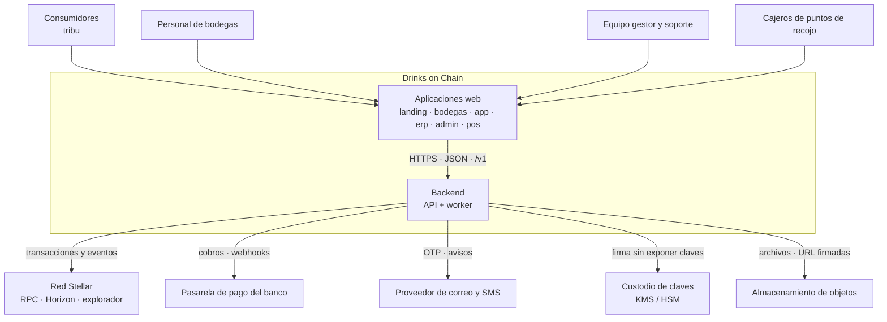

<sub>[Abrir en Mermaid Live](https://mermaid.live/edit#pako:eNpNk01v2zAMhv8K4etWtDsNKIYCiZO2a5YlqLPTvAMts4kSW_QoO13X9L-PcuXMJ4viww-9pF8TwyUl15A8VfxsdigtbKa5A0hX33_mScrOd7UtWch_KeTyphVbdHnyKyDT1UyRNYlnhxWUBIUm26KP_rt5pv757842DFvyLQu8gOeGpaXIpJOHUAb3JOxDiqZz7ftJyPCeey6Qviu2gs0OZqtUQ2Zi3cEDO0h3aF1MB3A7V-ekqaxBY9mRh2cq-tYrdKV1W8i7q6vi89DrYGLTDEeS8xHL2rrBaNify0xDmSmaA7myzz5Zf4UP8MxyIImUut5bzzYKP1IJWUtVhdIHPK7TIfE9i_3L5zr0p6lYUEUfhF4EndGjUIW9SLhl_VZQoDMcqWV2FzDhI5HGBs6wCLGKni2zSC2WYShpp9MoLfdQhcc4XXXCJdxnywivpmE6k6pGQw5rSzqbEMLFntqoRlwWuLi4UfHjXows3YKRpfMeWbfzYJzuN5t1Nrz-IdNk8Xx5_HRSqfuk72gr6DyaONoXoGPoyZ9U4xFluAjrFLPoAuyYDwpNFyNotVmfx3y0PiRRCUfAk5UawesC6ES0nkSpTkHEEYdidvb4v96Px2_Qx5aorGqYu-QjJDXplS3Dz_aaJ-2Oav0JriFPHHX6rCpP3gKGXcvZizPqaqUjvemaEluaWdT9r-P12z_7LjKe)</sub>

## 4. Contenedores (C4 · nivel 2)

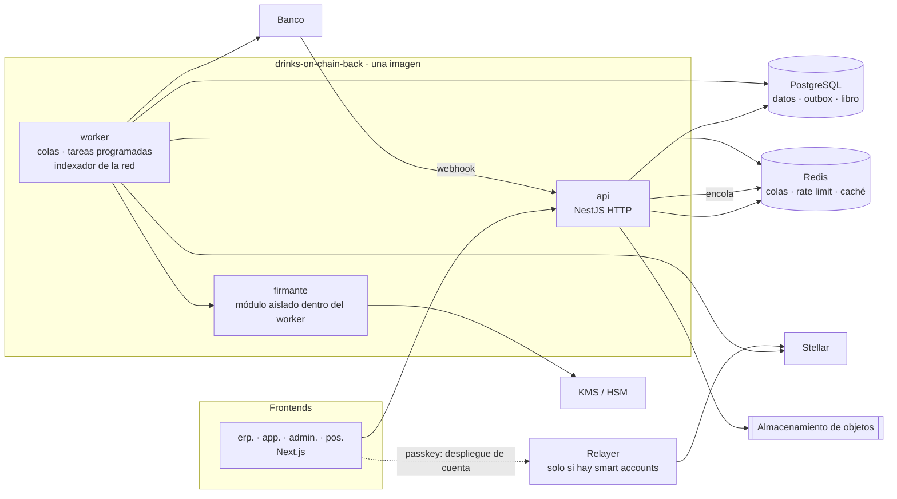

<sub>[Abrir en Mermaid Live](https://mermaid.live/edit#pako:eNplU01v2zAM_SuCThuwpAV2GFYMBRqkS9Okm2cH2CHagbaYWI0sGZKMJGj630s5duZuF0uPIh8fP_zCCyuR3zC-0XZflOACW6bCMOabfOugLtl3Z01AI320MnaXJNlacHT1mInm-jr_wqAe3GWlzAXV1o-_5e7q9gcewvjZC_4nshCbMO-STKDYkZWIpVNm50fWjEiNMqOcXnq6xgBTFWzRdERRzpyCoFZdGh8eM_awWiUXj9_pgjz21u3QtU6F1eB7ygAOCdXOkpAKJPjWRxmJB5DWMYlMA3MoL4TZfEaEG-UqoMa07lVk23yWjbYMlNcUSYEmuHhodk7-b_HJbP1B8MT6sHWY_Vq2TBKCvYizTcjtoUda5c4K_rFlSacxOEWp_P9FOQikWlUq9JYCijJe8WtP8HPyuKYy7nQFBRqoFMmNapnNn5E0kNrWb_EUx01fdsUesqeuiPR-uY7pNRy7rnpLtXvFSjgyX8U9gqKwjQn90LMVRWQBtYa-FZM4mQmYwraGaIrrxUaj2zjYM563MJkNUTodIiplAE9oYjNOnRONfxDSozNdj2ii7UlVvjOvhmiyOEtuc-wxL63dnf7KjLJp73kN3u_weEOt9LVWuG0wdrVoqL8gOBtHLffLSwL-ifEKaZeUjL_hi-ChxAoFAcENNsGBFvw1ukETbHY0BT0F1yBZmpr2BacK4vJ25tc3fpE0sQ)</sub>

- **api**: sin estado; valida, autoriza, escribe en PostgreSQL y en el *outbox* dentro de la misma transacción, y responde. Nunca espera a la red.
- **worker**: publica el *outbox* en colas, ejecuta trabajos (enviar transacciones, consultar el banco, enviar OTP, conciliar, liberar candados, caducar pases) y lee eventos de la red.
- **firmante**: única pieza que pide firmas al custodio. Recibe una intención ya validada ("clawback de 2 unidades del activo X desde Y por la entrega Z"), no XDR arbitrario.
- **relayer**: solo aparece si se adoptan smart accounts con passkey (doc 04, D1). El frontend lo necesita para desplegar la cuenta del usuario; lo opera el backend.

## 5. Módulos (contextos de negocio)

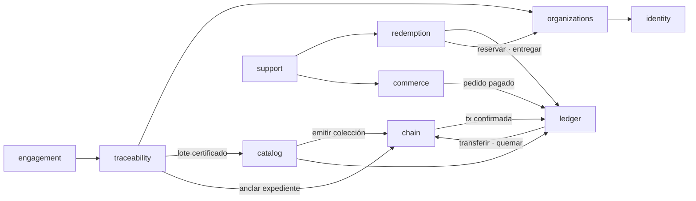

<sub>[Abrir en Mermaid Live](https://mermaid.live/edit#pako:eNplkkFPwzAMhf9KlDNIkzggcUBCbGJIo0MFToSDl7ghUpMULwXGtv-O06UwxKny55eXZ6dbqaNBeSFk08YP_QqUxKJWQYjbafWspDMYkksbJV8yXNY3DCNZCO4LkothXTqP9TV3EoFGWLn298j11SM3NCRoox3Z8i6z6D2SxgIXsynDFo1FGnXznIFTuVBIPYgIDfouX1_wrMq5MFiw6DlxwQ9P94zXfddFOrAyhDg9vcwTluRDyfio3HGUmFBopOQap8FEJXd5mr8iCLoFEvjZoXF8Mw6qeVVGLyr0LjkSOraotVP9ZNKchf_KvIOyn3Iwu5ooOrAlQFHwpyh45WHdILF99l2di7cePdCx-7waxZ-cITSOPBg4sqt_7AjXSO_wY8YjEdqD3V_xuDBe8lDWh-5Y8gzlZYaSN6aCPBGSn9yDM_mX23KgV34vxYWSAXuepVVyn2XQp_iwCZpbiXpk0ncGEk4dWAJf8P4b5Sbc7Q)</sub>

`audit` no aparece en la figura: recibe registros de todos los módulos.

| Módulo | Responsabilidad | Entidades propias | Eventos que publica | Sistemas |
|---|---|---|---|---|
| `identity` | Cuentas, credenciales, sesiones, OTP, 2FA, passkeys de acceso, dispositivos | `User`, `Credential`, `Session`, `OtpChallenge`, `Device` | `user.registered`, `device.enrolled` | Todos |
| `organizations` | Plataforma, bodegas, puntos de recojo, membresías, invitaciones, habilitación de puntos por lote | `Organization`, `Winery`, `PickupPoint`, `Membership`, `Invitation`, `PickupPointLot` | `winery.approved`, `pickup_point.enabled` | S1, S3, S4 |
| `traceability` | Parcelas → embotellado, laboratorio, expediente del lote, pasaporte público | Las 11 entidades actuales + `LotEvent`, `LotDossier` | `lot.bottled`, `lot.certified`, `lot.ready_for_issuance` | S1, S2, S3 |
| `catalog` | Productos, colecciones, precio fijo, medios, publicación | `Product`, `Collection`, `Media` | `collection.published`, `collection.unpublished` | S2, S3 |
| `commerce` | Pedidos, cobros con la pasarela, reembolsos | `Order`, `OrderItem`, `Payment`, `Refund` | `order.paid`, `order.failed`, `order.refunded` | S2, S3 |
| `ledger` | Libro de doble entrada de unidades; proyección de la cava | `LedgerAccount`, `LedgerEntry`, `Holding` (proyección) | `units.reserved`, `units.assigned`, `units.released` | S2, S3, S4 |
| `chain` | Cuentas Stellar, activos, transacciones y su estado, firmante, indexador, conciliación | `ChainAccount`, `Asset`, `ChainTransaction` | `chain.tx.confirmed`, `chain.tx.failed` | Todos (lectura) |
| `redemption` | Pases de retiro, validación, entregas, turnos | `ClaimPass`, `Delivery`, `Shift` | `claim.issued`, `claim.redeemed`, `claim.expired` | S2, S4, S3 |
| `engagement` | Reseñas, notificaciones al usuario | `Review`, `Notification` | `review.created` | S2, S3 |
| `support` | Tickets, disputas, entregas manuales autorizadas | `Ticket`, `TicketMessage`, `ManualDeliveryAuthorization` | `ticket.created`, `delivery.authorized` | S2, S3, S4 |
| `audit` | Registro de quién hizo qué, sobre qué, cuándo y desde dónde | `AuditLog` | — | S3 |

Reglas de convivencia entre módulos: cada módulo expone un servicio público y sus eventos; ningún módulo lee o escribe tablas de otro; las dependencias de la figura no forman ciclos (lo que "vuelve", como `chain.tx.confirmed`, llega por evento).

## 6. Modelo de datos objetivo (nuevas entidades)

Las entidades del ERP actual se conservan (con los ajustes del doc 01 §9). Estas son las que se añaden, a alto nivel:

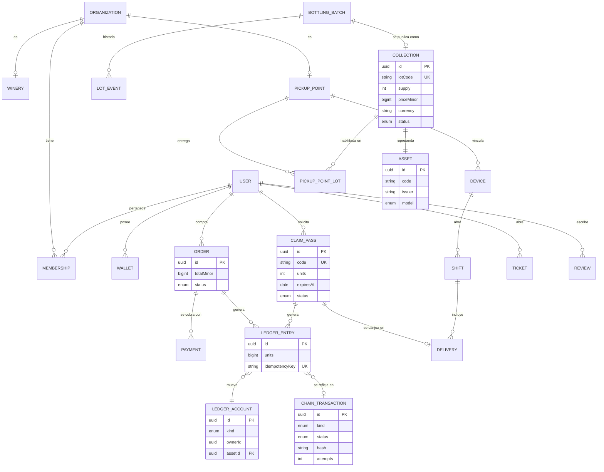

<sub>[Abrir en Mermaid Live](https://mermaid.live/edit#pako:eNqNle2OojAUhm-l4ffODcw_BjszRASC6GQ2JqbCWe0stKS0s2vEe98W6ggq7iTGpKfPOT0fL-3ByXgOziNyQEwo2QpSrhhCUfLihv5PN_WjEDXNwwM_oBmePeFk_urH6BGtHEmBwcox9GKOkxGqAiE1l1nyOm6D3vwQJ-8tDfU4FvvedBGv48gP0wE82LBZTPDS93CLfVKWqYKMs33bOohscCYFbK3XU5SmgR--rJ_c1Hs9-Wl0jZfYZrOjteSC3vFokBcFAfbaooxLDahSm4JmBGW85J1njzFeTYPc-Rx3ZwioBNQ6NXKTHatlRza0oJLkBAG7ntibq6N0ZMVruDHTKJnohQF0npUgpyFNzkjsvs9OrdB1ZXwjTFXsBhrgyQtO1pq2U99qgZyCeoHrz9axrvlb-GDzyNt-WZvredHCZlQq-IQRDzOXV9cP12nihnN3MB4Bvwr4uN22XqYtzfUgqRwpo9GKDPzlSeemQ4R9wDmy_mCee-rtsVq-hdrb7K2uLdc5GYhsxI25pVoN-B6Q6HD4zX5NmaCblrmQ1sGsEVKK5kj_4mm3rqWgbIsKLj19g6CFNVMmUa2qqth36w3dGlMlaAYzyrgYeGdKCGCZZYGpUu8QqWpjOJq_Tv33czBX2MBA61qB6AUtNVF8xbxQyEjw1vE3ZXlvm__R2vP7FlLXIP0cPU8vw3cSGwlu26IYlfUw9RzKikvTlCnsbVvbsNcq_V7iF139OmlH6t15ZkRKfbA8N74n4f93fzD-XlE5kYDgb0X1veXK8Sl3F8T9XkkuSdGT0HUc5wdyShAlobl50Q76kdpBqTVtBM5ASUGKlXM0GFGSz_cs01tSKNAWVZlk7Rtozcd_Z7I00A)</sub>

Cuentas del libro de unidades por activo (cada movimiento es un asiento que suma cero):

| Cuenta | Qué representa |
|---|---|
| `inventory` | Unidades emitidas y disponibles para la venta |
| `reserved_order` | Unidades apartadas por un pedido pendiente de pago |
| `holding:{usuario}` | Unidades en la cava de un usuario |
| `reserved_claim:{pase}` | Unidades apartadas por un pase de retiro activo |
| `delivered` | Unidades entregadas y pendientes de quema en la red |
| `burned` | Unidades quemadas con confirmación de la red |

Invariantes que la base de datos comprueba: la suma por activo es igual a lo emitido; ninguna cuenta queda en negativo; lo emitido de un lote no supera sus botellas certificadas (R7).

## 7. Integración con Stellar

### 7.1 Principios
- **Una intención, una transacción, un estado.** Cada operación en la red (crear cuenta, fijar flags, emitir, transferir, quemar, anclar) es un `ChainTransaction` con estado propio, reintentos y relación con el asiento del libro o el registro que la originó.
- **Comisiones y reservas las paga la plataforma**: cuenta de operaciones con *fee bump* y reservas patrocinadas. El usuario nunca necesita XLM.
- **El firmante solo firma intenciones de dominio validadas**, con límites por tipo (por ejemplo, un clawback nunca supera las unidades de la entrega que lo origina).
- **Testnet en desarrollo y staging; mainnet en producción**, seleccionado por configuración. Los hashes y direcciones de testnet nunca se muestran como definitivos.

### 7.2 Cuentas

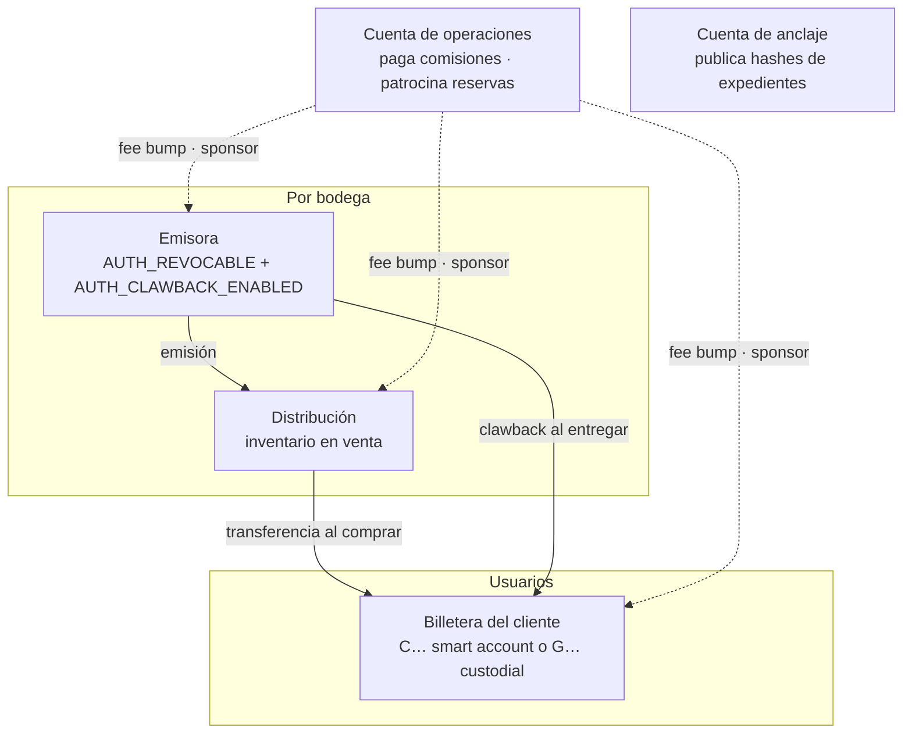

<sub>[Abrir en Mermaid Live](https://mermaid.live/edit#pako:eNqVkt1O3DAQhV9l5Nt26UKlVqqqlZLsqkVFgLrQvagrNHFmN24TO_IPtALenZkQEHtHr2KPj7-cM-NbZXxD6hOobedvTIshwUWpHcDZ-fqnVlUmlxAaAj9QQGO9o_i5Du8WA-4QjO9tHGug83xef4QBU_DGOoRAkcI1Rq1-Ca84rfZ46EyHv-mRlevOGoQWY8soPqW_AzWWtfR0P-Z6F3BooWTDO2TWuQ9Qj5tJAnC8FtMrNuUDjuji8uLr1ffVj7OqKE9W8AbGQnVSbMqi-na1OpXy8hmwPBbA0sYUbJ2NlVTb925EWXct5oP1QA7G9XSPXLNn8TJmkcVH5uaQkaXtOkrcQk7XgenGbCO20vlofvQBYi_NR2N8dgk8fJnqJsfkG4vdy5_JgsPCbLa404pkCpNVre4khQj4MwlSQBe3FMgZi4CdDG4IGES8OdyH8VhuajR_RMYmA_f3hY6fBcwOQKstEdS5H54GHwfvuOtawcFsIbj_UE9-X6kWI-otqJ5Cj7aRx3vLEVvqSfNGK0eZA3O_7kWGOfn1P2f4KIVMXMlDg4mWFnla_VS-fwBepv1P)</sub>

Todas las claves de estas cuentas viven en el custodio. La emisora necesita seguir activa porque firma los clawbacks; se protege con umbrales de firma, alertas ante operaciones no originadas por el sistema y rotación de firmantes.

### 7.3 Modelo de token (decisión D2)

| Opción | Cómo funciona | A favor | En contra |
|---|---|---|---|
| **Activo clásico por lote con clawback** (propuesta del frontend, docs 04 y 11) | Un activo `CÓDIGO:EMISOR` por lote, 1 unidad = 1 botella, quema por `clawback` del emisor, metadatos en `stellar.toml` (SEP-1) | Sin contratos que escribir ni auditar; quema nativa; visible en exploradores; smart accounts lo tienen sin trustline vía SAC | Sin identidad por botella; hay que gestionar flags y trustlines de cuentas `G…` |
| Token SEP-41 propio en Soroban | Un contrato con `decimals = 0` y metadatos por lote | Más expresivo, lógica a medida | Desarrollo, auditoría y mantenimiento de un contrato; repositorio de contratos |
| NFT por botella | Un token no fungible por unidad física | Identidad individual (útil con NFC en Fase 2) | Coste y complejidad desproporcionados para el MVP |

**Propuesta**: activo clásico por lote con clawback para el MVP (alineado con el frontend); contrato propio solo si la Fase 2 (NFC, P2P) lo exige. La configuración actual del backend (`CONTRACT_PRODUCT_NFT`, `CONTRACT_CLAIM_ESCROW`, etc.) apunta a otra dirección y debe aclararse (doc 04 §2).

### 7.4 Billetera del consumidor (decisión D1)

| Opción | Quién tiene la clave | Coste por usuario | Dependencias |
|---|---|---|---|
| A · Smart account `C…` con passkey | El dispositivo del usuario | Despliegue del contrato y renta de almacenamiento, pagados por la plataforma | Relayer, SDK en el frontend, recuperación de passkeys |
| B · Cuenta `G…` custodial | El custodio de la plataforma (una clave por usuario, o derivada de una semilla maestra según SEP-5 dentro del firmante) | Reserva base y de trustline, patrocinadas | Custodio de claves; responsabilidad de custodia |
| C · Cuenta ómnibus | La plataforma, en una sola cuenta; la cava es solo el libro interno | Casi nulo | Ninguna; pero el cliente no puede ver "su" saldo en el explorador |

El frontend decidió A por defecto y B como respaldo (doc 06 de frontend, 25-09) y luego sugirió al backend empezar por la custodial "que ya existe" (doc 11). Como esa custodial es simulada (doc 01 §7), la premisa cambia. **Propuesta**: el backend modela `Wallet` con un proveedor intercambiable (`SMART_ACCOUNT`, `CUSTODIAL`) y los mismos endpoints de lectura; se implementa primero el que el cliente elija en D1, y C queda documentada como contingencia si el calendario lo exige.

### 7.5 Estados de una transacción en la red

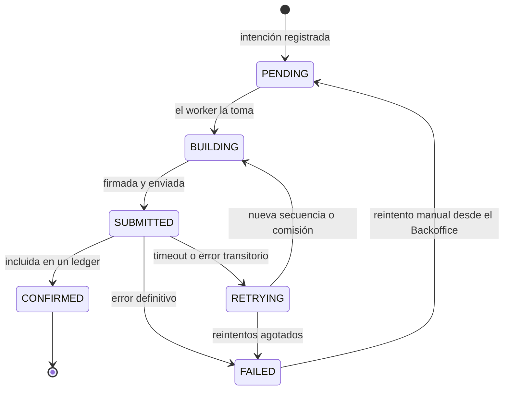

<sub>[Abrir en Mermaid Live](https://mermaid.live/edit#pako:eNplkk1PAjEQhv_KpEcjCdEbBxMRMJsAGj4OxvXQtLPrhO3U9GMNIfx324XFKMfOPO98vNODUFajGIHwQQackKydNIP2rmSA95sPGAwe4HW6nBTL5xEQB2RFZRwOq3sGhzX54KSWmT5TnWK8LeYnCTbwbd0OHTQSgjUd2qc7dr0dL4rNZjoZQUXOpGqwB-SWznUv-Y5-elnOitUi08SqiZRwZIgMDeoa3bViNd2s3rpZAhm0MYAFdM46SKOzp2Ad2SzrwX8bcMRWgkcV8-4yqZU15HsXrhvOHot5nu_URGNFTIHa6x496LAzNlgPsrZBausze0r_vcAFBSM5yiaV9xqzy2OpdraqSGHWXmzq5OmQJYtbEAaTwaTzvQ-lCJ9osEyPUjDG5EZTimPGZAx2vWeVUsFFTJH4pX-_xzl8_AHHALTr)</sub>

Cada estado se expone en `GET /v1/chain/transactions/:id` (y por hash) con enlace al explorador; es lo que el frontend llama `TxStatus` (docs 04 y 11 de frontend).

### 7.6 Anclaje de la trazabilidad
- Al certificar un embotellado se construye el **expediente del lote**: todos los registros de la cadena (parcela → embotellado → laboratorio) serializados en JSON canónico (RFC 8785) y sus archivos por hash.
- El hash SHA-256 del expediente se publica en la red con una transacción de la cuenta de anclaje (`memo` de tipo hash o `manage_data`). No hace falta un contrato.
- Cada evento del lote (`LotEvent`) guarda el hash del anterior: cualquier alteración posterior rompe la cadena y el pasaporte lo muestra.
- El pasaporte público enseña el hash, el enlace a la transacción y un "verificar" que recalcula el hash del expediente.

### 7.7 Indexación y conciliación
- El worker sigue la red (Stellar RPC; Horizon mientras siga disponible) y persiste lo que necesita: confirmaciones propias, pagos y clawbacks de los activos de la plataforma. RPC guarda historia limitada, así que la base de datos es el archivo.
- Una conciliación periódica compara el libro interno con los saldos en la red por activo y cuenta, y levanta una alerta ante cualquier diferencia.
- Mercury u otro indexador externo es una alternativa si el volumen crece (decisión D6 del frontend).

## 8. Pagos

- **Adaptador de pasarela** con tres modalidades posibles (redirección, widget embebido, QR interoperable), según lo que ofrezca el banco (doc 06 §3 de frontend). El resto del sistema solo ve `Payment`.
- **El webhook manda, no la redirección**: el pedido se marca pagado solo con la notificación firmada del banco (HMAC, marca de tiempo, protección contra repetición) o con la consulta activa a su API.
- **Importes en enteros de la unidad mínima** (`priceMinor`, centavos de boliviano) con moneda explícita.
- **Reserva con caducidad**: el pedido aparta unidades durante la ventana de pago y las libera si expira.
- **Conciliación diaria** con el extracto del banco; reembolsos y anulaciones por API.

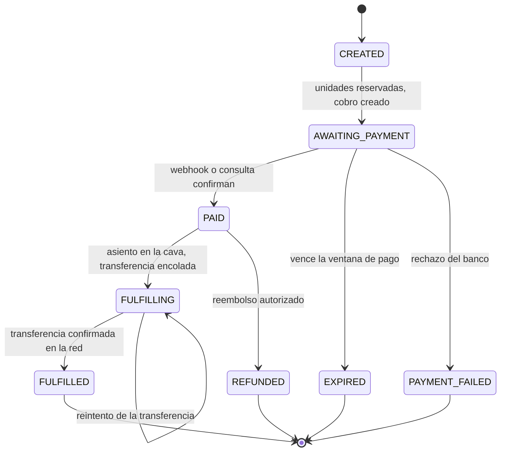

<sub>[Abrir en Mermaid Live](https://mermaid.live/edit#pako:eNp9Ut9rwjAQ_leOPA592WMfBmVtR6ETcco21iHX5NSwNpE07Zji_74kq1MH7u3y5b4fd8mecS2IRcBai5YSiWuDzbi_LRXA2807jMd3cD9L43maeGgoAxw_x_k8nzwsp_HrYzqZR9ApKVBQC4ZaMj0KbEfAdWU0cEMotJf4Swta0zhPIvikaqP1B7h2rdqutuiLlTQNqqvU9GWaz1LH7klxghp9YVEhCIItrv8zDfUyi_PCCxjiG9xpx6uhQsUD0ycL3dmiyPKicCIRYCudhwZS3o9jjyOwBlW7IuNSSHQ3XNduAV7ixDwX8o6XnOOsAgdhQ-I6PwQxJJUNUUQY_ULwIv4szRaT5GdMaipdtxqws9rI3fAwv7lCv3t8Dw7bPYcu13Z-c_Q4YWwErCE3kxT-k-1LZjfUUOkOJVPUubx1yQ6-zYd5-lKc-bV05JBuK05_coAP30dr1qg)</sub>

## 9. Procesos clave por dentro

### 9.1 Compra

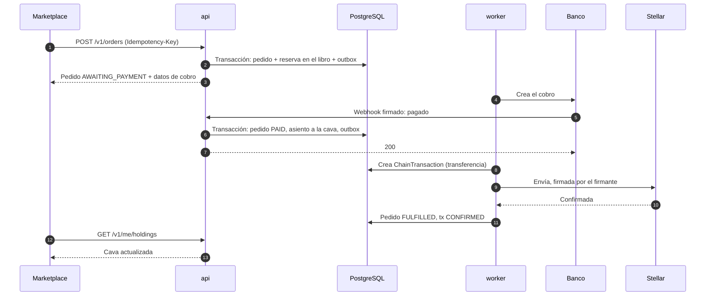

<sub>[Abrir en Mermaid Live](https://mermaid.live/edit#pako:eNqNU01vm0AQ_SsjTonqyG574xDJGBwhfwQXqqgSUjRmx_YqsEuXxY0b5b9nFpuqwpec0Mx7M-_NDPvmFVqQ54PX0O-WVEGhxL3BKlcA2Fqt2mpLxkU1GisLWaOyME0SwAZWaF7I1iUWdM2IHQNrOUTCwAGJbuzeULpZDvGNg_9o7nwlGywcFqAq9BBKMwellsoSuc7BbPLu_p6N-JA8Mj4-fh1rI8g0cBMLqmpteeDT3YJOt2d-zPww8CEzqBosCpm3k8nuu_KhJiGFhi9gqCFzRCAFVEIpt8ZldWu3-rVv0qkmrHoumj5N4yxePzwn01-raJ0xX6DVDQiCQnMDV7fhomDhw8wQus7_gGDRD_FE24PWL7CTpkKh2RTu-ftJ68k0Dke8I0nKakAoEQo84ujau7PxbTLpXbmunavZAaW69LdSK7ixLtiR4TVKvO0L0syHSB2dARIscPaLUGvjJutCZbs_Js2c4IYFtLrQ_pe9LHD-czmPl8uI_dtXmD2u5_GPVRQObvwQnU9c0figSyHVvhkeZMYDA5tvsZR_Oy1vBF5FLCyFewRvuWcPVFHOQe4pannCMvfeHc29hvSkCoasaYkzbc137B_MJf3-AWigFN8)</sub>

### 9.2 Canje y quema

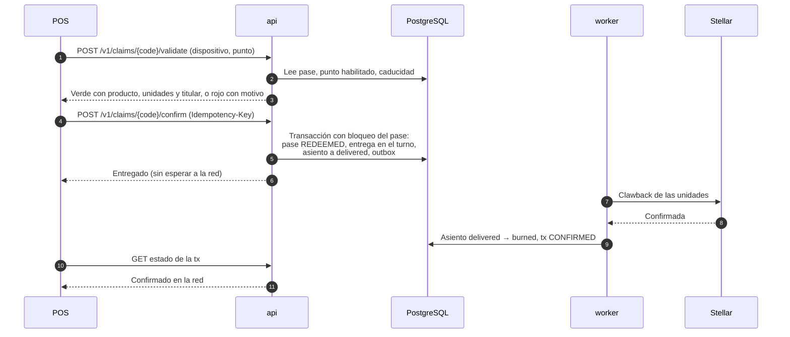

<sub>[Abrir en Mermaid Live](https://mermaid.live/edit#pako:eNqNU01P20AQ_Ssjn4IUFKCnWlUkIKaKSgvBFidfxrtD2GLvuvsRiKL89844IQf30pPX-96b92Z2d5cppynLIQv0J5FVtDC49tjVFgBTdDZ1DXn569FHo0yPNsLjQwkY5DNGrh-XgmBvxsjiZpC4ENeeytX9GF8J_O782792ZSVYGaltkUGB2fp8Pme3XJYVzDaXM9Wi6cJsJy3tZxtsjcZIMNEm9C6YaDZuCn2y0Z1JCRZzicVNDvdE7BfoiMIrNqY1ETXzFeqkuJD-lLCGHXN4Jq8JlLPQe8ecyORkhUkBthBNTJx2Cg68--0GYuckw__FZ_6L8R1Mlpq63kU-m-35D9qOolcebUClTJ0uLl6-2MGnaR0fpgNN7dBX_q3xs7ms4KlYFMXPYjEFstHTGvkLTIvJWzcdeBgMyRRQ9GZDnjR3kWLjPsYzKA41tINJMFwn9OTRs7JFYNmQdcXkssrhtsX3BtUbV2U4nGYlnLKSkismHbpGjZ9SafL6mOiUB-p0dfn1ChpOLeniB9w-_LpbPnFno_F-LyrOJWd5MGbuuIuTqZNhHKLXNptC1hFvGy3vY1dn8ZU6qvmnziyl6LGts73Q5KGUW6sYij7xNcpSL1fv-JaO2_u_NPAkgw)</sub>

Motivos de rechazo que el POS distingue (doc 11 de frontend): `ALREADY_REDEEMED`, `EXPIRED`, `WRONG_PICKUP_POINT`, `VOIDED`, `NOT_FOUND`.

## 10. Estados del pase y de la colección

### Pase de retiro

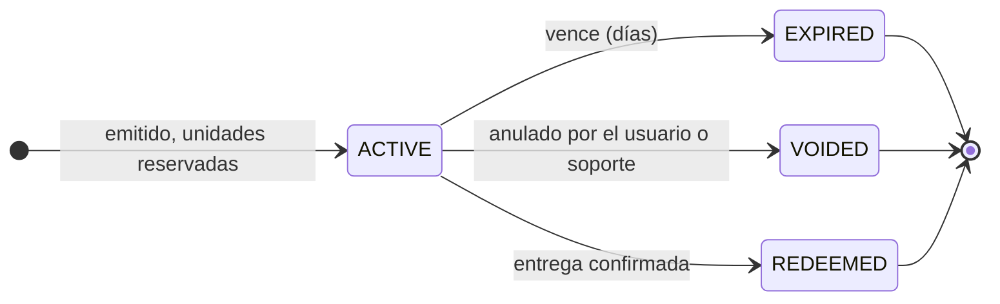

<sub>[Abrir en Mermaid Live](https://mermaid.live/edit#pako:eNpdkMFKAzEQhl9lyEmlC8VjD4K4OSwoyipFMB6GZKyBTaZMkgUpfXeTtlLpcb75_mFmdsqyI7UClTJm6j1uBEM335oI4LyQzZ4jPI6t_rj5hK67g_uHt2GtV0DBZ-94ASV6h44SCCWSGR2m5h-9Q2TUvdZPuq-hmIU2CJbjl5dQ3QtVv78MYzNnipbgypmyXFIdeX0hrp-HvnkYy4SOYcsCNEFJBcUzMCSuKFOLnYYecvWMho7x_-RvyTNTC1CB6pbetR_tjMrfFMjUwqhIJQtORu2bhiXz60-0tZWlUCVl684vPeH9L0HicqI)</sub>

### Colección

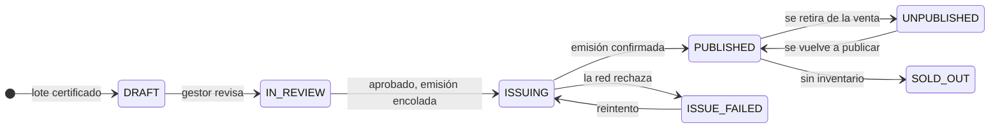

<sub>[Abrir en Mermaid Live](https://mermaid.live/edit#pako:eNptkVFLwzAQx7_KkUfZYOhbH4RJOy2UTVarD1ZGlty2gzYZaVLQse9ukurc1IdAcvf73_3vcmBCS2QJsM5yiynxreHtuL-uFYAkg8KSVlAsw_v16g3G41tIl9PZUwKNtggCjaUNCS51QGIqQvl8tcye8-wlgS12Vhsw2FPHA3XKDWRZVvn8PgG-N3rtC40AW-qodpPJ5kYBKqEbLgflwEbdY3VX5OVDliaXvNBqQ6b9RxHu2Wo2zYsgari3JP0RO_5xYr_zl9YMkrKobBzy1Dgy1fzMSIcetWQ4SAwNeq-Jpc-o3-a9pnfY9Agc9m7d-GWav23KRZGuFpXfe0cKSMXKhrwhNgLWoh-YZPjIQ83sDlus_aNmCp01vKnZMWDcWV2-K-FT1jj0EbeXP__-FT5-AvSjp2Q)</sub>

Los estados de la colección coinciden con las columnas del *pipeline* de emisión del Backoffice (doc 03 §7 de frontend: listo · en revisión · emitiendo · publicado · fallido).

## 11. Identidad y acceso

### 11.1 Audiencias

| Audiencia | Aplicaciones | Alta | Inicio de sesión | Segundo factor | Sesión |
|---|---|---|---|---|---|
| Personal de bodega | ERP | Invitación del dueño o del gestor, con enlace de activación | Correo + contraseña (argon2id) | TOTP opcional | Acceso 15 min + renovación rotativa |
| Equipo gestor y soporte | Backoffice | Invitación de un administrador | Correo + contraseña | **TOTP obligatorio** | Acceso 15 min + renovación rotativa corta |
| Consumidor | Marketplace | Autoregistro | OTP por correo o SMS; passkey de acceso opcional | — | Acceso 15 min + renovación rotativa larga |
| Dispositivo POS | POS | Código de vinculación de un solo uso desde el Backoffice | Credencial del dispositivo + PIN del cajero | El propio dispositivo | Sesión por turno, bloqueo por inactividad |

- Los tokens de renovación se guardan con hash, rotan en cada uso y una reutilización invalida la familia entera.
- En las aplicaciones web, la renovación viaja en cookie `HttpOnly; Secure; SameSite` del subdominio (la aplicación Next.js actúa de intermediario); así lo pedía el frontend (doc 09 §6 y doc 10 §2.4).
- Recuperación de contraseña, verificación de correo y cierre de sesión en todos los dispositivos forman parte del mínimo.
- El diseño deja la puerta abierta a un proveedor OIDC propio o externo sin cambiar a los clientes.

### 11.2 Roles por membresía

| Organización | Roles |
|---|---|
| Plataforma | `ADMIN`, `OPERATIONS` (gestor), `SUPPORT` |
| Bodega | `OWNER`, `ENOLOGIST`, `AGRONOMIST`, `OPERATOR`, `ACCOUNTANT` (solo lectura) |
| Punto de recojo | `MANAGER`, `CASHIER` |
| Sin organización | Consumidor |

- La autorización se decide con **el rol en la organización activa** más comprobaciones de propiedad (el pase es del usuario, el lote es de la bodega).
- Una persona puede tener varias membresías; la organización activa se elige en la sesión (`POST /v1/auth/switch-organization`), lo que resuelve el punto 13 del doc 09 de frontend.
- Nada que haga una organización cambia permisos en otra (cierra SE-01).

### 11.3 Aislamiento entre organizaciones
- Todas las tablas con datos de una organización llevan su `organization_id` y cada consulta pasa por un filtro común (como hoy).
- Como defensa en profundidad, **Row Level Security** de PostgreSQL con la organización de la petición fijada en la transacción.
- Pruebas automáticas de "no puedo ver ni tocar lo de otra bodega" para cada endpoint.

## 12. Estándares de API

| Tema | Estándar |
|---|---|
| Estilo | REST sobre JSON, recursos en plural, prefijo `/v1`, cambios incompatibles solo en una versión nueva |
| Contrato | OpenAPI 3.1 generado del código y publicado en cada release; tipos y esquemas zod generados para el frontend y `@drinks-on-chain/mocks` |
| Envoltorio | Se conserva el actual: `{ success, statusCode, timestamp, path, data }` y `{ success: false, ..., error: { code, message, details } }` |
| Errores | Códigos estables y documentados; `details: [{ field, code, message }]` en validación (punto 19 del doc 09 de frontend); 400 formato, 401, 403, 404, 409 conflicto, 422 regla de negocio, 429, 5xx |
| Listas | `data: { items, total, limit, offset }`, `limit` máximo 100; cursor para históricos largos |
| Idempotencia | Cabecera `Idempotency-Key` obligatoria en pedidos, pases, confirmaciones de entrega, emisiones y reembolsos |
| Tiempo y dinero | Fechas ISO 8601 en UTC; importes en enteros de la unidad mínima con moneda; medidas con precisión declarada |
| Seguridad | Bearer o cookie según la audiencia; CORS por lista de orígenes por entorno; rate limit global y por ruta sensible |
| Webhooks entrantes | Firma HMAC, marca de tiempo, tolerancia de reloj y registro para repetición |
| Documentación | Swagger solo en desarrollo o protegido; guía de cambios por versión |

## 13. Datos

- **PostgreSQL gestionado** con copias automáticas, recuperación a un punto en el tiempo y restauración probada cada mes.
- **Prisma** con migraciones versionadas; cambios con patrón *expand/contract* para no romper despliegues.
- **Identificadores** UUID (v7 ordenables en tablas nuevas); códigos legibles (lote, pase) aparte.
- **Sin borrado físico** en trazabilidad, libro, pedidos, pases ni auditoría; claves foráneas con `RESTRICT`.
- **Auditoría** de toda escritura relevante: actor, organización, acción, recurso, antes y después, IP y dispositivo.
- **Datos personales mínimos** (nombre, correo, teléfono), cifrado en reposo, política de retención y proceso de exportación y baja del consumidor; la normativa aplicable en Bolivia se revisa con asesoría legal.
- **Archivos en almacenamiento de objetos**: privados con URL firmadas (informes, licencias, inspecciones); públicos solo los medios del catálogo, detrás de CDN.

## 14. Seguridad

Objetivo: **OWASP ASVS nivel 2** y el **OWASP API Security Top 10** como lista de control, con un modelo de amenazas por flujo que mueve valor.

| Amenaza | Flujo | Control |
|---|---|---|
| Doble canje de un pase | POS | Transición de estado con bloqueo de fila, restricción única de entrega por pase, confirmación idempotente |
| Pase reenviado o capturado | POS | El QR es una referencia firmada al estado del servidor; válido solo en puntos habilitados; nombre del titular en pantalla; código rotativo opcional en la app |
| Webhook falsificado o repetido | Compra | HMAC, marca de tiempo, registro de identificadores procesados, consulta de confirmación al banco |
| Emisión de más unidades que botellas | Emisión | Invariante R7 en base de datos, doble aprobación en el Backoffice, conciliación con la red |
| Clave institucional comprometida | Cadena | Custodio con firma sin exportar la clave, firmante con límites por intención, umbrales multifirma, alertas de operaciones no originadas por el sistema |
| Escape entre organizaciones | Todos | Filtro común + RLS + pruebas por endpoint |
| Robo de sesión | Todos | Tokens cortos, renovación rotativa en cookie `HttpOnly`, CSP estricta en las apps |
| Abuso de subidas | ERP | Tipos permitidos sin SVG, antivirus, cuotas, almacenamiento privado |
| Fraude interno en el mostrador | POS | Auditoría por cajero, cierre de turno conciliado con inventario, alertas de patrones anómalos |
| Enumeración y fuerza bruta | Auth, pasaporte | Rate limit por IP real y por cuenta, bloqueo progresivo, mensajes genéricos |

Además: secretos en un gestor de secretos por entorno, dependencias auditadas en CI, escaneo de secretos, cabeceras de seguridad y revisión de seguridad antes de pasar a mainnet.

## 15. Observabilidad y operación

- **Logs JSON** estructurados con identificador de correlación que viaja de `api` a `worker` y a cada `ChainTransaction`.
- **Trazas** con OpenTelemetry; **errores** en Sentry (decisión 4.5 del doc 10 de frontend); **métricas** de latencia, errores, profundidad de colas, tiempo de confirmación en la red, fallos de webhook.
- **Alertas**: saldo bajo de la cuenta de operaciones, transacciones fallidas, diferencias de conciliación, webhooks rechazados, colas atascadas, candados que vencen hoy.
- **Objetivos de servicio iniciales (propuesta)**:

| Operación | Objetivo |
|---|---|
| Validar un pase en el POS | p95 < 500 ms |
| Registrar una entrega | p95 < 1 s, sin depender de la red |
| Confirmación en la red tras la entrega | p95 < 60 s |
| Disponibilidad mensual de la API en el MVP | 99,5 % |
| Recuperación ante desastre | RPO ≤ 15 min, RTO ≤ 4 h |

## 16. Entornos y entrega

| Entorno | Red Stellar | Pago | Despliegue | Datos |
|---|---|---|---|---|
| Local | Testnet o `stellar/quickstart` en Docker | Adaptador mock | `docker compose` (PostgreSQL, Redis, almacenamiento de objetos local) | Semilla determinista |
| Desarrollo | Testnet | Sandbox del banco | Automático desde `dev` | Semilla de demostración (la que pide el doc 10 §2.1 de frontend) |
| Staging | Testnet | Sandbox del banco | Automático desde etiqueta de versión candidata | Copia anonimizada |
| Producción | Mainnet | Producción del banco | Desde `main` con aprobación manual | Reales |

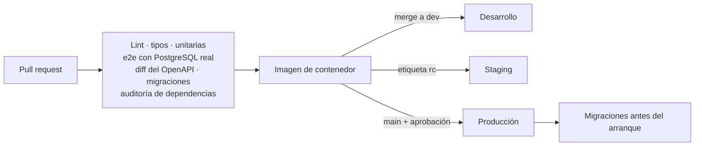

<sub>[Abrir en Mermaid Live](https://mermaid.live/edit#pako:eNpdUV9LwzAQ_ypHXnUo-iAMGcgqUrZhXcUX68MtuXaBNKlposi67-6l2xQGecn9_uayE9IpElMQtXHfcos-wHJdWYBi_V6JIhoDnj4j9aESHzCZzGC-YGCpbYAqXl9v7iDozvWnS7Q6oNfY32_81YxuCKSzULg-NJ7KlyW7oRkxpesaFBl47sg-FPnJodWNR6mdpYMHRqWD8wklhazgwwpFVnIMt0pt54uxW7564nJ5iw3ZxOTsQJYUyw88JiTi0JJvCJLb1wDZ4xurMurRe2eMO-NS0LyAgODlAOVrSigDNto256aoLVwAdt5t-AWpcX1rB15llnbpnYryb3zUMjY2X-XJd_X_dkCu3o8L4lpoucIoEZcguD1nqfRtu0qELbWMTaESlmLwaCqxTzSMwZU_VjIUfCSexE5hoEwjx7TH8f4X6C2qVg)</sub>

La infraestructura (servidores, base de datos, dominios, secretos) se declara en el repositorio o en uno de infraestructura, para que el entorno sea reproducible. La elección de proveedor queda abierta (doc 04, P-B).

## 17. Pruebas

| Nivel | Qué cubre | Herramienta |
|---|---|---|
| Unitarias | Reglas de dominio (candados, D.O., balances, libro, estados) | Jest |
| Integración | Repositorios, transacciones, RLS, outbox, colas | Jest + PostgreSQL y Redis en contenedores (Testcontainers) |
| Contrato | Que la API cumple su OpenAPI y que no hay cambios incompatibles | Validación de respuestas + diff del OpenAPI en CI |
| e2e de flujos | Singani Gran Reserva de parcela a QR; compra → cava; pase → entrega → quema; alta de bodega | Supertest contra la app completa |
| Red | Emisión, transferencia, clawback y anclaje | `stellar/quickstart` local y testnet en un trabajo nocturno |
| Carga | Validación y confirmación en el POS, catálogo | k6 o similar antes de producción |
| Seguridad | Autorización entre organizaciones en cada endpoint | Suite dedicada |

## 18. Qué se conserva y qué cambia del backend actual

| Se conserva | Se corrige | Se reemplaza | Se añade |
|---|---|---|---|
| NestJS, Prisma, PostgreSQL, Redis | Reglas de trazabilidad (EA-01 a EA-08) | `MockDynamicWalletProvider` por un proveedor real (D1) | Módulos `catalog`, `commerce`, `ledger`, `chain`, `redemption`, `engagement`, `support`, `audit` |
| Estructura por módulos, DTO validados, Swagger | Roles y membresías (SE-01, OP-05) | Hooks on-chain simulados por el módulo `chain` con outbox | Proceso `worker`, colas y tareas programadas |
| Envoltorio y catálogo de errores | Sesiones (SE-03) | Validación de entorno por *feature flags* | Custodio de claves y firmante |
| Correlation-ID, saneado de logs | Subidas y almacenamiento (SE-04) | Almacenamiento local por objetos | CI, Dockerfile, entornos, observabilidad |
| Filtro por bodega en consultas | Transacciones en escrituras de varios pasos (OP-01) | — | Pagos, OTP, 2FA, dispositivos, auditoría |
| Contrato del ERP que ya usa el frontend | Código de lote y URL de QR configurables | — | Datos de demostración en el servidor de desarrollo |
| Patrón *strategy* por bebida | Pasaporte con datos reales (EA-05) | — | Expediente del lote y anclaje real |

Los cambios en endpoints del ERP que hoy consume el frontend se hacen de forma aditiva cuando se pueda; los que no (por ejemplo, quitar `phytosanitaryStatus` del alta del pesaje) se acuerdan con frontend y se anuncian antes.

## 19. Siguiente paso

Con la revisión de estos tres documentos y las respuestas a las decisiones del doc 04, el siguiente entregable es el **roadmap del backend** por etapas (endurecimiento del ERP, cimientos de plataforma, Marketplace, POS, Backoffice, integración y mainnet), alineado con el calendario del frontend (doc 03 de `drinks-on-chain-docsfront`).
